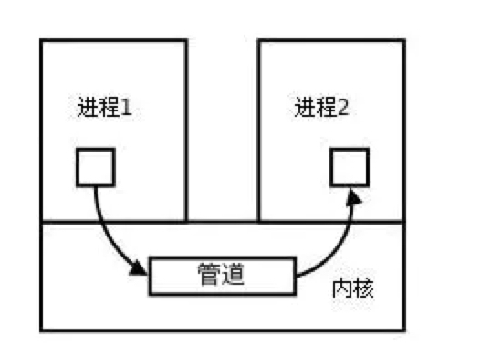

## 进程之间的通信方式

### 一. unix 管道：

>- 单独构成一种独立的文件系统：管道对于管道两端的进程而言，就是一个文件，但它不是普通的文件，它不属于某种文件系统，而是自立门户，单独构成一种文件系统，并且只存在与内存中。
>- 数据的读出和写入：一个进程向管道中写的内容被管道另一端的进程读出。写入的内容每次都添加在管道缓冲区的末尾，并且每次都是从缓冲区的头部读出数据。
>- 管道的实质是一个内核缓冲区，进程以先进先出的方式从缓冲区存取数据，管道一端的进程顺序的将数据写入缓冲区，另一端的进程则顺序的读出数据。该缓冲区可以看做是一个循环队列，读和写的位置都是自动增长的，不能随意改变，一个数据只能被读一次，读出来以后在缓冲区就不复存在了。当缓冲区读空或者写满时，有一定的规则控制相应的读进程或者写进程进入等待队列，当空的缓冲区有新数据写入或者满的缓冲区有数据读出来时，就唤醒等待队列中的进程继续读写。

#### 管道性质： 

>无名管道无需显示打开，创建时直接返回文件描述符，在读写时需要确定对方的存在，否则将退出。如果当前进程向无名管道的一端写数据，必须确定另一端有某一进程。如果写入无名管道的数据超过其最大值，写操作将阻塞，如果管道中没有数据，读操作将阻塞，如果管道发现另一端断开，将自动退出。

### 内存共享(借助信号量实现有序访问)：

>使得多个进程可以可以直接读写同一块内存空间，是最快的可用IPC形式。是针对其他通信机制运行效率较低而设计的。
>
>为了在多个进程间交换信息，内核专门留出了一块内存区，可以由需要访问的进程将其映射到自己的私有地址空间。进程就可以直接读写这一块内存而不需要进行数据的拷贝，从而大大提高效率。
>
>由于多个进程共享一段内存，因此需要依靠某种同步机制（如信号量）来达到进程间的同步及互斥。

#### 信号量(semaphore)

> 信号量是一个计数器，用于多进程对共享数据的访问，信号量的意图在于进程间同步。
>
> 为了正确地实现信号量，信号量值的测试及减1操作应当是原子操作。为此，信号量通常是在内核中实现的。Linux环境中，有三种类型：**Posix（[可移植性操作系统接口](https://link.jianshu.com?t=http://baike.baidu.com/link?url=hYEo6ngm9MlqsQHT3h28baIDxEooeSPX6wr_FdGF-F8mf7wDp2xJWIDtQWGEDxthtPNiJtlsw460g1_N0txJYa)）有名信号量（使用Posix IPC名字标识）**、**Posix基于内存的信号量（存放在共享内存区中）**、**System V信号量（在内核中维护）**。这三种信号量都可用于进程间或线程间的同步。

* 信号量是非负整型变量，除了初始化之外，它只能通过两个标准原子操作：wait(semap) , signal(semap) ; 来进行访问；

  

### 三. Signal 信号

> * 信号是Linux系统中用于进程间互相通信或者操作的一种机制，信号可以在任何时候发给某一进程，而无需知道该进程的状态

### 二.消息队列特点总结：

 （1）消息队列是消息的链表,具有特定的格式,存放在内存中并由消息队列标识符标识.
 （2）消息队列允许一个或多个进程向它写入与读取消息.
 （3）管道和消息队列的通信数据都是先进先出的原则。
 （4）消息队列可以实现消息的随机查询,消息不一定要以先进先出的次序读取,也可以按消息的类型读取.比FIFO更有优势。
 （5）消息队列克服了信号承载信息量少，管道只能承载无格式字 节流以及缓冲区大小受限等缺。
 （6）目前主要有两种类型的消息队列：POSIX消息队列以及System V消息队列，系统V消息队列目前被大量使用。系统V消息队列是随内核持续的，只有在内核重起或者人工删除时，该消息队列才会被删除。

