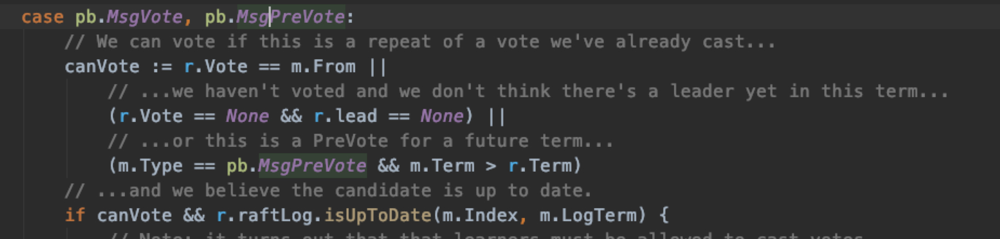

## Raft协议：

[TOC]

### 动画实现：

http://thesecretlivesofdata.com/raft/#election

### Raft本质：


* server :
  * 一致性算法模块
  * 持久化保存的日志
  * 按照日志提交的顺序进行顺序操作的的状态机；
* 流程：
  * client 发起请求，请求到达一致性模块
  * 一致性模块对日志持久化本地，同步给集群其他server
  * 修改commit index， 然后应用于状态机
  * 响应客户端
  
* 一致性算法 主要完成什么事情呢？<mark>维护了未达成一致的日志缓冲区，达成一致的日志才通知应用层</mark>
  * 输入日志进行处理的算法，检测正确性
  * 日志的维护和管理，未提交，提交，已应用，
  * 日志（快照）的网络收发，应用层自行实现。
  * 日志（快照）的持久化存储，应用层自行实现。

* 应用层： 
  * 都以相同的数据灌入日志给应用层，那么得到的结果将最终一致


### **单机存在的状态有三种：**


### 选举流程：

> 保证在任意时刻最多只有一个leader

#### condidate: 

* 发起投票携带的请求信息
  * 新的term
  * last 日志 index
  * last 日志 index的term 
* 流程：

```flow
st=>start: follower心跳超时
c1=>operation: condidate角色


term=>operation: term++
a=>operation: 给自己投票
bC=>operation: 重置选举超时计时器
c=>operation: 获取其他节点投票
cond=>condition: 达成共识？
cl=>operation: 成为leader
c3=>operation: 选举超时
rpc=>condition: 收到RPC？

c5=>operation: AppendEntries-RPC
c6=>operation: term不小于cur_term
c7=>operation: 成为follower

e=>end
st->c1->rpc 
rpc(yes)->c5->c6->c7->e
rpc(no)->term->a->bC->c->cond
cond(yes)->cl(left)->e
cond(no)->c3(right)->term


```

* 注意 在完成一轮选举后，假如选票被瓜分，无leader产生，下一轮首先触发选举超时的condidate，将进行下一term的选举，这个时候就又可以进行新一轮的投票了。

* <mark>选举完成后，提交前面任期的日志条目---同步对齐</mark>

  在成为leader之后，需要再提交一条dummy的日志的原因–只要该日志提交成功，leader上该日志之前的日志就可以提交成功。

#### <mark>解决分区问题</mark>-预选举 prevote

* 预选举能够解决分区恢复惊群问题，也能让选举更加顺利,例如：

```
考虑到一种情况：当出现网络分区的时候，A、B、C、D、E五个节点被划分成了两个网络分区，A、B、C组成的分区和D、E组成的分区，其中的D节点，如果在选举超时到来时，都没有收到来自leader节点A的消息（因为网络已经分区），那么D节点认为需要开始一次新的选举了。

正常的情况下，节点D应该把自己的任期号term递增1，然后发起一次新的选举。由于网络分区的存在，节点D肯定不会获得超过半数以上的的投票，因为A、B、C三个节点组成的分区不会收到它的消息，这会导致节点D不停的由于选举超时而开始一次新的选举，而每次选举又会递增任期号。

在网络分区还没恢复的情况下，这样做问题不大。但是当网络分区恢复时，由于节点D的任期号大于当前leader节点的任期号，这会导致集群进行一次新的选举，即使节点D肯定不会获得选举成功的情况下（因为节点D的日志落后当前集群太多，不能赢得选举成功）。
```

为了避免这种无意义的选举流程，节点可以有一种PreVote的状态，在这种状态下，想要参与选举的节点会首先连接集群的其他节点，只有在超过半数以上的节点连接成功时，才能真正发起一次新的选举。

* 拦截类似于拜占庭问题

```
先进行拦截的是 类似于拜占庭问题的节点，只有他自己脱离集群了
1

```

**当前的electionElapsed是否小于electionTimeout来确定是否还在租约期以内**

#### Follower

* 确保日志是比自己新的才能投票给他
* 多数人确保他的日志是新的说明它拥有全部已提交日志

```flow
st=>start: follower应答选举
c1=>operation: 是否可以投票
term=>operation: 没有给他人投票过
a=>operation: lastLogTerm>=自己
bC=>condition: lastLogTerm大于自己？
c=>operation: 投票
cl(yes)=>condition: lastLogIndex>=自己?
c3=>operation: 选举超时
e=>end
st->c1->term->a->bC->c->cond

bC(yes,right)->c
bC(no)->cl
cl(yes)->c
```


* 是否可以投票：
  * 之前给这个节点投过票
  * 预投票阶段
  * 之前没有给别人投过票



* ticker 会定时刷新置 Vote = None 


### 数据写入过程：


1. `raft`库会首先将日志数据写入`未持久化数据缓冲区`。
2. 由于`未持久化数据缓冲区`中有新增的数据，会通过`Ready`结构体通知给应用层。
3. 应用层然后更新这块数据到`已持久化数据缓冲区`
4. 数据通过网络同步给集群中其他节点。大部分节点达成一致。commit index移动。
5.  真正提交给状态机

#### 选举安全：

对于一个任期，只能有一个leader选举出来

* 对于一个任期，只能投给一个condidate 
* 获取超半数人的同意

#### 日志同步：

* leader 代表的是最全的日志，以leader的日志为准，所以leader不会删除日志，只会append
* leader 同步follower的时候，会矫正日志以自己为标准。


### 如何保证日志主副本之前是完全匹配的呢？

* 主本输入唯一且不会被来回修改

1. **因为** 集群在任意时刻最多有一个leader存在, leader在一个任期内只会在同一个索引处写入一次日志
2. **又因为** 领导者从来不会删除或者覆盖自己的日志, 并且日志一旦写入就不允许修改
3. **所以** 只要任期和索引相同,那么在任何节点上的日志也都相同

* 矫正日志：从匹配处开始追加

1. **因为** 跟随者每次只会从与leader的PreLog匹配处追加日志,如果不匹配 则nextIndex - 1 重试
2. **所以** 由递归的性质可知 一旦跟随者和leader在PreLog处匹配,那么之前的所有日志就都是匹配的
3. **所以** 只要把preLog之后的日志全部按此次Leader同步RPC的日志顺序覆盖即可保证 二者的一致性


### 确保所有已提交日志不丢失：

* 已提交日志是完全匹配的

  * > **定义  A为上个任期最后一条已提交日志，B为当前任期的leader**

  * > **因为**  A必然同步到了集群中的半数以上节点

  * > **又因为** B只有获得集群中半数以上节点的选票后才能成为leader

  * > **所以**  B的选民中必然存在拥有A日志的节点

  * > **又因为 选举限制**， B成为leader的前提是比给它投票的所有选民都要新

  * > **所以** B的日志中必然要包含A

  * > **又因为** **日志完全匹配规则** 如果A被B包含，那么比A小的所有日志都被B包含

  * > **因为** lastApplied <= commitIndex

  * > **又因为** raft保证已提交日志在所有集群节点上的顺序一致

  * > **所以** 应用日志必然在在所有节点上顺序一致


### 如何做到线性一致性？

#### 出现不一致的case：

* Leader和Follower之间存在状态差：这是因为更新总是从Leader复制到Follower，因此，Follower的状态总的落后于Leader，不仅于此，Follower之间的状态也可能存在差异。因此，如果不作特殊处理，从集群不同的节点上读数据，读出的结果可能不相同；
* 假如限制总是从某个特点节点读数据，一般是Leader，但是如果旧的Leader和集群其他节点出现了网络分区，其他节点选出了新的Leader，但是旧Leader并没有感知到新的Leader，于是出现了所谓的脑裂现象，旧的Leader依然认为自己是主，但是它上面的数据已经是过时的了，如果客户端的请求分别被旧的和新的Leader分别处理，其得到的结果也会不一致。

#### 关键的数据结构：

* ReadState ： <mark>用来保存读请求来时，节点的commit状态</mark>

  * Index : 接受到改读请求时，节点的commit索引
  * RequestCtx : 客户端读取的唯一标识

  ```
  type ReadState struct {
    Index uint64
    RequestCtx []byte
  }
  ```

* ReadIndexStatus

  * Req : 保存原始的readIndex请求
  * index： leader 当前的commit index
  * acks：存放该readIndex请求有哪些节点进行了应答，当超过半数应答时，leader就可以确认自己还是当前集群的leader。

#### 操作流程：

> 从Follower节点读：
>
> Follower先向Leader询问readIndex，
>
> Leader收到Follower的请求后依然确认自己Leader的身份，然后返回当前的commitIndex作为readIndex
>
> Follower拿到readIndex后，等待本地的applyIndex大于等于readIndex后，即可读取状态机中的数据返回。


