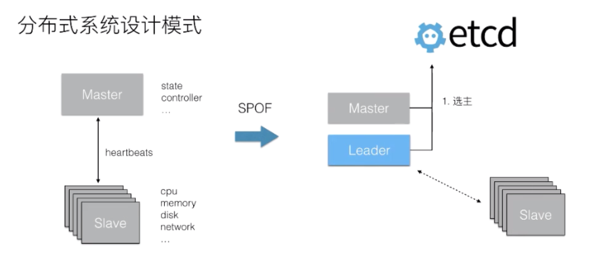

## etcd：

[TOC]


### 起源：

> CoreOs 公司， 解决集群管理系统中 OS 升级的分布式并发控制（分布式信号量）以及配置文件的存储与分发等问题

<mark> etcd 被设计为提供高可用、强一致的小型 keyvalue 数据存储服务。 </mark>

#### 发展历史：

> 2013 年 6 月份由 CoreOS 公司向 GitHub 中提交了第一个版本的初始代码。

>  2014 年的 6 月 Kubernetes v0.4 版本中，它使用了 etcd 0.2 版本作为实验核心元数据的存储服务，自此 etcd 社区得到了飞速的发展。

> 2015 年 2 月份，etcd 发布了第一个正式的稳定版本 2.0。在 2.0 版本中，etcd 重新设计了 Raft 一致性算法，并为用户提供了一个简单的树形数据视图，
>
> 在 2.0 版本中 etcd 支持每秒超过 1000 次的写入性能，满足了当时绝大多数的应用场景需求。2.0 版本发布之后，经过不断的迭代与改进，其原有的数据存储方案逐渐成为了新时期的性能瓶颈，之后 etcd 启动了 v3 版本的方案设计。。

> 2017 年 1 月份的时候，etcd 发布了 3.1 版本，v3 版本方案基本上标志着 etcd 技术上全面成熟。在 v3 版本中 etcd 提供了一套全新的 API，重新实现了更高效的一致性读取方法，
>
> 并且提供了一个 gRPC 的 proxy 用于扩展 etcd 的读取性能。同时，在 v3 版本的方案中包含了大量的 GC 优化，在性能优化方面取得了长足的进步，在该版本中 etcd 可以支持每秒超过 10000 次的写入。。

> 2019 年，etcd 即将发布全新的 3.4 版本，该版本由 Google、Alibaba 等公司联合打造，将进一步改进 etcd 的性能及稳定性，以满足在超大型公司使用中苛刻的场景要求。


### CAP ：


### etcd基本特点：

* 主写从读，通过raft算法同步数据，达成数据一致性
* etcd默认数据一更新就落盘持久化，数据持久化存储使用WAL (write ahead log，预写式日志)格式。WAL记录了数据变化的全过程，在etcd中所有数据在提交之前都要先写人WAL中。etcd的Snapshot (快照)文件则存储了某一时刻etcd的所有数据，默认设置为每10000条记录做一次快照，经过快照后WAL文件即可删除。


### 基本API：

增删改查和redis命令基本一样

不同点：

> 1. 根据指定版本 get , watch 
> 2. 根据前缀匹配 get ，watch 
> 3. 定义范围匹配 get ,watch 
> 4. Watch 多个key
>
> 

* get 可支持 --prefix 前缀获取

  * 全局自增版本号
  * 单key自增版本号
    * update 全局版本戳
    * create 全局版本戳

  ```json
  etcdctl  get  /ao/q  -w json | jq .
  {
    "header": {
      "cluster_id": 14841639068965180000,
      "member_id": 10276657743932975000,
      "revision": 12, // 全局自增版本号
      "raft_term": 9  // 那个朝代
    },
    "kvs": [
      {
        "key": "L2FvL3E=",
        "create_revision": 12,  //创建时对应的全局版本号
        "mod_revision": 12,  // 最新修改对应的全局版本号
        "version": 1, // 针对单个key的版本号
        "value": "MQ=="
      }
    ],
    "count": 1
  }
  ```

  

* get 范围匹配示例：

  ```sql
  $ etcdctl get foo foo3
  foo
  bar
  foo1
  bar1
  foo2
  bar2
  ```

* Get 指定版本

  ```sql
  $ etcdctl get --prefix --rev=4 foo # 访问修订版本为 4 时的键的版本
  foo
  bar_new
  foo1
  bar1
  ```

#### lease 租约：


* 创建一个lease

  ```
  etcdctl lease grant 100
  
  lease 694d7a5c968b5d09 granted with TTL(100s)
  ```

* 把 key 绑定到这个lease上

  ```
  etcdctl put k1 v1  --lease=694d7a5c968b5d05
  ```

* 保持心跳

  ```
  lease keep-alive  694d78e3bc12d134
  
  lease 694d78e3bc12d134 keepalived with TTL(30)
  lease 694d78e3bc12d134 keepalived with TTL(30)
  lease 694d78e3bc12d134 keepalived with TTL(30)
  ```

* 查询租期

  ```
  lease timetolive 694d78e3bc12d137
  
  lease 694d78e3bc12d137 granted with TTL(300s), remaining(271s)
  ```

* 查询租期以及关联的key

  ```
  lease timetolive 694d78e3bc12d137 --keys
  
  lease 694d78e3bc12d137 granted with TTL(300s), remaining(261s), attached keys([/home/wohu/key1])
  ```


### 数据版本机制：

> Term : 
>
> 朝代，代表的是整个集群 Leader 的任期。当集群发生 Leader 切换，term 的值就会 +1。在节点故障，或者 Leader 节点网络出现问题，再或者是将整个集群停止后再次拉起，都会发生 Leader 的切换。

>  Revision :
>
> 代表的是全局数据的版本。当数据发生变更，包括创建、修改、删除，其 revision 对应的都会 +1。特别的，在集群中跨 Leader 任期之间，revision 都会保持全局单调递增。正是 revision 的这一特性，使得集群中任意一次的修改都对应着一个唯一的 revision，因此我们可以通过 revision 来支持数据的 MVCC，也可以支持数据的 Watch。


### Key存储的数据结构：


> etcd 将每一次修改都记录了下来
>
> 使用 watch 订阅数据时，可以支持从任意历史时刻（指定 revision）开始创建一个 watcher，在客户端与 etcd 之间建立一个数据管道，etcd 会推送从指定 revision 开始的所有数据变更。etcd 提供的 watch 机制保证，该 Key 的数据后续的被修改之后，通过这个数据管道即时的推送给客户端。
>
> etcd 中所有的数据都存储在一个 b+tree 中（灰色），该 b+tree 保存在磁盘中，并通过 mmap 的方式映射到内存用来支持快速的访问。灰色的 b+tree 中维护着 revision 到 value 的映射关系，支持通过 revision 查询对应的数据。因为 revision 是单调递增的，当我们通过 watch 来订阅指定 revision 之后的数据时，仅需要订阅该 b+ tree 的数据变化即可。


## 应用场景：

### 分布式选主:

<mark>已完成</mark>

> 可以看到，每个节点都创建了自己的key（同时生成了一个keep alive 的lease），但是这些key的前缀是一致的，选主是根据前缀去选主的。
>
> 如果有a，b，c三个节点同时去竞选，分别对应竞选的createRevision是0，1，2，那么每个节点会watch比自己createRevision小并且最大的节点，这是个循环的过程，等到所有比自己createRevision小的节点都被删除后，自己才成为leader。
>
> 对应的，a节点会成为leader，b节点在watch a节点，c节点在watch b节点。如果b节点key被删除了，c节点会去watch a节点。
>
> 如果a节点key被删除了，b节点会成为leader。




### 分布式锁（值为1的分布式信号量）：

<mark>已完成</mark>

* 抢到锁快速返回，未抢到锁则等待；

> 每个 mutex 会创建一个租约 lease，并且租约是长期有效的
> 使用 prefix/leaseId 作为 key 向 etcd 插入数据
> WithFirstCreate 获取owner ， 查看owner是否是自己，如果是自己
> 如果 mutex 发现自己的 prefix/leaseId 的 CreateRevision 是这些 prefix 下所有 key 中最小的，那么当前 mutex 获得锁


### 其他：

* 分布式信号量
* 存储进程的执行状态
* 服务发现
* 负载均衡


##  模块划分：

>* 网络层： 
>
> 提供网络数据读写功能，监听服务端口，完成集群节点间的通信


> * Raft 协议：
>
>   通过复制日志文件的方式来保证数据的强一致性，当我们写入一个key时，主要是写到leader节点，然后通过raft协议，复制到其他节点中，


> * 持久化
>
>   默认请求一进来就进行落盘持久化，持久化利用的是wal，write ahead log，预写式日志，wal记录了数据变化的全过程。etcd的快照则保存了某一时刻etcd的所有数据，默认为一万条数据做一次快照。


## V3 & v2

* 增加 lease机制 和 mini 事务

> 通信方式优化：
>
> 改为grpc通信，基于http/2的TCP连接多路复用。一个Client的不同watch可以共享同一个TCP连接。

> 区间watch与线段树：
>
> watch请求可以关注一个key (单key)，或者一个key前缀(区间)，所以watchGroup包含两种Watcher:一种是key Watchers，数据结构是每个key对应一组Watcher，另外一种是range Watchers，数据结构是一个线段树，可以方便地通过区间查找到对应的Watcher。

>数据模型发生了较大变化：
>
>etcd v2数据不直接落盘，落盘的是日志和快照文件，这些只是数据的中间格式而非最终形式，统通过回放日志文件来构建数据的最终形态。
>
>v3则是支持事务和多版本并发控制的磁盘数据库，落盘的是数据的最终形态，日志和快照的主要作用是进行分布式的复制。


## etcd store 数据模型：

1. key -> keyIndex 

   > 由key通过B+tree 找到 keyIndex 结构体
   >
   > keyIndex ： 存放了这个key的每一个生命周期的变动的索引号
   >
   > 使用的是： github.com/google/btree来在内存中存储btree索引信息

2. keyIndex -> 具体的kv值

   > keyIndex : 内含key的多个版本id

#### lease ：

1. lease 一张表 

   > <Lease ID，序列化后的Lease数据包括TTL、ID>

2. kv 绑定 lease

   > 键值已经存放到另外的Bucket里了，写入数据的时候也会将这些键值绑定的Lease ID写入，这样在恢复数据的时候就可以将键值与Lease ID绑定的关系写入内存中


参考文章：

> https://zhuanlan.zhihu.com/p/87014600
>
> https://www.codedump.info/post/20210515-raft/


