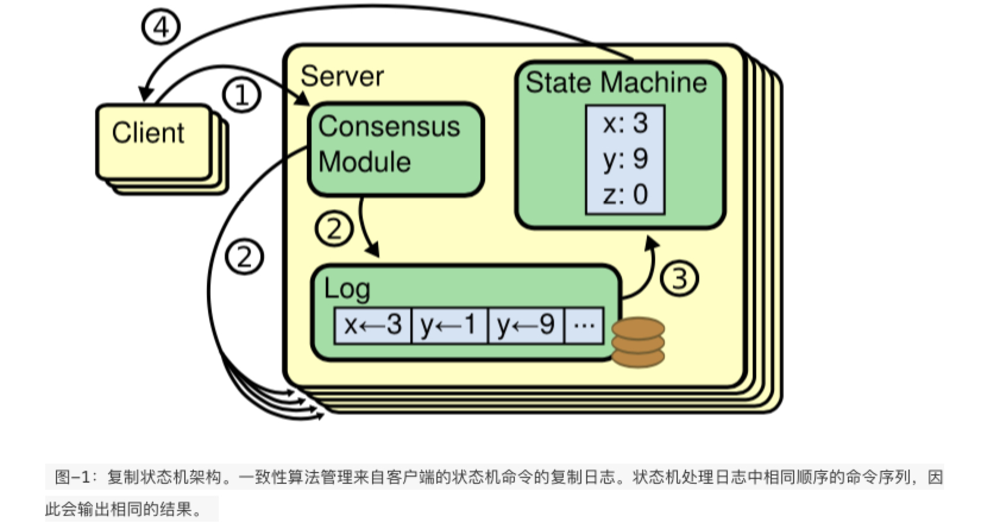

## 复制状态机：

> 一个状态机开始于给定的开始状态。每个收到的输入都通过过渡方程和输出方程来产生一个新的状态以及相应的输出。这个新的状态会一直保持到下一个输入到达，产生的输出会传递给相应的接收者。
>
> <mark>分布式服务中要求状态机具有确定性：同一状态机的多个副本以“开始”状态开始，并且以相同顺序接收相同输入将到达已生成相同输出的相同状态。这也就是复制状态机的理解。</mark>

