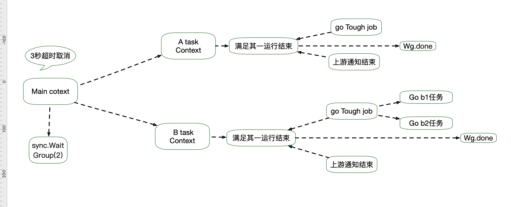

## Context 

##### 背景 ： 

> goroutine 的运行过程中需要进行控制 ，比如 定时结束，接受信号结束，存储一些关键信息啥的。 通俗来熟就是gorutine的一个管家。 
>
> context 是一个接口，功能： ------> 可以把他理解为 ： 老式的诺基亚手机   
>
> 1. 闹钟⏰功能： 延时和定时结束 具有设置定期结束协程 将手机号交给一个定时器，定时器到时候会给你打电话；
>
> 2. 通信功能：仅限于通信（收到消息和未收到消息的区别），别人通知你，你可以通知你的下游；
>
>    只要有别人的手机号（cancle 接口），

### 应用：



* 代码---> 同级文件


### 初识： 

```go
type Context interface {
    Deadline() (deadline time.Time, ok bool)

    Done() <-chan struct{}
  
    // 返回取消的错误原因，因为什么Context被取消。
    Err() error

    Value(key interface{}) interface{}
}
```

* `Deadline`

  方法是获取设置的截止时间的意思，第一个返回式是截止时间，到了这个时间点，Context会自动发起取消请求；第二个返回值ok==false时表示没有设置截止时间，如果需要取消的话，需要调用取消函数进行取消。

* `Value`

  获取该Context上绑定的值，是一个键值对，所以要通过一个Key才可以获取对应的值，这个值一般是线程安全的。

* `Done`

  Context取消的时候，我们就可以得到一个关闭的chan，关闭的chan是可以读取的，所以只要可以读取的时候，就意味着收到Context取消的信号了

##### 定义一个能力： 放弃当前的操作而无需等待工作停止

* 在第一次调用之后，对这个能力的后续使用不会执行任何操作；（也就是说只允许执行一次）

```golang
type CancelFunc func()
```


#####` emptyCtx`实现Context接口的方法，可以看到，这些方法什么都没做，返回的都是nil或者零值。


### Context的继承衍生

```go
//只具有取消的功能 ； 
func WithCancel(parent Context) (ctx Context, cancel CancelFunc)
//在指定的时间会自动调用 取消函数 ；  也可以在到期之前进行取消 ； 
func WithDeadline(parent Context, deadline time.Time) (Context, CancelFunc)
//在此之后延期 n s 后进行取消  ； 也可以到期之前进行取消 ； 
func WithTimeout(parent Context, timeout time.Duration) (Context, CancelFunc)

func WithValue(parent Context, key, val interface{}) Context
```

> 接收的都有一个partent参数，就是父Context，我们要基于这个父Context创建出子Context的意思，这种方式可以理解为子Context对父Context的继承，也可以理解为基于父Context的衍生。

##### Context 使用原则

1. 不要把Context放在结构体中，要以参数的方式传递
2. 以Context作为参数的函数方法，应该把Context作为第一个参数，放在第一位。
3. 给一个函数方法传递Context的时候，不要传递nil，如果不知道传递什么，就使用context.TODO
4. Context的Value相关方法应该传递必须的数据，不要什么数据都使用这个传递
5. Context是线程安全的，可以放心的在多个goroutine中传递


## Context 的源码设计


#####最上层的`空的context节点`

```go
type emptyCtx int

func (*emptyCtx) Deadline() (deadline time.Time, ok bool) {
   return
}

func (*emptyCtx) Done() <-chan struct{} {
   return nil
}

func (*emptyCtx) Err() error {
   return nil
}

func (*emptyCtx) Value(key interface{}) interface{} {
   return nil
}
```


##### 基于emptyCtx创建一个控制合理退出的上下文

```go
// A cancelCtx can be canceled. When canceled, it also cancels any children
// that implement canceler.
type cancelCtx struct {
   Context

   mu       sync.Mutex            // protects following fields
   done     chan struct{}         // created lazily, closed by first cancel call
   children map[canceler]struct{} // 连接所有的可以直接取消的子节点context；
   err      error                 // create the error  when by the first cancel call
}
```

* 可以直接取消的context 需要实现的接口： 

  ```go
  // A canceler is a context type that can be canceled directly. The
  // implementations are *cancelCtx and *timerCtx.
  type canceler interface {
     cancel(removeFromParent bool, err error)
     Done() <-chan struct{}
  }
  ```

  ```go
  func (c *cancelCtx) Done() <-chan struct{} {
     c.mu.Lock()
     if c.done == nil {
        c.done = make(chan struct{})
     }
     d := c.done
     c.mu.Unlock()
     return d
  }
  ```

* *cancel closes c.done, cancels each of c's children, and, if removeFromParent is true, removes c from its parent's children.*

  >func (c *cancelCtx) cancel(removeFromParent bool, err error) 

  * 找到父节点

    ```go
    // parentCancelCtx follows a chain of parent references until it finds a
    // *cancelCtx. This function understands how each of the concrete types in this
    // package represents its parent.
    func parentCancelCtx(parent Context) (*cancelCtx, bool) {
       for {
          switch c := parent.(type) {
          case *cancelCtx:
             return c, true
          case *timerCtx: // 他本身就是一个可以取消的 上下文 ；
             return &c.cancelCtx, true
          case *valueCtx:
             parent = c.Context
          default:
             return nil, false
          }
       }
    }
    ```


##### 建立和父节点之间的关联关系：

* 父节点取消的时候能够找到子节点同时进行取消；
* 如果不是取消型的父节点，设置一个goroutine专门监控goroutine的取消；

* ```go
  
  // propagateCancel arranges for child to be canceled when parent is.
  func propagateCancel(parent Context, child canceler) {
     //如果是一个不具有取消特性的context ，直接返回不用建立树形关系；
     if parent.Done() == nil {
        return // parent is never canceled
     }
      ---找到一个可取消的 父节点  context ； ---
     if p, ok := parentCancelCtx(parent); ok {
        p.mu.Lock()
        if p.err != nil {
           // parent has already been canceled
           child.cancel(false, p.err)
        } else {
           if p.children == nil {
              p.children = make(map[canceler]struct{})
           }
           p.children[child] = struct{}{}
        }
        p.mu.Unlock()
     } else {
       // 如果 找不到可以取消的父节点；监控这个父节点，一旦父节点取消，这个点下面都会取消。
        go func() {
           select {
           case <-parent.Done():
              child.cancel(false, parent.Err())
           case <-child.Done():
           }
        }()
     }
  }
  ```


##### 生成一个 deadline context 

```go

func WithDeadline(parent Context, d time.Time) (Context, CancelFunc) {
  
  
  --- 如果父节点 设置了定时关闭 ，并且 关闭在这个子节点设置的关闭时间之前的话，这样直接设置为一个可以取消的节点就ok了---
  --- 到时候父节点取消会通知子节点；---
  
  
  
	if cur, ok := parent.Deadline(); ok && cur.Before(d) {
		// The current deadline is already sooner than the new one.
		return WithCancel(parent)
	}
  
  
  
  
  
	c := &timerCtx{
		cancelCtx: newCancelCtx(parent),
		deadline:  d,
	}
  
  --- 将子节点和父节点进行关联 ---
	propagateCancel(parent, c)
	dur := time.Until(d)
	if dur <= 0 {
		c.cancel(true, DeadlineExceeded) // deadline has already passed
		return c, func() { c.cancel(false, Canceled) }
	}
	c.mu.Lock()
	defer c.mu.Unlock()
  
  
  --- 设置goroutine 进行监控取消 --- 
	if c.err == nil {
		c.timer = time.AfterFunc(dur, func() {
			c.cancel(true, DeadlineExceeded)
		})
	}
	return c, func() { c.cancel(true, Canceled) }
}
```


