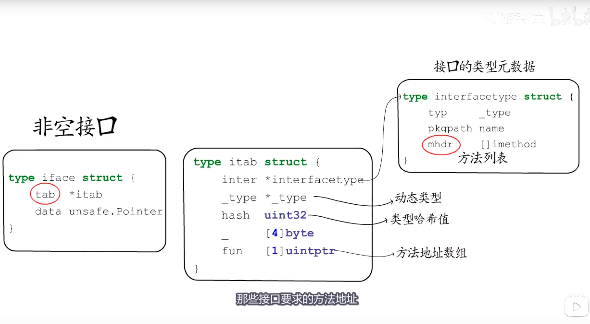
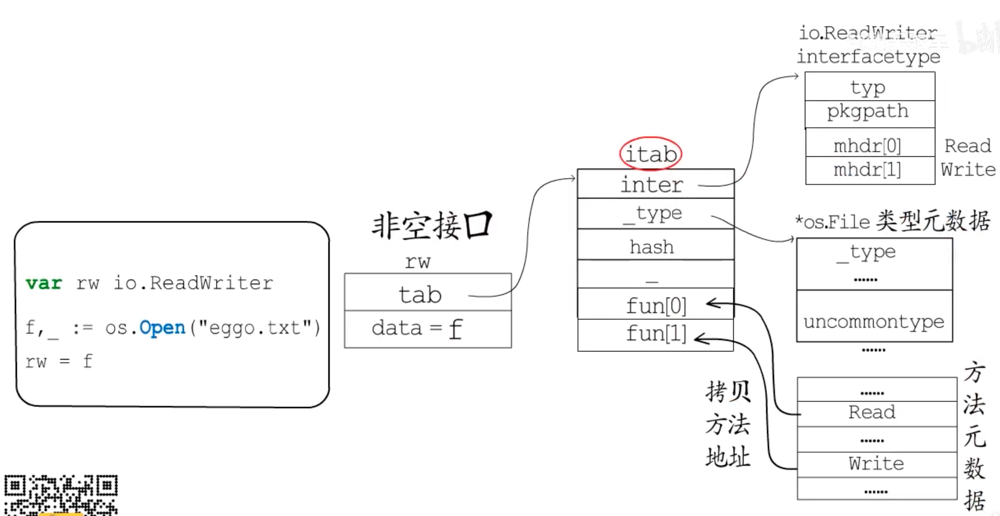
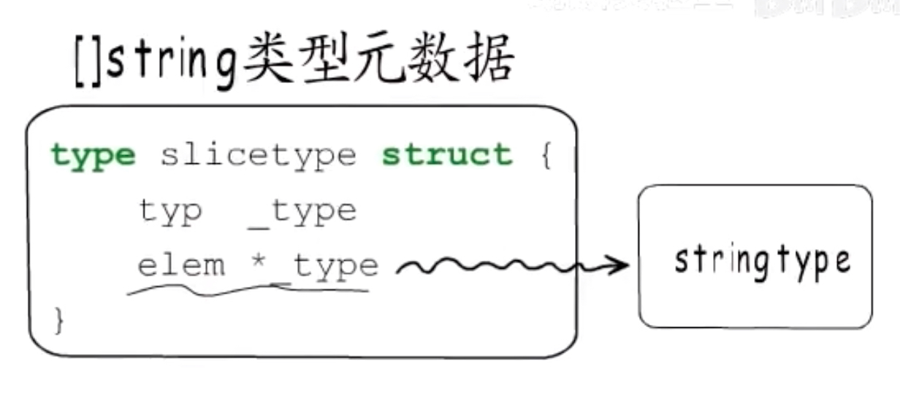
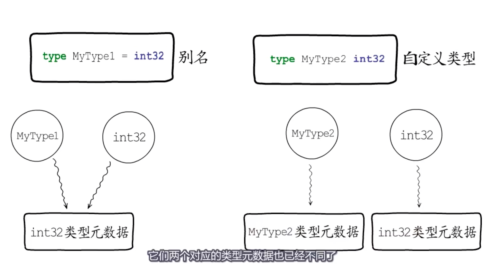

# 数据结构：

[文章](https://draveness.me/golang/docs/part2-foundation/ch04-basic/golang-interface/)

>不包含任何方法的接口类型 ： runtime.eface 
>
>包含方法的接口类型： runtime.iface 

###  空接口:

> 任意类型都可以转换成 `interface{}`

```go
type eface struct { // 16 字节
	_type *_type                     // 指向底层数据类型的指针
	data  unsafe.Pointer             // 指向底层数据的指针
}

type _type struct {
	size       uintptr      字段存储了类型占用的内存空间，为内存空间的分配提供信息；
	ptrdata    uintptr      
	hash       uint32       字段能够帮助我们快速确定类型是否相等
	tflag      tflag
	align      uint8
	fieldAlign uint8
	kind       uint8
	equal      func(unsafe.Pointer, unsafe.Pointer) bool  字段用于判断当前类型的多个对象是否相等
	gcdata     *byte
	str        nameOff
	ptrToThis  typeOff
}
```


### 含有方法的接口：

> 每一个 [`runtime.itab`](https://draveness.me/golang/tree/runtime.itab) 都占 32 字节，我们可以将其看成接口类型和具体类型的组合，它们分别用 `inter` 和 `_type` 两个字段表示
>
> 1. interfaceType
> 2. 对象类型

```go

type iface struct { // 16 字节
	tab  *itab
	data unsafe.Pointer
}


type itab struct { // 32 字节
	inter *interfacetype      接口类型
	_type *_type              对象类型
	hash  uint32              用于快速判断类型是否相等
	_     [4]byte
	fun   [1]uintptr          对象实现的方法的起始地址
}
```



##### 示例：




* golang 会将itab 结构体缓存起来，以<接口类型，动态对象类型>为key，value 为 动态对象指针； 


# 接口类型是如何初始化和传递的?：

```go

type Duck interface {
	Quack()
}

type Cat struct {
	Name string
}

func (c *Cat) Quack() {
	println(c.Name + " meow")
}
func main() {
	var c Duck = &Cat{Name: "draven"}
	c.Quack()
}
```

 

## 指针类型：

##### 这句代码执行了什么了呢？ var c Duck = &Cat{Name: "draven"}

1. 结构体 `Cat` 的初始化；

   >* 获取 结构体类型的指针 放到栈中
   >* 底层创建一个结构体 ，然后把指针放到栈上： 调用 [`runtime.newobject`](https://draveness.me/golang/tree/runtime.newobject) 函数，这个函数会以 `Cat` 结构体类型指针作为入参，分配一片新的内存空间并将指向这片内存空间的指针返回到 SP+8 上
   >* SP+8 现在存储了一个指向 `Cat` 结构体的指针，我们将栈上的指针拷贝到寄存器 `DI` 上方便操作；
   >* 由于 `Cat` 中只包含一个字符串类型的 `Name` 变量，所以在这里会分别将字符串地址 `&"draven"` 和字符串长度 6 设置到结构体上，最后三行汇编指令等价于 `cat.Name = "draven"`；

2. 赋值触发的类型转换过程；

   > `Duck` 作为一个包含方法的接口，它在底层使用 [`runtime.iface`](https://draveness.me/golang/tree/runtime.iface) 结构体表示。[`runtime.iface`](https://draveness.me/golang/tree/runtime.iface) 结构体包含两个字段，
   >
   > 其中一个是指向数据的指针，
   >
   > 另一个是表示接口和结构体关系的 `tab` 字段，
   >
   > 我们已经通过上一段代码 SP+8 初始化了 `Cat` 结构体指针，这段代码只是将<mark>编译期间生成的 [`runtime.itab`](https://draveness.me/golang/tree/runtime.itab) 结构体</mark>指针复制到 SP 上

3. 调用接口的方法 `Quack()`；

   > 到这里，我们会发现 SP ~ SP+16 共同组成了 [`runtime.iface`](https://draveness.me/golang/tree/runtime.iface) 结构体，而栈上的这个 [`runtime.iface`](https://draveness.me/golang/tree/runtime.iface) 也是 `Quack` 方法的第一个入参


##### **var c Duck = Cat{Name: "draven"} 执行了什么？**

* 在栈上初始化结构体
* 在栈上生成 interface 结构体时 ，引用的数据的指针是在堆上新建的一个指针；


###### common 部分：

* 类型名称
* 类型大小 
* 对齐边界
* 是否自定义




###### UnCommonType :只有自定义的类型有，通过这个可以找到定义的方法元数据。





