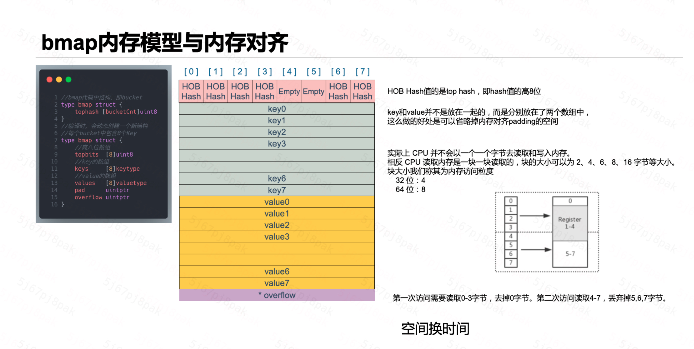

# Map

```go
type hmap struct {
	count     int   //
	flags     uint8
	B         uint8
	noverflow uint16
	hash0     uint32

	buckets    unsafe.Pointer
	oldbuckets unsafe.Pointer
	nevacuate  uintptr

	extra *mapextra
}

type mapextra struct {
	overflow    *[]*bmap
	oldoverflow *[]*bmap
	nextOverflow *bmap
}
```


## 数据结构：

Hmap  -> bmap -> overflow -> bmap

## 渐进式扩容触发：

1. 元素个数 >= 桶个数 * 6.5
2. overflow 的桶太多

修改数据时进行逐步迁移，在被动rehash的基础上，还会维护一个rehash进度，对整体未进行rehash的key进行遍历rehash


## 无缩容


## bitmap：内存对齐




