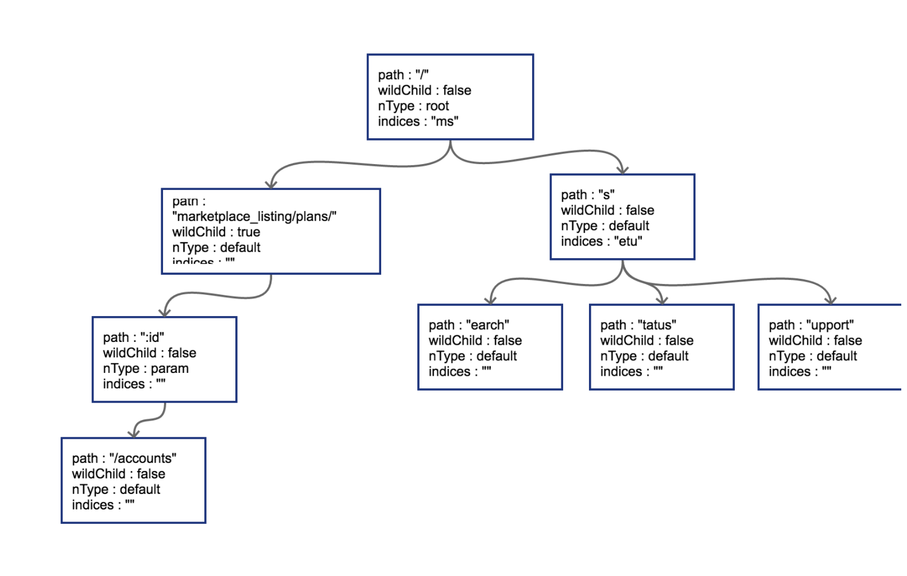

##Router

> 在大型的项目中进行路由的时候，进行路由的规则很多的时候，较流行的开源go Web框架大多使用httprouter，或是基于httprouter的变种对路由进行支持。前面提到的github的参数式路由在httprouter中都是可以支持的。目前开源界最为流行（star数最多）的Web框架[gin](https://github.com/gin-gonic/gin)使用的就是httprouter的变种


### 路由的原理

* 字典树🌲 

  + node 节点

    ```makefile
    path: 当前节点对应的路径中的字符串
    
    wildChild: 子节点是否为参数节点，即 wildcard node，或者说 :id 这种类型的节点
    
    nType: 当前节点类型，有四个枚举值: 分别为 static/root/param/catchAll。
        static                   // 非根节点的普通字符串节点
        root                     // 根节点
        param                    // 参数节点，例如 :id
        catchAll                 // 通配符节点，例如 *anyway
    
    indices：子节点索引，当子节点为非参数类型，即本节点的wildChild为false时，会将每个子节点的首字母放在该索引数组。说是数组，实际上是个string。
    ```

  + 原型

    

