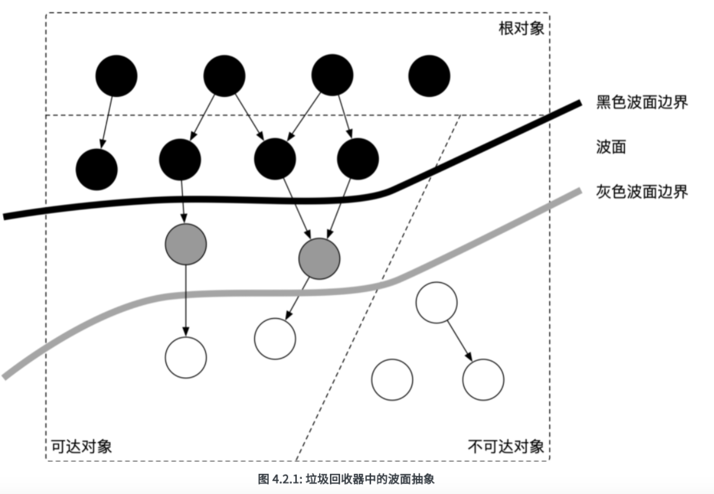
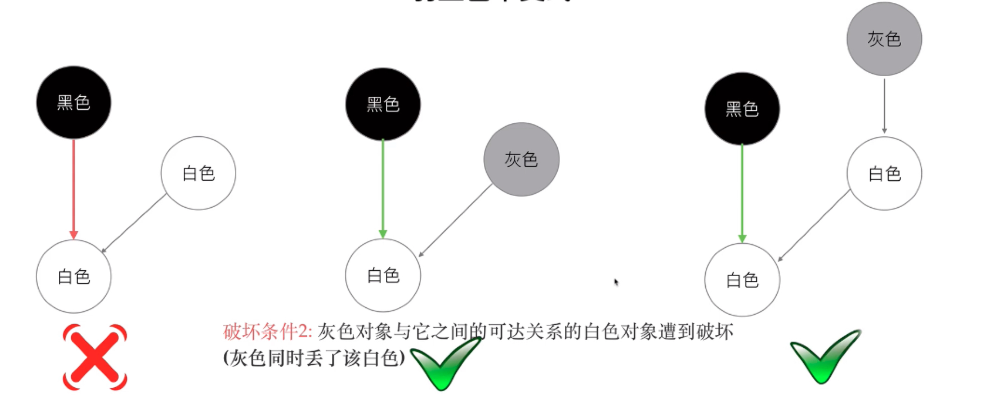
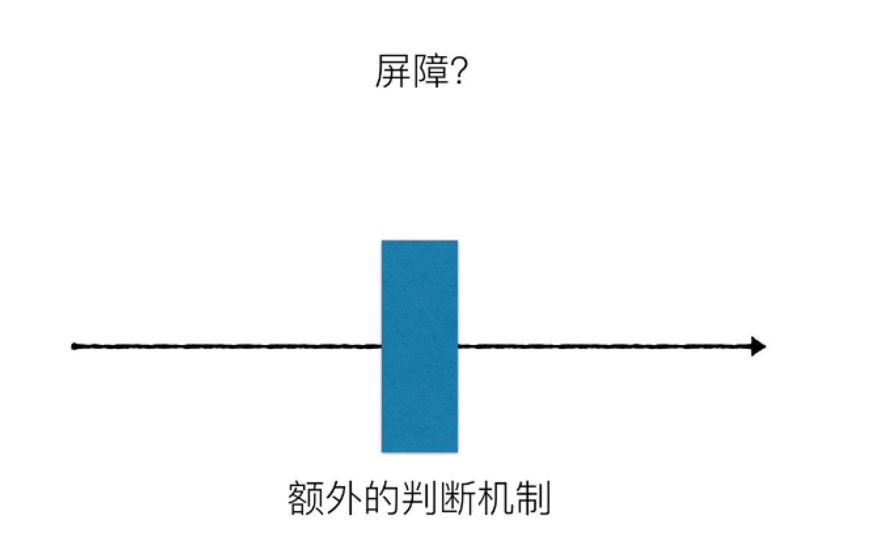
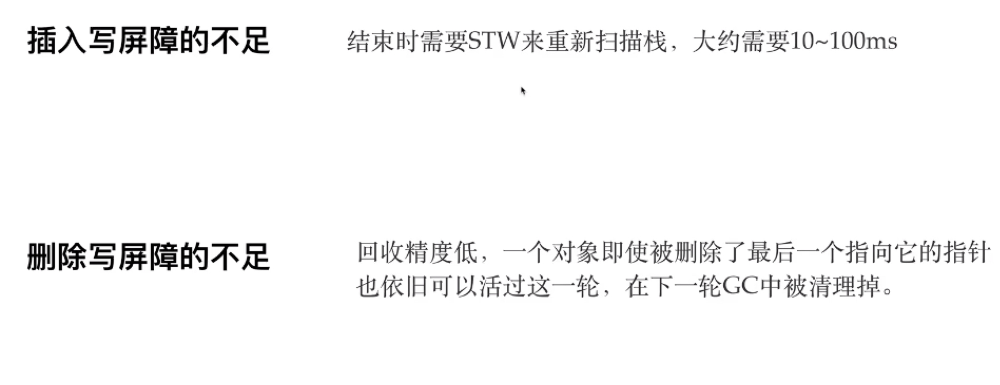

# 

* 可达性 扫描
* 三色标记法
* 强弱三色定理 引出两种屏障
* 混合写屏障
* 并发增量式扫描

## golang gc

> Version 1 : 1.3 , 标记清除法。
>
> Version 2 : 1.5  三色标记法 + 堆空间启动 写屏障 ，栈空间不启动，需要重新扫描一次栈（stw) 
>
> Version 3 : 1.8 三色标记法 + 混合写屏障机制 ，栈空间不启动屏障，整体过程基本不需要stw，效率较高


## 先说GC

### 1. 追踪式GC：

* #### 标记清除法： 

  ##### Mark-sweep 

  ```
  第一步： 从根对象触发标记所有可以触达的对象，mark为存活对象
  第二步： 遍历堆中的所有对象，将未被标记的用一个链表串起来
  ```

  ##### 面临的问题： 

  * stop the world 的时间太长	

* #### 标记整理法

  和标记清除法的区别点是：将标记好的对象整理到另外一块新的内存上去

* #### 分代式

  我们每一次GC不一定全量扫，可能只是扫一部分就好；

  做事原则：

  如果一个对象存活时间很短则不容易被回收，存活时间越长则越不容易回收

* #### 增量式：

  * 将标记与清扫的过程分批执行，每次执行很小的部分，从而增量的推进垃圾回收，达到近似实时、几乎无停顿的目的。
  

### 引用计数

根据对象自身的引用计数来回收，当引用计数归零时立即回收。存在循环引用的问题


​	

## 并发GC进度条-三色法标记法

```
这样三种不变性所定义的回收过程其实是一个 波面（Wavefront） 不断前进的过程， 这个波面同时也是黑色对象和白色对象的边界，灰色对象就是这个波面。

其实本质就是一个垃圾回收的进度条。
```




### 引起对象误删除：

* 黑色对象引用了一个白色对象
* 并且白色对象上方没有灰色保护伞


### 如何确保对象不会被误删除呢？

##### 强三色不变式

* 强制性的不允许黑色对象引用白色对象 

##### 弱三色不变式

* 基础： GC开始后： 所有的新生对象均为黑色
* 允许黑色对象可以引用白色对象
* 但是确保白色对象存在其他灰色对象对它的引用，或者他的上游存在灰色对象；
* 所以要避免切断白色对象与保护伞的关联




## 屏障：

> 所谓的屏障，就是多加一层操作



### 插入屏障：

```
当黑色对象A 引用一个对象B的时候，不管B的上游是咋样的，都强制将B置为灰色；
```

* 插入屏障确保了三色不变性，但是为了保证栈的运行速度，所以对栈上元素不进行增加插入屏障
* 扫描完堆上会进行重新进行扫描栈，此时进行stw，此时需要stw 10ms - 100ms 


### 删除屏障：

<mark>关键点</mark>：避免切断白色节点上边的灰色路线

```
如果删除的对象本身为黑色和灰色，不变，如果为白色，则变为灰色。
```

##### 缺点：

* 回收精度低，所有删除的对象即使没有指向他的引用，也会保护一轮不被删除；




### 混合写屏障： 

* 栈上实现删除写屏障
* 堆上开启插入写屏障

### 为什么要进行stw？

用户程序和回收器会同时使用到写屏障记录集，所以还要考虑用户程序和垃圾回收程序之间的竞争问题，如果没有stw的时间，那么垃圾回收开始的消息便很难及时通知到每个线程，可能导致某些线程开启写屏障的时间有所延迟而发生错误。


每个P都对应一个GC mark worker,marker worker 创建后很快陷入休眠，等待到标记阶段得到调度执行；

* 第一次STW， GC进入 _GCMark 阶段，

  全局变量 

  gcphrase = _GCMark     ： gc的状态为gc标记状态

  writeBarrier.enabled = true   ： 写屏障开启

  gcBlackedEnabled = 1  ： 用于标识是否允许进行GC标记工作

  在STW的情况下开启写屏障，所有的P都知道写屏障已经开启，

* 在标记工作标记完成后：

  gcphrase = _GCMarkTermination 

  gcBlackedEnabled = 0 ： 不在进行GC标记工作

* 进入 

  gcphrase = _GCOff

  writeBarrier.enabled = false   ： 关闭写屏障 

  

  

  


## GC的触发方式

1. 手动触发
2. Mallocgc ： 每次GC后都会设置下一次触发GC的内存分配量
3. Sysmon  runtime.forcegchelper 协程 ，会判断时间隔一段时间进行强制gc


## GO-GC-特点：

* 无分代（对象没有代际之分）、

* 不整理（回收过程中不对对象进行移动与整理）、

* 并发（与用户代码并发执行）的三色标记清扫算法。原因在于：

1. 对象整理的优势是解决内存碎片问题以及“允许”使用顺序内存分配器。但 Go 运行时的分配算法基于 tcmalloc，基本上没有碎片问题。 并且顺序内存分配器在多线程的场景下并不适用。Go 使用的是基于 tcmalloc 的现代内存分配算法，对对象进行整理不会带来实质性的性能提升。
2. 分代 GC 依赖分代假设，即 GC 将主要的回收目标放在新创建的对象上（存活时间短，更倾向于被回收），而非频繁检查所有对象。但 Go 的编译器会通过**逃逸分析**将大部分新生对象存储在栈上（栈直接被回收），只有那些需要长期存在的对象才会被分配到需要进行垃圾回收的堆中。也就是说，分代 GC 回收的那些存活时间短的对象在 Go 中是直接被分配到栈上，当 goroutine 死亡后栈也会被直接回收，不需要 GC 的参与，进而分代假设并没有带来直接优势。并且 Go 的垃圾回收器与用户代码并发执行，使得 STW 的时间与对象的代际、对象的 size 没有关系。Go 团队更关注于如何更好地让 GC 与用户代码并发执行（使用适当的 CPU 来执行垃圾回收），而非减少停顿时间这一单一目标上。


## 如何维持GC和new的动态平衡？

* 每个G 都会有个一个信用值， 收获和付出是成正比的；


