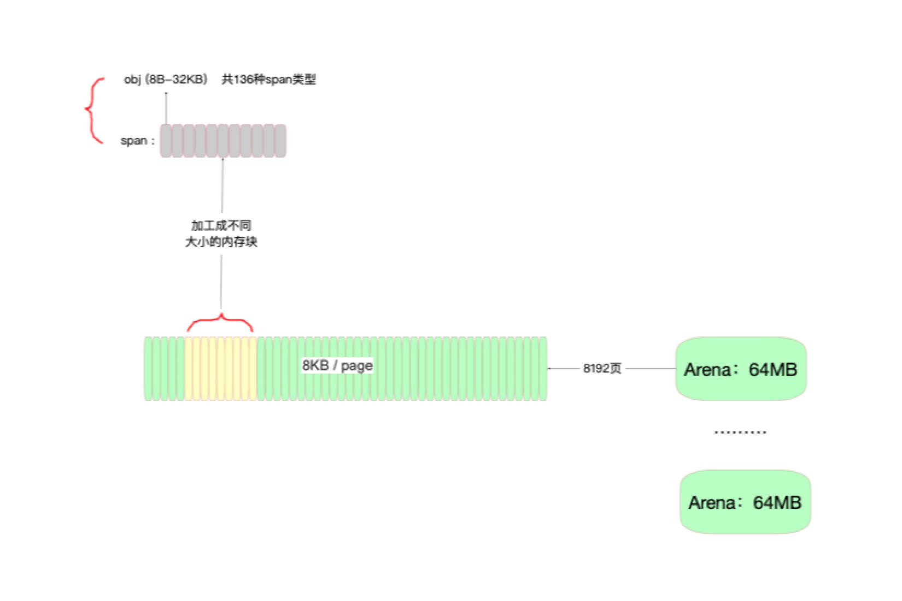
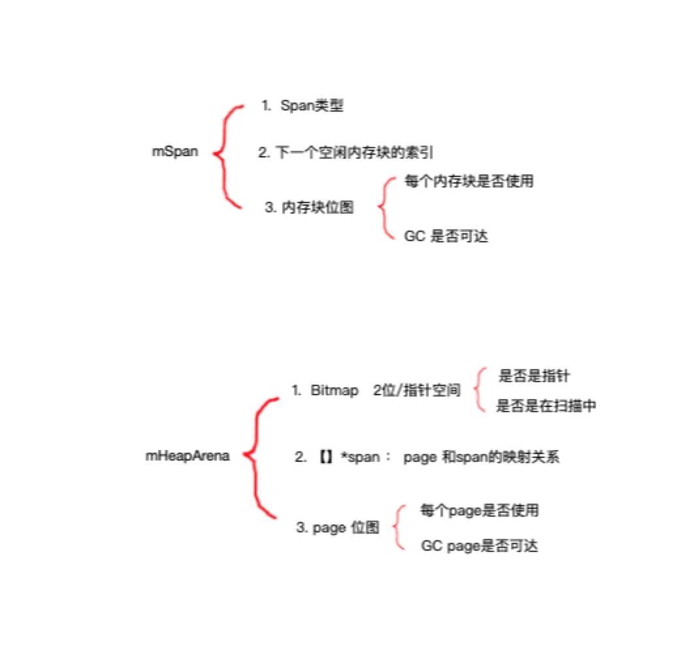
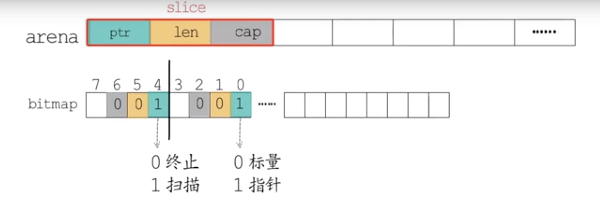
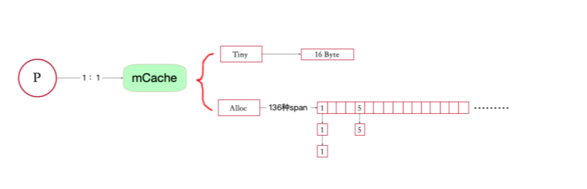
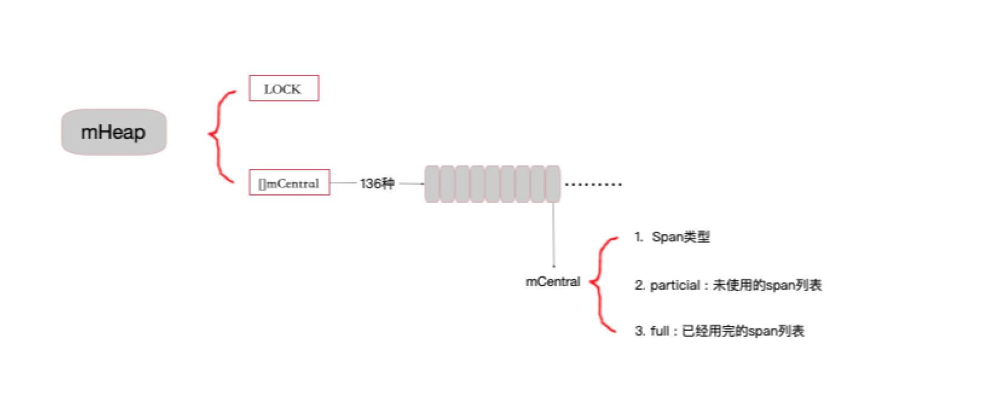
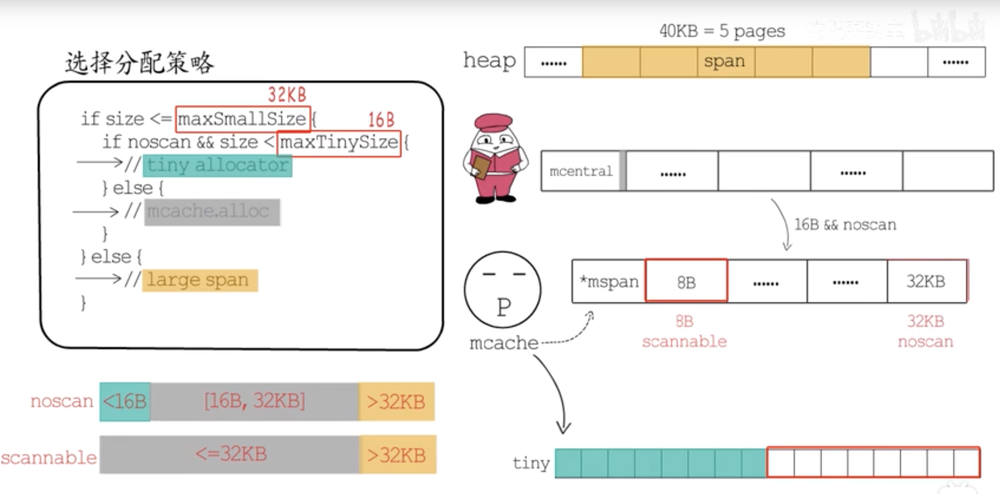
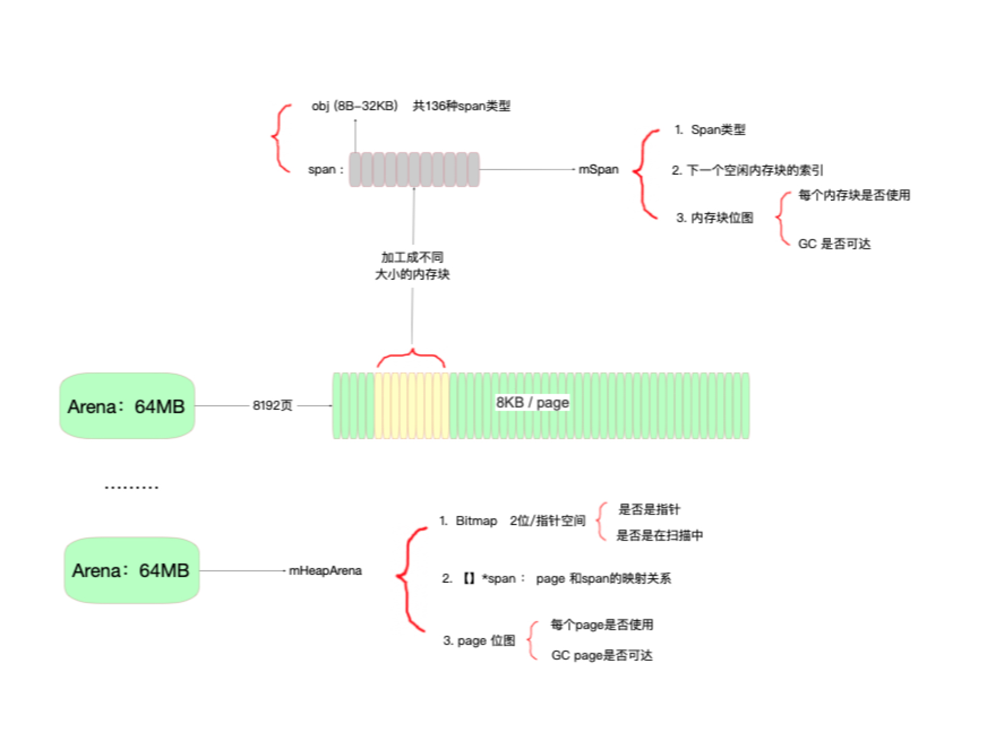
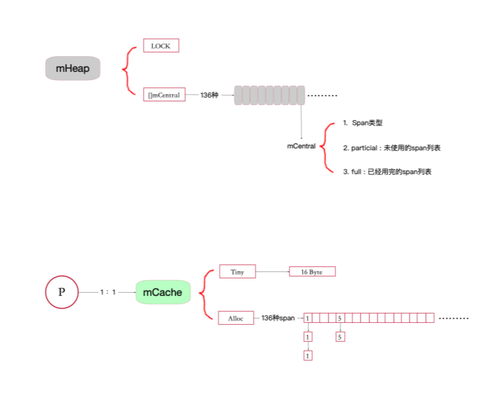

 

# golang内存管理

* 原始材料
* 分类 的核心思想
* 管理体系
* 辅助GC

## 1.基本

> 内存页，一块8KB大小的内存空间。Go与操作系统之间的内存申请和释放，都是以page为单位的。




## 2. 重要的数据结构标记管理

1. 辅助GC
2. 管理分配内存




##### page 和 span ： 

page和span相互映射，主要是标记了 哪些span已经被使用，哪些span是可达的

##### Bitmap：gc 扫描工具




* 在分配内存时，bitmap中的信息会用到元数据类型中的gcdata信息来标记这块内存是个对象还是一个指针
* 两个标记位 
  *  一个是标记是否指针
  * 一个标记一个完整的对象边界，扫描到边界后终止扫描，一个完整的对象已经扫描完成了


##### span 内存块：

>inuse标记位 =  mark标记位
>
>mark标记位  =  new()

 

## 管理分配者：

### 1. cache  

mchache在初始化时是没有任何span的，在使用过程中会动态的从central中获取并缓存下来，跟据使用情况，每种class的span个数也不相同。上图所示，class 0的span数比class1的要多，说明本线程中分配的小对象要多一些。

根据对象是否包含指针，将对象分为noscan和scan两类，其中noscan代表没有指针，而scan则代表有指针，需要GC进行扫描。mcache和span的对应关系如下图所示：




### 2. Heap.central

> cache作为线程的私有资源为单个线程服务，而central则是全局资源，为多个线程服务，当某个线程内存不足时会向central申请，当某个线程释放内存时又会回收进central。src/runtime/mcentral.go:mcentral定义了central数据结构：

```go
type mcentral struct {
    lock      mutex    // 多个P会访问，需要加锁
    spanclass spanClass  // 对应了mspan中的spanclass
    nonempty  mSpanList // 该mcentral可用的mspan列表
    empty     mSpanList // 该mcentral中已经被使用的mspan列表
}
```



### 3. 申请内存的过程：




### 总结： 





## gc相关：

* GC中判断是否是指针，如果往下探索?

  基于HeapArena 记录的元数据信息，我们只要知道一个对象的地址，就可以根据bitmap信息扫描它内部是否含有指针；

* 在哪里标记对象是否存活啊？

  根据指针得到page，然后找到span --> gcMarkBit 标记为1即为存活对象


## 标记完成后需要清扫，新添加的对象会不会误清扫？

* https://www.cnblogs.com/polaris1119/p/13435836.html
* 有点类似于redis 进行清理key


