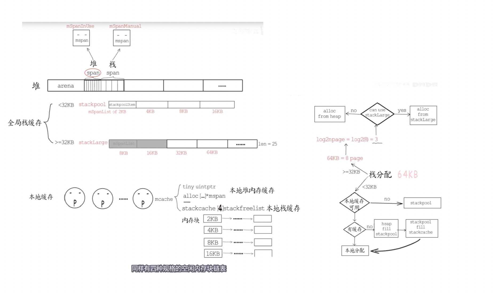
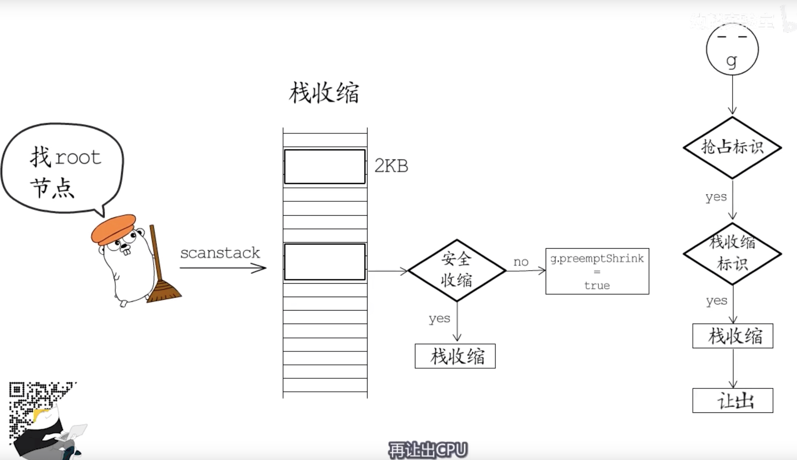
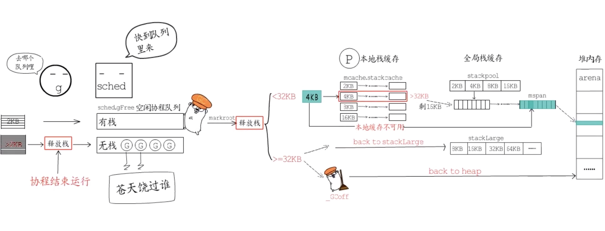

[TOC]

## 设计原理： 

栈区的重要性：

* 栈区的操作是使用到 cpu 两个以上的寄存器： 包含BP和SP两个栈寄存器，分别存储了栈的基址地址和栈顶地址，`BP和SP之间的内存就是函数的调用栈；`

#### 1. 内存逃逸

* 关键点是将变量放到堆上还是栈上区别是： 

```
堆上： 一般用于多线程共享，GC 进行回收，生命周期相对较长
栈上： 栈在快速销毁之后，内存也会被快速回收
```

一. 手动管理内存 ： c语言 ，c++ ,手动分配到栈上 或者 堆上

二. 编译器根据规则进行逃逸分析进行管理内存，原则： `分配在栈上的对象，在栈销毁后，不能存在对这个对象的引用`


#### 2. 栈空间管理

##### 发展历史： 

1. v1.0 ~ v1.1 — 最小栈内存空间为 4KB；
2. v1.2 — 将最小栈内存提升到了 8KB[7](https://draveness.me/golang/docs/part3-runtime/ch07-memory/golang-stack-management/#fn:7)；
3. v1.3 — 使用**连续栈**替换之前版本的分段栈[8](https://draveness.me/golang/docs/part3-runtime/ch07-memory/golang-stack-management/#fn:8)；
4. v1.4 — 将最小栈内存降低到了 2KB[9](https://draveness.me/golang/docs/part3-runtime/ch07-memory/golang-stack-management/#fn:9)；


##### 链表栈： 

初始化分配一段内存

* 扩增内存 (到达内存不够触发阈值的时候):

  会在全局的栈缓存链表中找到空闲的内存块并作为新 Goroutine 的栈空间返回；在其余情况下，栈内存空间会从堆上申请一块合适的内存。多个栈空间会以链表的形式串联起来，运行时会通过指针找到连续的栈片段：

* 缩减内存：

  一旦 Goroutine 申请的栈空间不在被需要，运行时会调用 [`runtime.lessstack:go1.2`](https://draveness.me/golang/tree/runtime.lessstack:go1.2) 和 [`runtime.oldstack:go1.2`](https://draveness.me/golang/tree/runtime.oldstack:go1.2) 释放不再使用的内存空间。

总结：

```
缺点：
 分段栈的内存扩缩容设计方式： 会在Goroutine 使用的内存越过了分段栈的扩缩容阈值，运行时会触发栈的扩容和缩容，带来额外的工作量；
```


##### replace栈：

1. 在内存空间中分配更大的栈内存空间；
2. 将旧栈中的所有内容复制到新栈中；
3. **将指向旧栈对应变量的指针重新指向新栈**；
4. 销毁并回收旧栈的内存空间；


## 3.基于replace栈：初始化（分配器），扩容，缩容

###### 初始化-栈内存分配器：

栈空间在运行时中包含两个重要的全局变量，分别是 [`runtime.stackpool`](https://draveness.me/golang/tree/runtime.stackpool) 和 [`runtime.stackLarge`](https://draveness.me/golang/tree/runtime.stackLarge)，这两个变量分别表示全局的栈缓存和大栈缓存，前者可以分配小于 32KB 的内存，后者用来分配大于 32KB 的栈空间：

这两个用于分配空间的全局变量都与内存管理单元 [`runtime.mspan`](https://draveness.me/golang/tree/runtime.mspan) 有关，我们可以认为 Go 语言的栈内存都是分配在堆上的，运行时初始化会调用 [`runtime.stackinit`](https://draveness.me/golang/tree/runtime.stackinit) 初始化这些全局变量

从调度器和内存分配的经验来看，如果运行时只使用全局变量来分配内存的话，势必会造成线程之间的锁竞争进而影响程序的执行效率，栈内存由于与线程关系比较密切，所以我们在每一个线程缓存 [`runtime.mcache`](https://draveness.me/golang/tree/runtime.mcache) 中都加入了栈缓存减少锁竞争影响。


###### 扩容： 

**编译器阶段设置触发检查点:**

编译器会在 [`cmd/internal/obj/x86.stacksplit`](https://draveness.me/golang/tree/cmd/internal/obj/x86.stacksplit) 中为函数调用插入 [`runtime.morestack`](https://draveness.me/golang/tree/runtime.morestack) 运行时检查，它会在几乎所有的函数调用之前检查当前 Goroutine 的栈内存是否充足，如果当前栈需要扩容，我们会保存一些栈的相关信息并调用 [`runtime.newstack`](https://draveness.me/golang/tree/runtime.newstack) 创建新的栈：


1. 在内存空间中分配更大的栈内存空间；
   1. 如果栈空间较小，使用全局栈缓存或者线程缓存上固定大小的空闲链表分配内存；
   2. 如果栈空间较大，从全局的大栈缓存 [`runtime.stackLarge`](https://draveness.me/golang/tree/runtime.stackLarge) 中获取内存空间；
   3. 如果栈空间较大并且 [`runtime.stackLarge`](https://draveness.me/golang/tree/runtime.stackLarge) 空间不足，在堆上申请一片大小足够内存空间；
2. 将旧栈中的所有内容复制到新栈中；
3. **将指向旧栈对应变量的指针重新指向新栈**；
4. 销毁并回收旧栈的内存空间；

在扩容的过程中，最重要的是调整指针的第三步，这一步能够保证指向栈的指针的正确性，因为栈中的所有变量内存都会发生变化，所以原本指向栈中变量的指针也需要调整。我们在前面提到过经过逃逸分析的 Go 语言程序的遵循以下不变性 —— **指向栈对象的指针不能存在于堆中**，所以指向栈中变量的指针只能在栈上，我们只需要调整栈中的所有变量就可以保证内存的安全了。

**图 7-46 连续栈的内存布局**


###### 缩容：

因为需要拷贝变量和调整指针，连续栈增加了栈扩容时的额外开销，但是通过合理栈缩容机制就能避免热分裂带来的性能问题[10](https://draveness.me/golang/docs/part3-runtime/ch07-memory/golang-stack-management/#fn:10)，在 GC 期间如果 Goroutine 使用了栈内存的四分之一，那就将其内存减少一半，这样在栈内存几乎充满时也只会扩容一次，不会因为函数调用频繁扩缩容。


```
go run -gcflags "-m -l"
```


## 栈分配：

* stackpool : 全局分配中心
* Stacklarge:全局大对象分配中心
* stackCache: P中本地的栈缓存




## 栈增长-runtime-gcopystack：

>1. 是通过编译器和runtime合作实现的，编译器会在函数的头部安插检查代码， 不够则调用runtime中的相关函数增长栈空间
>
>2. 栈空间是成倍增长的
>
>3. 将 g 状态置为 gcopyStack,然后进行copy到new stack，然后在继续向下执行

## 栈收缩-抢占切换：



## 栈释放-层级向上： 

* G buffer 




