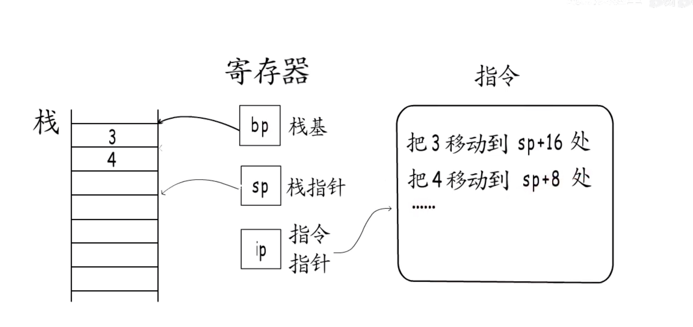

## 函数调用过程：

* 栈侦：分配给函数的栈空间
* bp 栈基：栈底
* sp 栈顶，又叫栈指针

#### Call 指令跳转，Ret 指令恢复现场

A()

> 1: 调用者的栈基地址
>
> 2: 局部变量
>
> 3：调用函数的返回值（调用B函数的返回值）
>
> 4：入参（调用B函数的入参）

> 保存现场：记录函数A的下一条指令

B()

>1: 调用者的栈基地址
>
>2: 局部变量
>
>3：调用函数的返回值
>
>

