##高并发多开线程运转不可以吗

### 课外知识：

进程是操作系统内资源分配的最小单位，进程中的线程可以共享资源

在unix/linux中,通过时间轮片算法+动态优先级算法实现进程的调度.
线程又称轻进程(weight process),由微软提出.现在的操作系统大多支持线程(linux的支持通过线程库),比进程的开销更小.主要用来摆平多cpu.<mark>cpu时间片的基本单位可以理解为线程</mark>


### 面临的问题：

```
线程太重了 ， 占用极大内存。
cpu调度吃力，CPU切换上下文成本很高
```

##### 为啥操作系统做不出类似于golang这样轻量级的协程呢？

* 操作系统的视角是进程，又是分配资源的最小单位，需要切换不同进程的上下文，不像GPM一样切换的只是 G（调用栈，上下文，sp指针）


### GPM模型：

|      | **数据结构**                                | **数量**                                       | **意义**               |
| ---- | ------------------------------------------- | ---------------------------------------------- | ---------------------- |
| G    | runtime.g  运行的函数指针,  stack, 上下文等 | 每次都go  func都代表一个G,  无限制             | 代表一个用户代码执行流 |
| P    | runtime.p  per-P的cache,  runq和free  g等   | 默认为机器核数.  可通过GOMAXPROCS环境变量调整. | 表示执行所需的资源     |
| M    | runtime.m  对应一个由clone创建的线程        | 比P多,  一般不会多太多.  最大1万个             | 代表执行者,  底层线程  |


##### SysMon协程：

> SysMon协程是在go runtime初始化之后, 执行用户编写的代码之前, 由runtime启动的不与任何P绑定, 直接由一个M执行的协程. 类似于linux中的执行一些系统任务的内核线程. 
>
> 可认为是10ms执行一次. (初始运行间隔为20us, sysmon运行1ms后逐渐翻倍, 最终每10ms运行一次. 如果有发生过抢占成功, 则又恢复成初始20us的运行间隔, 如此循环)


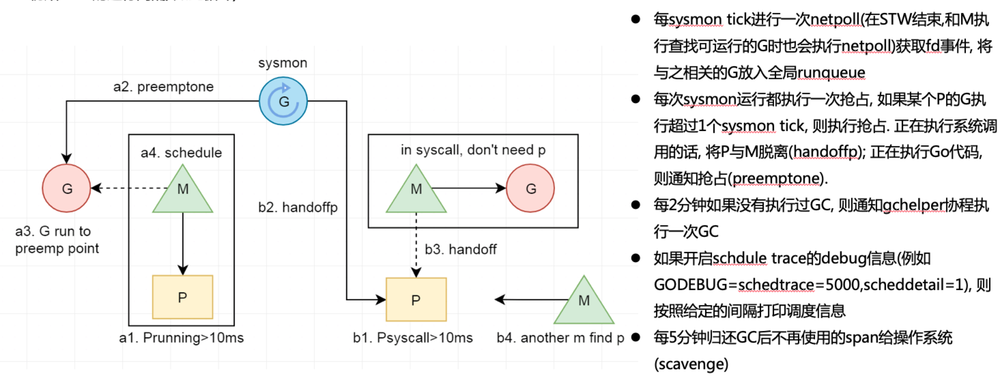


##### 网络IO：

1.封装epoll, 有网络操作时会epollcreate一个epfd.

2.所有网络fd均通过fcntl设置为NONBLOCK模式, 以边缘触发模式放入epoll节点中.

3.对网络fd执行Accept(syscall.accept4), Read(syscall.read), Write(syscall.write)操作时, 相关操作未ready, 则系统调用会立即返回EAGAIN; 使用gopark切换该协程

4.在不同的时机, 通过epollwait来获取ready的epollevents, 通过其中data指针可获取对应的g, 将其置为待运行状态, 添加到runq


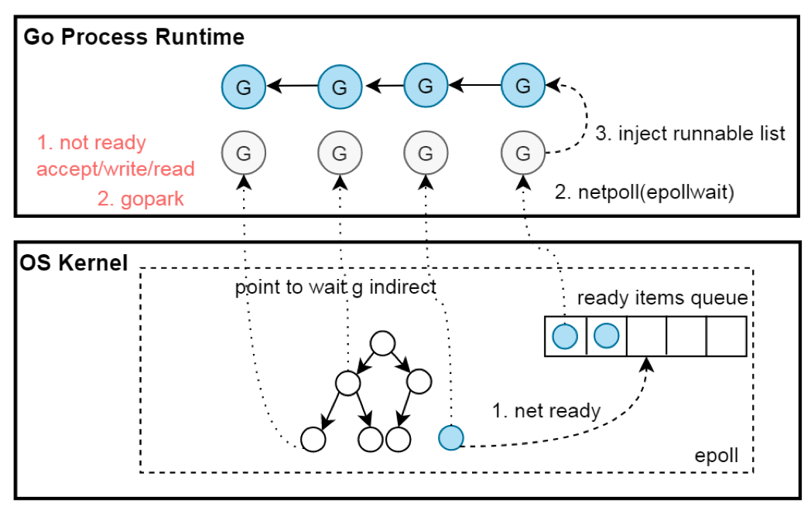

##### 总结：

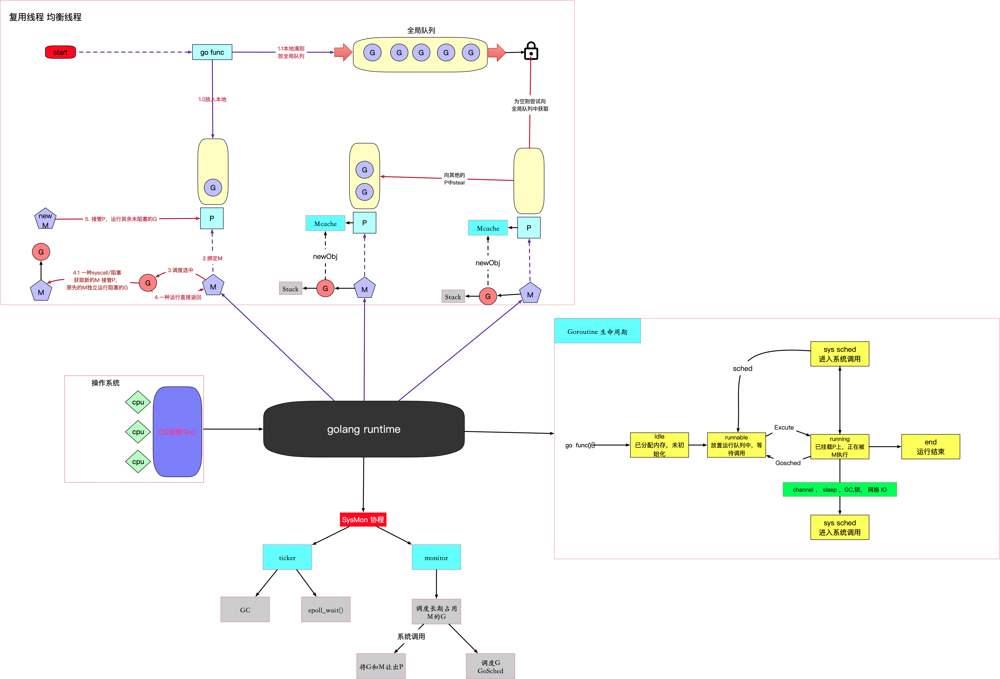


## main hello:

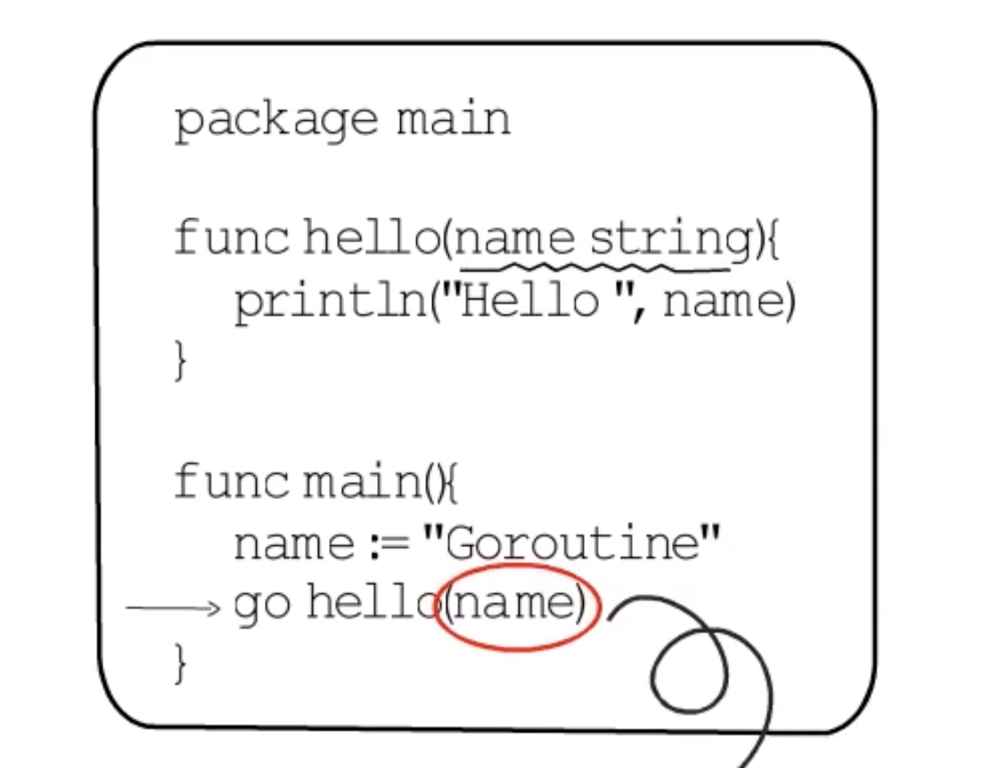


1. OS 进程的相关初始化
2. 初始化g0 ，m0 ， p【0】 以及scheded里面的各种全局变量
   * g0 社区管理者
3. g0 开始创建runtime.main (并不是我们理解的func main) G，放到本地队列中，然后调用mStart函数-->schedule()函数
4. m0 调度到 runtime.main G 
   * 开启sycmon线程，package初始化等
   * 调用 func main
5. go hello() 实则为调用了一个newProc的函数
   * new G （<mark>很巧妙的一点：提前在栈中压入exit函数</mark>）
     * new 栈
     * 初始化 sched 结构体
       * sp ：指向栈上的地址
       * pc ： 程序计数器


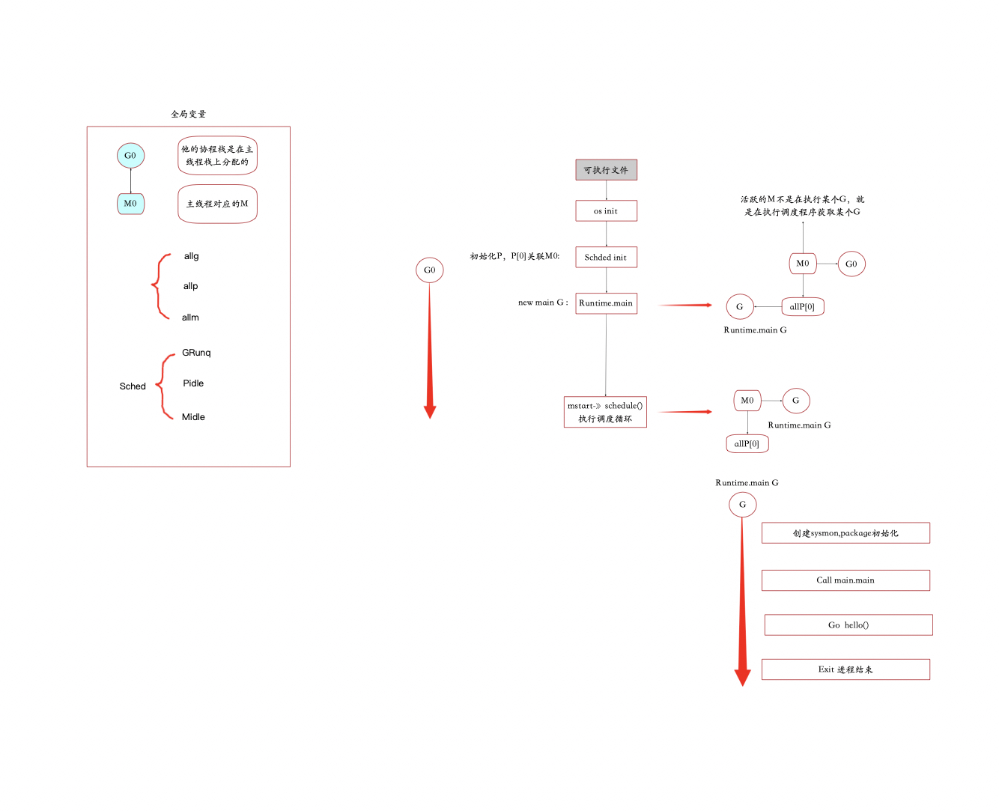


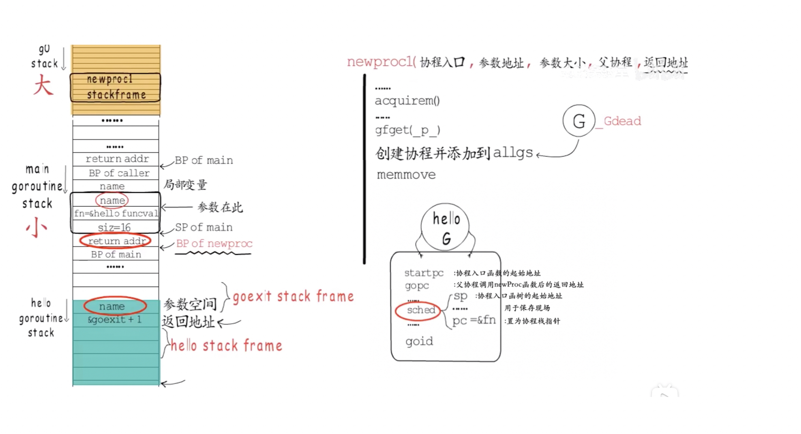

为什么要切换到g0栈运行newProc1函数？

* g0栈比较大，g0的栈直接分配到线程栈上
* 很多函数不支持栈增长

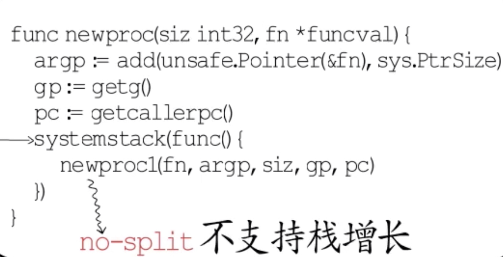


## Main-channel:

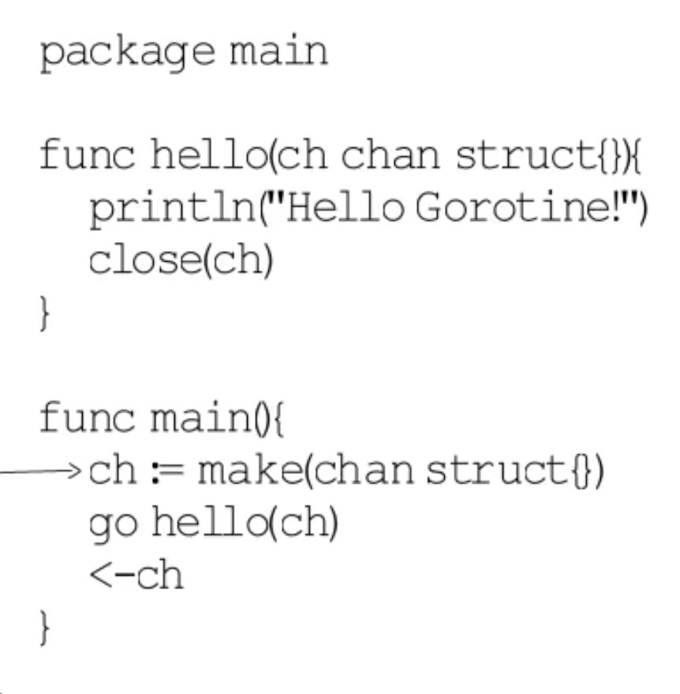

##### Gopark:

1. gopark
   * g的自行收尾，切换g的状态值保存现场状态
   * 切换g0，对m进行清理现场，然后调用schedule（）
2. goready
   * 切换到g0栈，切换g的状态，放到runq中

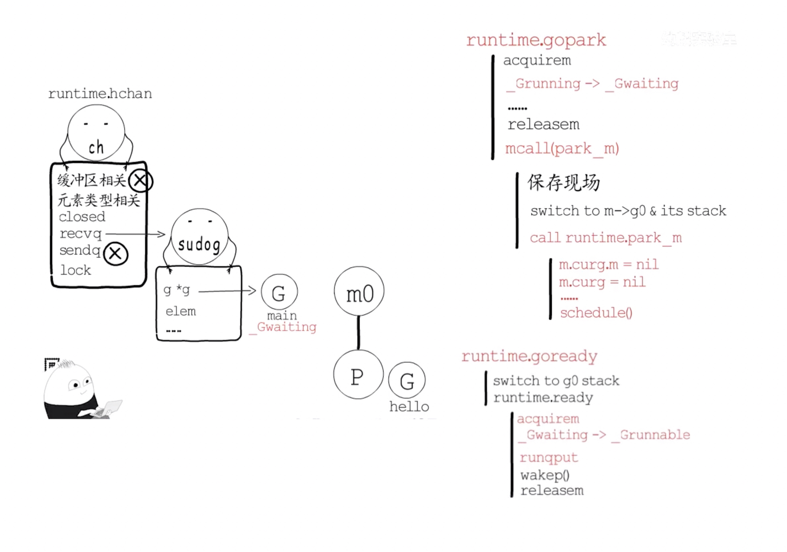

## Sysmon 监控线程：

>监控线程与GPM中的m不同，并不依赖p，也不由GPM模型调度，他会重复执行一系列任务。

##### Timer:

每次调度时都会执行checkTimers函数，检查并执行已经到时间的那些timer， 这样还是不够稳妥，万一所有的m都在忙，不能及时触发调度，可能会导致time的时间发生很大的偏差，所以还是通过监控线程来增加一层保障。

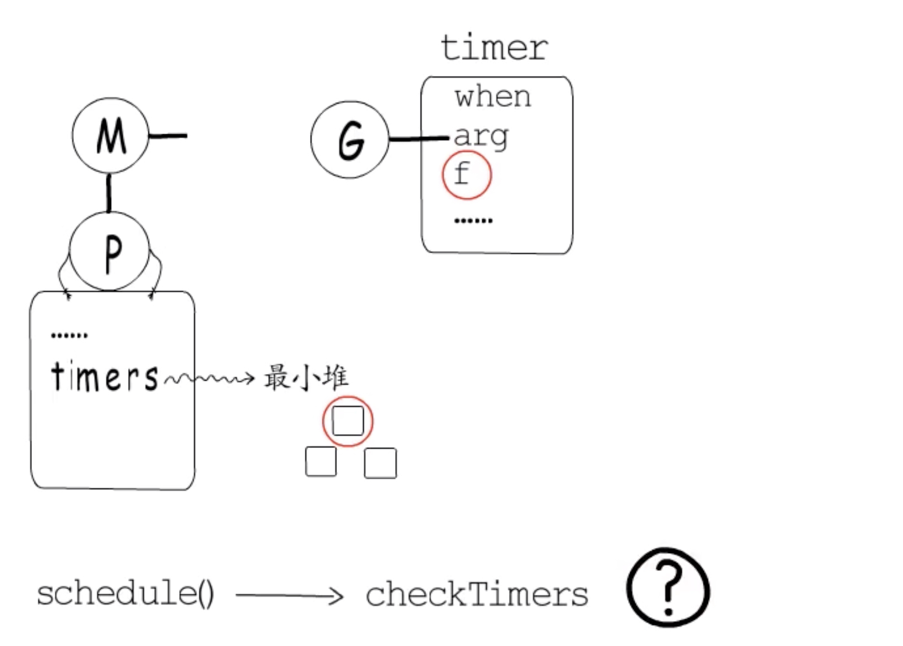

##### Netpoll :

如果协程需要等待IO事件，也就是需要让出，以epoll为例，若IO事件尚未准备就绪，需要注册要等待的IO事件到监听队列中，而每个监听对象都对应一个eventdata，所以就在这里记录那个协程在等待,等待IO事件就绪时把它放置到runq中就好，而获取到就绪的io时间需要主动轮询，所以为了降低io延时，需要时不时的轮询一下，也就netpoll，实际上监控线程，调度器，gc等工作过程都会按需执行netpoll，全局变量sched中会记录上次<mark>netpoll</mark>执行的时间，监控线程监控到距离上次轮询超过了10ms，就会再次执行

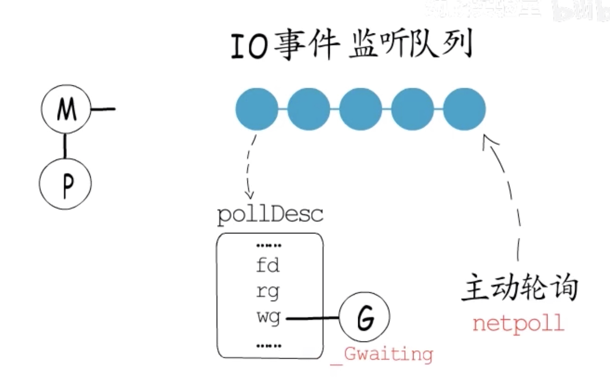

##### 抢占-公平调度：

* 运行时间超过10ms的要让一让了，p中会有专门记录运行时间。

> 如何通知让出呢？

除了对协程栈没什么消耗的函数调用，go语言编译器都会在函数头部插入栈增长的相关代码，

栈增长：

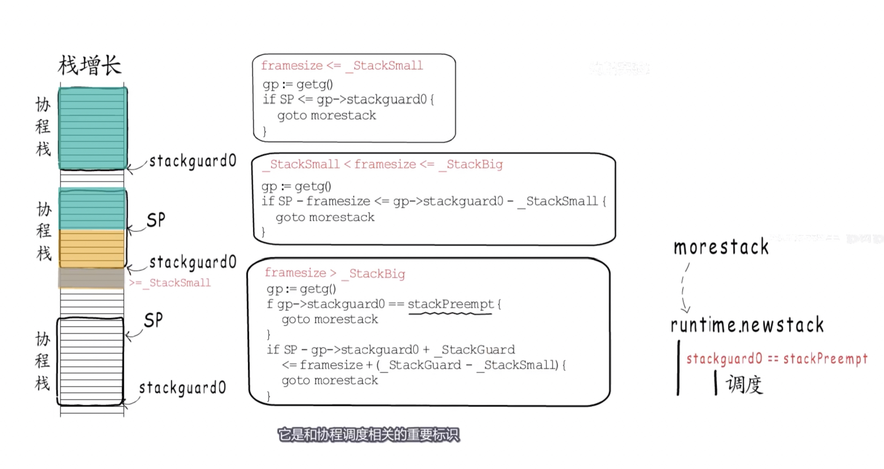

当runtime希望某个协程让出cpu时，就会把它的stackguard0赋值为stackPreempt,执行扩增时，就会执行调度；

面临这种情况就无能为力了:

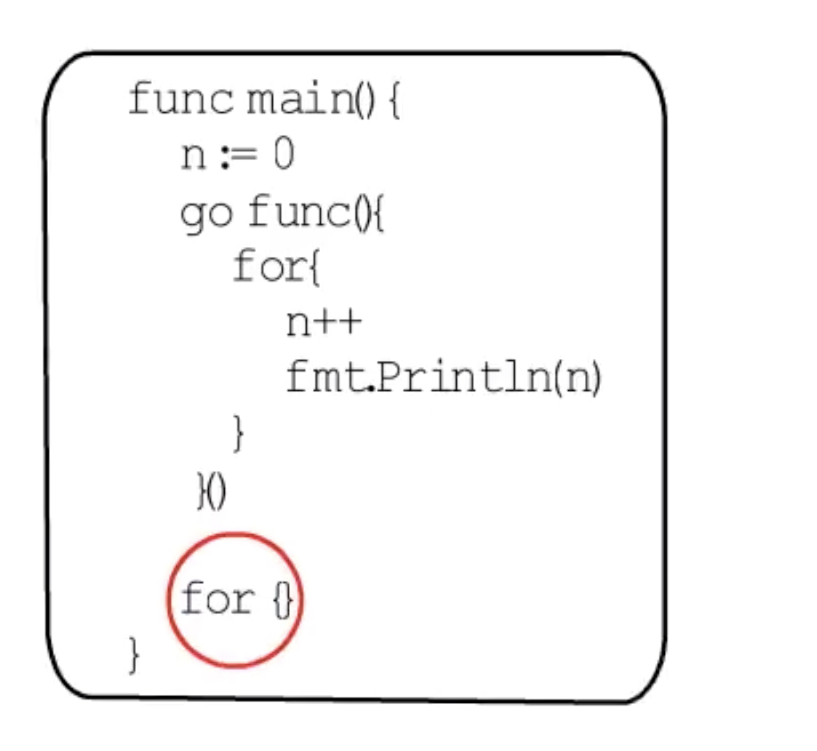


异步抢占：

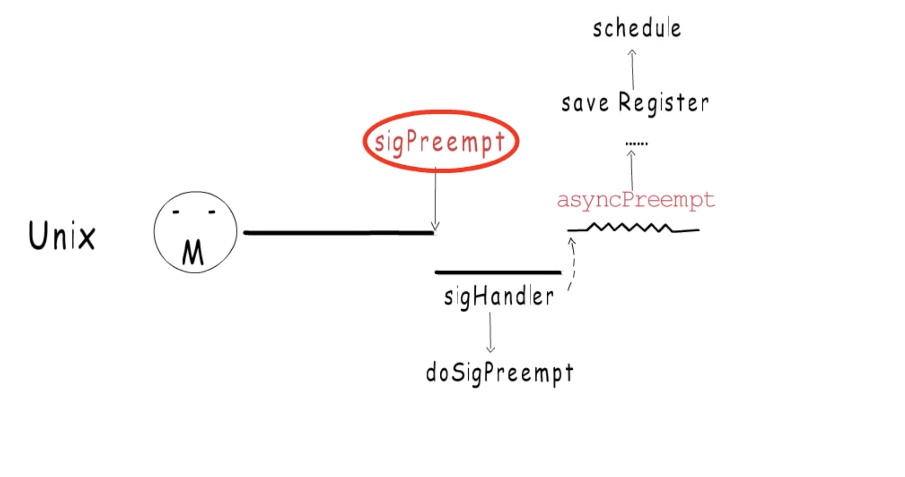


##### GC:

> 定时执行GC


## Schedule()

1. 是否要执行gc
2. 有没有要执行的timer
3. 调用findrunnable，直到找到可运行的g返回
   1. 尝试从本地获取
   2. 没有从全局runq中获取
   3. netpoll
   4. steal g from other p
4. execute
   1. 绑定m和g关系
   2. 修改g状态为running
   3. gogo函数<mark>g.sched</mark>恢复协程栈指针，指令指针继续执行

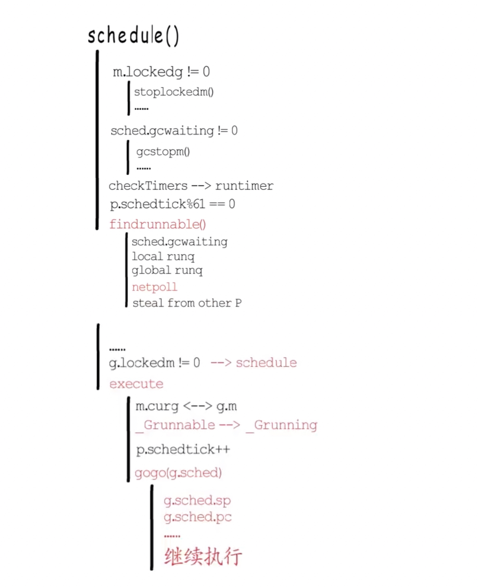


