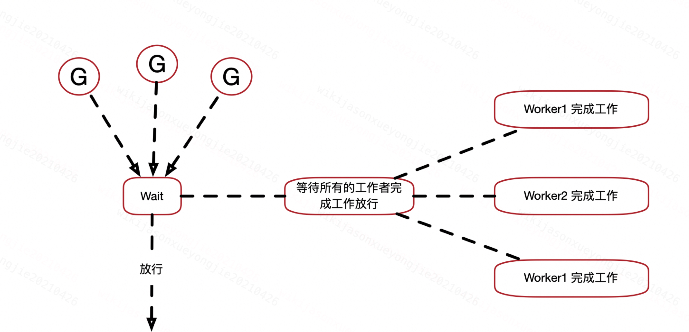
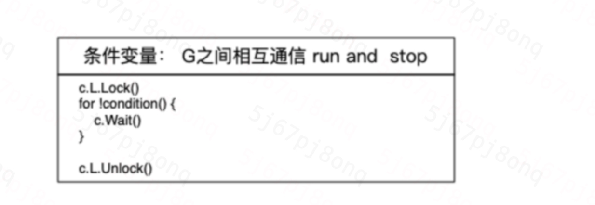

## sync.Mutex

### 是如何实现的呢？

```
设置一个lock标志位，CAS 原子性操作进行强锁。
借用信号量将强锁的goroutine进行休眠
```

### 其他特性：

```
实现了公平锁和非公平锁的择机切换
```


## sync.Once

```
设置一个是否运行过标志位
lock加锁进行修改
double check确保执行顺序
```

```go
//doubble check ;
func (once Once) Do(do func())  {
	if atomic.LoadUint32(&once.Once) != 1 {
		once.mutex.Lock()
		defer once.mutex.Unlock()
		if once.Once ==0 {
			defer atomic.StoreUint32(&once.Once,1)
			do()
		}
	}
}
```


## Sync.WaitGroup

```
有种人满发车的概念

实现：
信号量将 goroutine hold
计数器计数完成工作的的人数是否等于车满人数
```




## Sync.Cond

```
协程之间通信，相互之间按照特定顺序唤醒

实现方式：

信号量唤醒

引入一个lock锁确保唯一执行
```




## Sync.pool

```
产生的原因在于 防止GC吃力，对一些常用对象进行复用

三层兜底缓存： private，shared   其他processor的localPool
```

## singleFlight.Group

```
解决的问题是： 减少对下游瞬间的压力
```

```
map
mutex 
waitGroup 
确保请求是单飞过去
```


