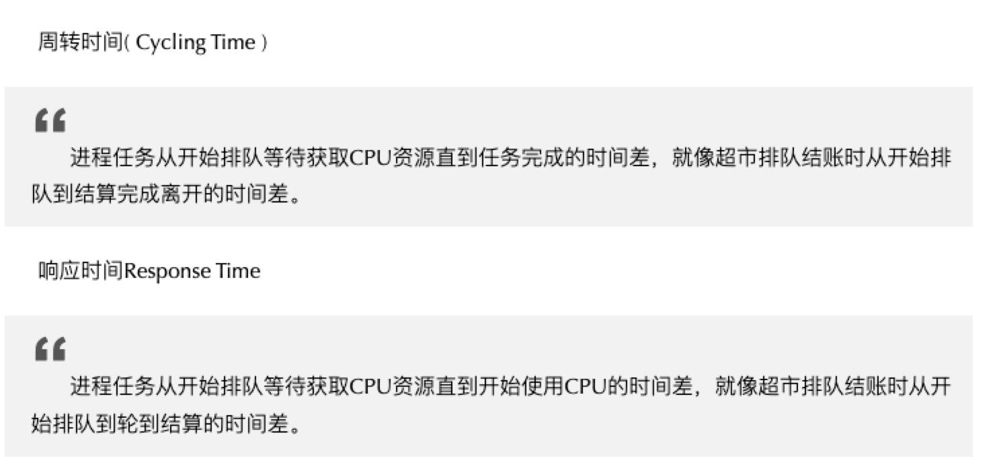
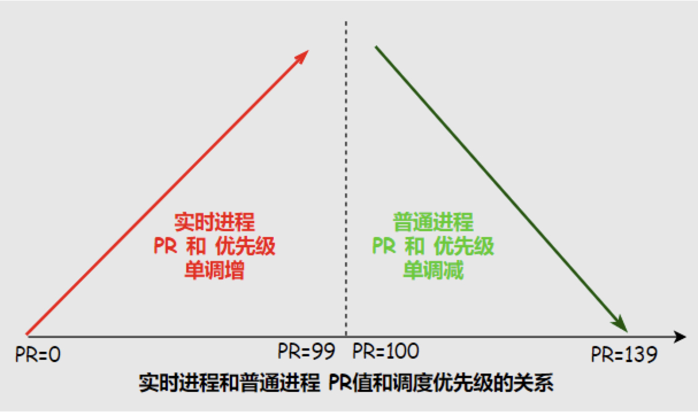

## 指标：

## 目标：

> 调度是为了让需求和资源能够完美的契合。
>
> 1. 实时进程要更优先被调度，普通进程的优先级一定低于实时进程
> 2. IO密集型进程要调度频繁一些，IO密集型要少分配时间片，少吃多餐
> 3. CPU密集型可以稍微惩罚，CPU密集型可以分配长一些的时间片，少餐多吃

### IO密集型和CPU密集型

## 影响优先级的两个因素：

* nice  :  谦让值
* priority : 权重值
  - 实时进程PR值范围是0~99，数值越大被调度优先级越高
  - 普通进程PR值范围是100~139，数值越小被调度优先级越高
    - Nice值范围是-20~19，并不是优先级但影响PR值，作用在普通进程上

## 参考文献：

https://www.eet-china.com/mp/a111242.html

