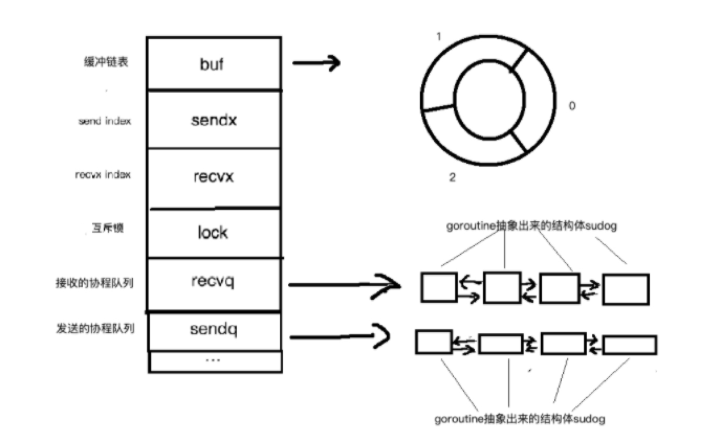

 

#### channel 结构图：

- `buf`是有缓冲的channel所特有的结构，用来存储缓存数据。是个循环链表
- `sendx`和`recvx`用于记录`buf`这个循环链表中的发送或者接收的index
- `lock`是个互斥锁。
- `recvq`和`sendq`分别是接收(<-channel)或者发送(channel <- xxx)的goroutine抽象出来的结构体(sudog)的队列。是个双向链表

### 实现文章：

 https://i6448038.github.io/2019/04/11/go-channel/

