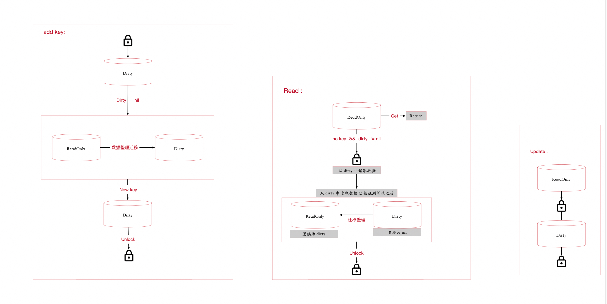

# Sync.Map

## 特点：

* 公共地址区： 单写能达到双写的效果

* atomic 解决interface 结构体赋值在高并发情况下引起的读取中间态问题；

  ```doc
  有些朋友可能没有注意过，在 Go(甚至是大部分语言)中，一条普通的赋值语句其实不是一个原子操作。
  例如，在32位机器上写int64类型的变量就会有中间状态，因为它会被拆成两次写操作(汇编的MOV指令)——写低 32 位和写高 32 位，
  如果一个线程刚写完低32位，还没来得及写高32位时，另一个线程读取了这个变量，那它得到的就是一个毫无逻辑的中间变量，这很有可能使我们的程序出现Bug。
  
  这还只是一个基础类型，如果我们对一个结构体进行赋值，那它出现并发问题的概率就更高了。很可能写线程刚写完一小半的字段，读线程就来读取这个变量，那么就只能读到仅修改了一部分的值。这显然破坏了变量的完整性，读出来的值也是完全错误的。
  
  面对这种多线程下变量的读写问题，Go给出的解决方案是atomic.Value登场了，它使得我们可以不依赖于不保证兼容性的unsafe.Pointer类型，同时又能将任意数据类型的读写操作封装成原子性操作。
  ```

  ```go
  
  type readOnly struct {
  	m       map[interface{}]*entry
  	amended bool // true if the dirty map contains some key not in m.
  }
  ```

  

## 限制：

* <mark> 双map，隔离扩容操作 </mark>
* 其实大部分的atomic包的操作都是因为兼容32位系统


## 原理：

* 把增加key的操作放在一个专用map中进行加锁操作，这个map 相当于加了读写锁的
* 除增加key其他以外的操作，绝大部分放在另一个map中，允许高并发执行这些操作的




## 问题一： 为什么在写入的时候都用原子性操作？

* 这样在写入的时候不会影响进行并发的读取


## 问题一： 为什么用两个map来实现？

* readOnly 中的数据不需要加锁就可以直接进行读取，而不用care 写相关的操作
* Dirty 中的读取就需要进行全局加锁了，读写锁；


## 缺点：

* 涉及到key的迁移： 如果key太多的时候，readOnly ---> dirty 的迁移是个问题


## Update 之后会不会出现dirty和readOnly 不一致的问题？

* 不会，因为 update 的数据同时被dirty 和 readOnly 同时引用，update改动的是同一份数据源，这样就不会出现数据不一致的问题。
* <mark>这样设计的好处</mark>

```golang
type entry struct {
	p unsafe.Pointer // *interface{}
}
type readOnly struct {
	m       map[interface{}]*entry
	amended bool // true if the dirty map contains some key not in m.
}
```


## 为什么必须是全量copy map ？

* 因为我们要始终保持一份readOnly数据是不动的，只能靠准备一个副本，然后原子性update来实现


```
curl https://common.hongyibo.com.cn/webapp/platform/orderInfo/getActiveOrderInfo 
```


### 前置知识：

> type ArbitraryType int
>
> type Pointer *ArbitraryType

```go
type entry struct {
  p unsafe.Pointer // *interface{}  这个地方是一个eface 结构体的地址
}

func newEntry(i interface{}) *entry {
	return &entry{p: unsafe.Pointer(&i)}
}

```

* 从entry中加载是原子性的加载    <mark>如果不是原子性的加载会有啥问题吗？</mark>

  ```go
  func (e *entry) load() (value interface{}, ok bool) {
  	p := atomic.LoadPointer(&e.p)
  	if p == nil || p == expunged {
  		return nil, false
  	}
  	// 是一个interface类型的指针
  	return *(*interface{})(p), true
  }
  ```

* 为什么要抽离出entry结构体？

  > 相当于抽离一个公共内存区放置存储值的地址，这样我们写一次就可以相当于双写了


