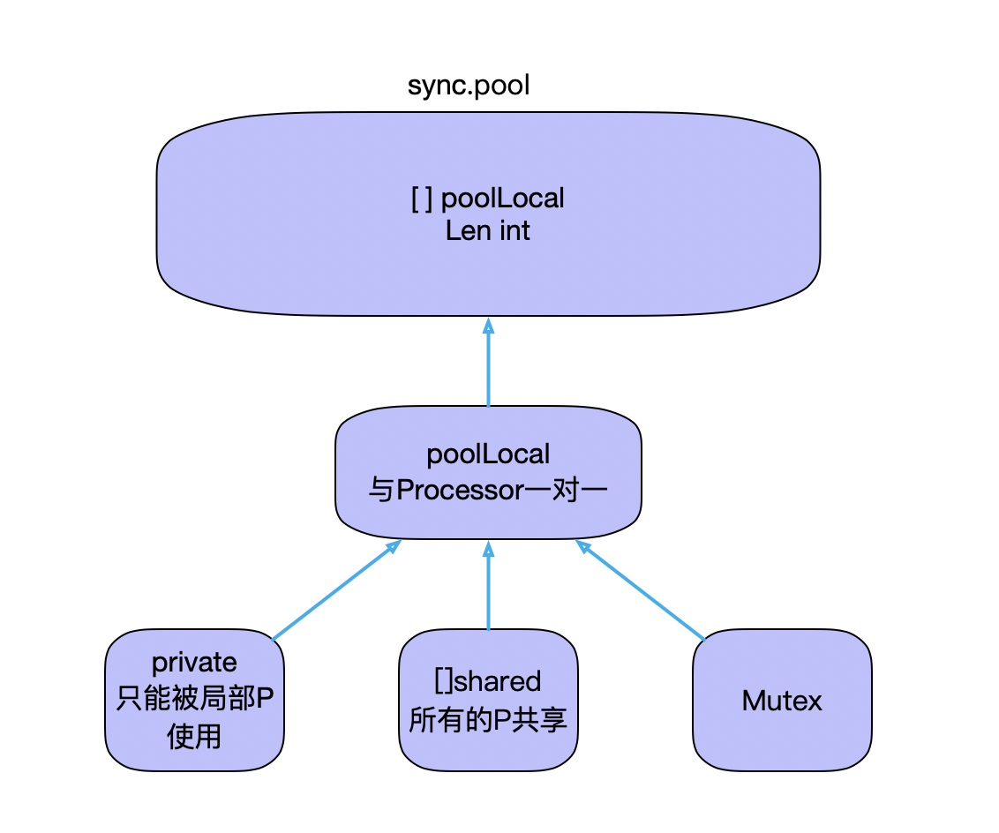

##+Sync.Pool.   

<mark>整个系统中的对象都是共享的</mark>

* 
* 问题 ： 这里为什么要设置非抢占（不进行 GC）？ 

> sync.Pool 可以理解为会为每一个Processor 创建一个localPool   （创建条件为： 参考 pinslow 函数下面有；） 
>
> sync.Pool设计的目的是用来保存和复用临时对象，以减少内存分配，降低CG压力。
>
> sync.Pool 管理了一组临时对象，当需要时从池中获取，使用完毕后从再放回池中，以供他人使用。
>
> https://blog.csdn.net/u010853261/article/details/90647884

* 结构图 

  

* 一个Processor  持有一个  poolLocal 

* 每个 poolLocal 的大小均为缓存行的偶数倍，包含一个 private 私有对象、shared 共享对象 slice 以及一个 Mutex 并发锁。

```go
type Pool struct {
	noCopy noCopy

	local     unsafe.Pointer //固定大小的poolLocal ，  实质代表为 【】poolLocal
	localSize uintptr   // size of the local array

	// New optionally specifies a function to generate
	// a value when Get would otherwise return nil.
	// It may not be changed concurrently with calls to Get.
	New func() interface{}
}

type poolLocal struct {
	poolLocalInternal

	// 将 poolLocal 补齐至两个缓存行的倍数，防止 false sharing,
	// 每个缓存行具有 64 bytes，即 512 bit
	// 目前我们的处理器一般拥有 32 * 1024 / 64 = 512 条缓存行
	pad [128 - unsafe.Sizeof(poolLocalInternal{})%128]byte
}

// Local per-P Pool appendix.
type poolLocalInternal struct {
	private interface{}   // 只能被局部调度器P使用
	shared  []interface{} // 所有P共享
	Mutex                 // 访问共享数据域的锁
}

```

### Put

* 首先获取当前goroutine所运行的P持有的localPool
* 优先放入 private
* 如果 private 已经有值，即不能放入则放入 shared

```go
// Put adds x to the pool.
func (p *Pool) Put(x interface{}) {
	if x == nil {
		return
	}
	if race.Enabled {
		if fastrand()%4 == 0 {
			// Randomly drop x on floor.
			return
		}
		race.ReleaseMerge(poolRaceAddr(x))
		race.Disable()
	}
	l := p.pin()
	if l.private == nil {
		l.private = x
		x = nil
	}
	runtime_procUnpin()
	if x != nil {
		l.Lock()
		l.shared = append(l.shared, x)
		l.Unlock()
	}
	if race.Enabled {
		race.Enable()
	}
}
```

### get

* 首先获取poolLocal 
* 优先从 private 中选择对象
* 取不到，则对 shared slice 加锁，取最后一个
* 取不到，则尝试从其他线程中 steal
* 还是取不到，则使用 New 方法新建

```sql
func (p *Pool) Get() interface{} {
	// 首先获取 poolLocal
	l := p.pin()
	// 先从private取
	x := l.private
	l.private = nil
	runtime_procUnpin()
	// private不存在再从shared里面去
	if x == nil {
		// 加锁，从 shared 获取
		l.Lock()
		// 从 shared 尾部取缓存对象
		last := len(l.shared) - 1
		if last >= 0 {
			x = l.shared[last]
			l.shared = l.shared[:last]
		}
		l.Unlock()
		if x == nil {
			// 如果取不到，则获取新的缓存对象
			x = p.getSlow()
		}
	}
	// 如果 getSlow 还是获取不到，则 New 一个
	if x == nil && p.New != nil {
		x = p.New()
	}
	return x
}
```


## 细节

```go
// Implemented in runtime.
func runtime_registerPoolCleanup(cleanup func())
func runtime_procPin() int  //如果你了解goroutine的调度原理，就容易理解些，这里procPin函数实际上就是先获取当前goroutine，然后对当前协程绑定的线程（即为m）加锁，即mp.locks++，然后返回m目前绑定的p的id。这个所谓的加锁有什么用呢？这个理就涉及到goroutine的调度了，系统线程在对协程调度的时候，有时候会抢占当前正在执行的协程的所属p，原因是不能让某个协程一直占用计算资源，那么在进行抢占的时候会判断m是否适合抢占，其中有一个条件就是判断m.locks==0，ok，看起来这个procPin的含义就是禁止当前P被抢占。相应的，procUnpin就是解锁了呗，取消禁止抢占。

那么我们来看下，为何要对m设置禁止抢占呢？其实所谓抢占，就是把m绑定的P给剥夺了，其实我们后面获取本地的poolLocal就是根据P获取的，如果这个过程中P突然被抢走了，后面就乱套了，我们继续看是如何获取本地的poolLocal的。
func runtime_procUnpin()
```


### 去其他的processor中去拿对象

```go
// 去steal 其他 P 的 localpool 中进行拿对象 ；
func (p *Pool) getSlow() (x interface{}) {
	// See the comment in pin regarding ordering of the loads.
	size := atomic.LoadUintptr(&p.localSize) // load-acquire
	local := p.local                         // load-consume
	// Try to steal one element from other procs.
	pid := runtime_procPin()
	runtime_procUnpin()
	for i := 0; i < int(size); i++ {
		l := indexLocal(local, (pid+i+1)%int(size))
		l.Lock()
		last := len(l.shared) - 1
		if last >= 0 {
			x = l.shared[last]
			l.shared = l.shared[:last]
			l.Unlock()
			break
		}
		l.Unlock()
	}
	return x
}
```


### pin()函数获取per-P的localPool

```go
func (p *Pool) pin() *poolLocal {
  // 实现获取runtime的Processor，并设置禁止抢占(避免GC),然后返回P的id
	pid := runtime_procPin()
	// 在 pinSlow 中会存储 localSize 后再存储 local，因此这里反过来读取
	// 因为我们已经禁用了抢占，这时不会发生 GC
	// 因此，我们必须观察 local 和 localSize 是否对应
	// 观察到一个全新或很大的的 local 是正常行为
	s := atomic.LoadUintptr(&p.localSize) // load-acquire
	l := p.local                          // load-consume
	// 因为可能存在动态的 P（运行时调整 P 的个数）procresize/GOMAXPROCS
	// 如果 P.id 没有越界，则直接返回
	if uintptr(pid) < s {
		return indexLocal(l, pid)
	}
	// 没有结果时，涉及全局加锁
	// 例如重新分配数组内存，添加到全局列表
	return p.pinSlow()
}

```

* 根据注释：pin函数首先会调用运行时实现获得当前 P 的 id，然后设置P禁止抢占(避免GC)。然后检查 pid 与 p.localSize 的值 来确保从 p.local 中取值不会发生越界。如果不会发生，则调用 indexLocal() 完成取值。否则还需要继续调用 pinSlow() 。
* 在这个过程中我们可以看到在 runtime 调整 P 的大小的代价。如果此时 P 被调大，而没有对应的 poolLocal 时， 必须在取之前创建好，从而必须依赖全局加锁，这对于以性能著称的池化概念是比较致命的，因此这也是 pinSlow() 函数的由来。


### 增添 P 所对应的localPool

```go

//如果 整个 pool 中所有P 的 localpool 都为空 ，并且所有的P 为新的运行上下文 ，这样的话，从新扩增这个 P 所对应的 ；
func (p *Pool) pinSlow() *poolLocal {
	// Retry under the mutex.
	// Can not lock the mutex while pinned.
	runtime_procUnpin()
	allPoolsMu.Lock()
	defer allPoolsMu.Unlock()
	pid := runtime_procPin()
	// poolCleanup won't be called while we are pinned.
	s := p.localSize
	l := p.local
	if uintptr(pid) < s {
		return indexLocal(l, pid)
	}
	if p.local == nil {
		allPools = append(allPools, p)
	}
	// If GOMAXPROCS changes between GCs, we re-allocate the array and lose the old one.
	size := runtime.GOMAXPROCS(0)
	local := make([]poolLocal, size)
	atomic.StorePointer(&p.local, unsafe.Pointer(&local[0])) // store-release
	atomic.StoreUintptr(&p.localSize, uintptr(size))         // store-release
	return &local[pid]
}
```
