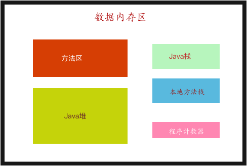
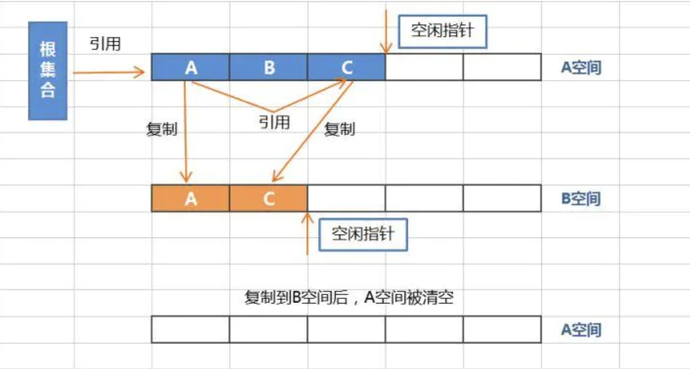
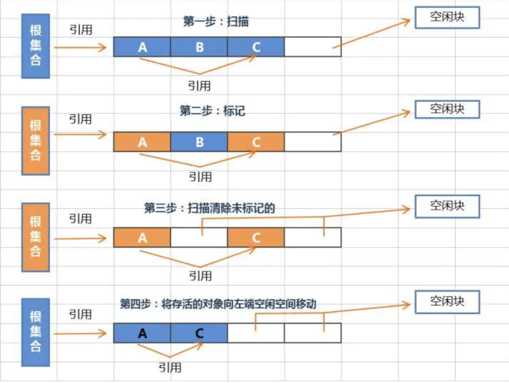
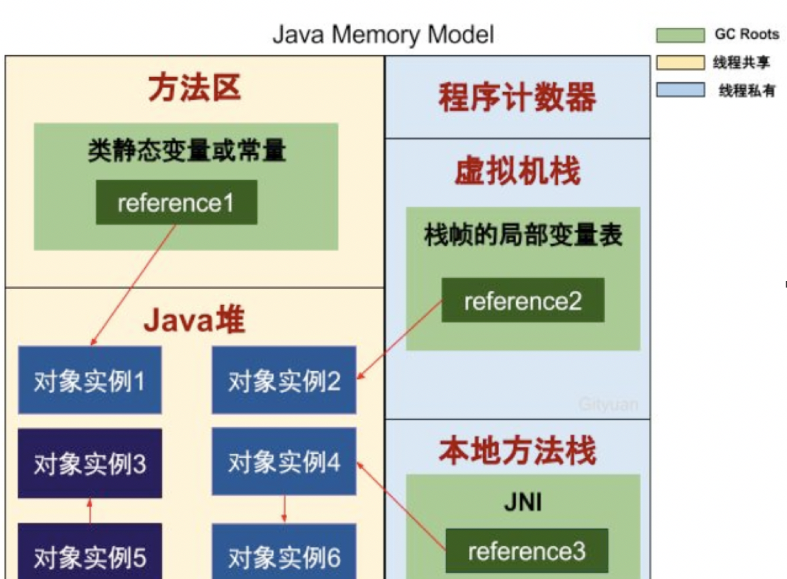

### JVM 

* 类加载器
* 内存
* cpu执行引擎

##### 类加载器定义：

* Bootstrap ClassLoader :启动类加载器

1. 将存放于<JAVA_HOME>\lib目录中的，或者被-Xbootclasspath参数所指定的路径中的，

2. 是虚拟机识别的（仅按照文件名识别，如 rt.jar 名字不符合的类库即使放在lib目录中也不会被加载）类库加载到虚拟存中。

3. 启动类加载器无法被Java程序直接引用


*  Extension ClassLoader 扩展类加载器: 

1. 将<JAVA_HOME>\lib\ext目录下的

2. 被java.ext.dirs系统变量所指定的路径中的所有类库加载。
3. 开发者可以直接使用扩展类加载器


* Application ClassLoader :应用程序类加载器：

1. 负责加载用户类路径(ClassPath)上所指定的类库,开发者可直接使用。


##### 类加载器加载过程

* 双亲委派模型

> 当一个类加载器接受到一个加载请求的时候，他会把这个加载请求委托给他的父加载器进行加载，每个加载器都是同样的操作所以最后都会委托给启动加载器进行加载，如果此加载器在它的搜索范围里面找不到所需要的类，子加载器就会尝试去加载这个类。

* 加载类到内存中的过程：

  + 加载 ， 以二进制流的形式加载到方法区的数据结构，同时在java堆中创建class对象

  + 链接

    + ​         验证：校验class文件字节流的正确性  
    + ​         准备：  为方法区中的静态变量分配存储空间，初值为0或者null
    + ​         解析：是将常量池中的符号引用转化为直接引用的过程； 类变量，类方法的解析，接口解析，类解析，字段解析；此时 class对象结构才完整

  + 初始化

    + 先父类后子类静态类型的初始化

      


##### 不会类初触发始化的几个误区

* 由子类调用父类的静态属性；－－－这样是不会引起子类的初始化的；

*  调用final　static的属性的时候，Final static 修饰的变量在编译期间会放在常量池中，不会触发初始化；但这个地方如果计算这个值复杂的话，也会引起这个类的初始化的；

* 定义对象型数组，不会导致对类的初始化；

  > 静态语句块有个特点：只能访问到定义在静态语句块之前的变量，不能访问到静态语句块之后的变量，但是能对之后的变量进行赋值

  > Jvm保证类的cinit是线程安全的；在同一时间只允许new一个对象；


##### 运行时数据区

* 线程共享的部分 
  + 方法区，也称为静态区。 专门存储class文件信息的地方
  + 堆 ： Java中实例的对象放置在堆中， （也包括运行时常量池）
* 线程私有的部分
  + Java栈： 线程执行方法的内存模型
    + 在栈内，会对每一个执行到的Java封装成一个栈帧；所有的栈帧都出站，线程结束 
    + 局部变量表 ： 参数和局部变量（对象为引用，基本数据类型为实际的值）
    + 操作栈数：记录当前的操作点
    + 动态链接：动态的调用方法
    + 返回地址： 
  + 本地方法栈： 存储程序运行时的本地方法
  + 程序计数器： 一个指针，指向命令执行的地址




##### String str =new String("abc")和String str ="abc"的不同

* String str ="abc "是直接向常量池中进行查找，没有则创建一个，返回常量池中的地址
* String str =new String("abc ")
  + 先向常量池中寻找没有则创建
  + 然后在堆创建一个新的String 对象，最后返回堆中的地址
* Integer类型数小于128时放置在常量池如果大于的话就要new对象；  


```
在jdk8的时候java废弃了永久代，但是并不意味着我们以上的结论失效，因为java提供了与永久代类似的叫做“元空间”的技术。
废弃永久代的原因：由于永久代内存经常不够用或发生内存泄露，爆出异常java.lang.OutOfMemoryErroy。元空间的本质和永久代类似。不过元空间与永久代之间最大的区别在于：元空间并不在虚拟机中，而是使用本地内存。也就是不局限与jvm可以使用系统的内存。理论上取决于32位/64位系统可虚拟的内存大小。
```


#####Eden and survivor 区

1. 所有新生成的对象首先都是放在年轻代的。年轻代的目标就是尽可能快速的收集掉那些生命周期短的对象。

2. 新生代内存按照8:1:1的比例分为一个eden区和两个survivor(survivor0,survivor1)区。一个Eden区，两个 Survivor区(一般而言)。大部分对象在Eden区中生成。回收时先将eden区存活对象复制到一个survivor0区，然后清空eden区，当这个survivor0区也存放满了时，则将eden区和survivor0区存活对象复制到另一个survivor1区，然后清空eden和这个survivor0区，此时survivor0区是空的，然后将survivor0区和survivor1区交换，即保持survivor1区为空， 如此往复。

3. 当survivor1区不足以存放 eden和survivor0的存活对象时，就将存活对象直接存放到老年代。若是老年代也满了就会触发一次Full GC，也就是新生代、老年代都进行回收

4. 新生代发生的GC也叫做Minor GC，MinorGC发生频率比较高(不一定等Eden区满了才触发)

##### 年老代（Old Generation）

1. 在年轻代中经历了N次垃圾回收后仍然存活的对象，就会被放到年老代中。因此，可以认为年老代中存放的都是一些生命周期较长的对象。

2. 内存比新生代也大很多(大概比例是1:2)，当老年代内存满时触发Major GC即Full GC，Full GC发生频率比较低，老年代对象存活时间比较长，存活率标记高。

##### 持久代（Permanent Generation）

* 用于存放静态文件，如Java类、方法等。持久代对垃圾回收没有显著影响，但是有些应用可能动态生成或者调用一些class，例如Hibernate 等，在这种时候需要设置一个比较大的持久代空间来存放这些运行过程中新增的类。

```
永久代的垃圾收集主要回收两部分内容：废弃常量和无用的类。回收废弃常量与回收Java堆中的对象非常类似。以常量池中字面量的回收为例，假如一个字符串“abc”已经进入了常量池中，但是当前系统没有任何一个String对象是叫做“abc”的，换句话说是没有任何String对象引用常量池中的“abc”常量，也没有其他地方引用了这个字面量，如果在这时候发生内存回收，而且必要的话，这个“abc”常量就会被系统“请”出常量池。常量池中的其他类（接口）、方法、字段的符号引用也与此类似。
判定一个常量是否是“废弃常量”比较简单，而要判定一个类是否是“无用的类”的条件则相对苛刻许多。类需要同时满足下面3个条件才能算是“无用的类”：
该类所有的实例都已经被回收，也就是Java堆中不存在该类的任何实例。
加载该类的ClassLoader已经被回收。
该类对应的java.lang.Class 对象没有在任何地方被引用，无法在任何地方通过反射访问该类的方法。
虚拟机可以对满足上述3个条件的无用类进行回收，这里说的仅仅是“可以”，而不是和对象一样，不使用了就必然会回收。是否对类进行回收，HotSpot虚拟机提供了-Xnoclassgc参数进行控制，还可以使用-verbose:class及-XX:+TraceClassLoading、 -XX:+TraceClassUnLoading查看类的加载和卸载信息。
在大量使用反射、动态代理、CGLib等bytecode框架的场景，以及动态生成JSP和OSGi这类频繁自定义ClassLoader的场景都需要虚拟机具备类卸载的功能，以保证永久代不会溢出。
```


##### 标记复制算法

* 优点 ： 清理速度快， 适合用于新生代，清除的废弃内存比较多的情况
* 缺点： 占用内存大，消耗性能高
* 


##### 标记整理算法

* 优点： 占用内存小
* 缺点：消耗时间长，需要进行重新整理
* 


* 引用计数法判定是否为垃圾对象

  

