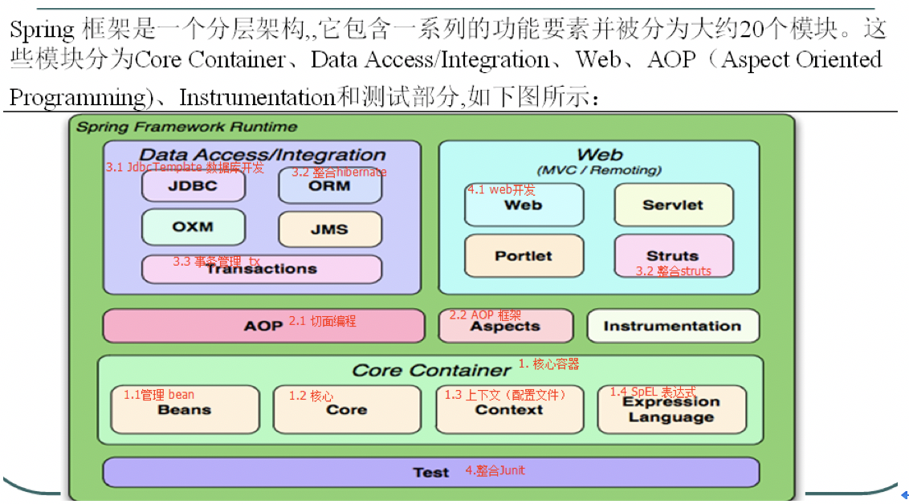

## Spring 

* 大致模块

  

### IOC 控制反转Bean实例化方式

* 直接配置
* 实例工厂
* 静态工厂

### Bean 的种类

* 普通Bean ，Spring直接创建
* FactoryBean：  **具有工厂生成对象的能力，一个实现了FactoryBean接口（接口有一个getObject（）的方法）的类**  
  + **运行原理：首先实例化这个实现接口的类然后调用getObject（）方法，这个方法有返回对象，最后返回这个返回对象；**  
* BeanFactory： 只能生成一种特殊的bean
  + ProxyFactoryBean：此工厂bean用于生产具有代理功能的实例对象

### 单例和多例

* Singleton：单例，默认值；例如：servlet就是只创建一次
  + ​         *@Scope(“singleton”)*  

* Prototype（原型，标准的意思）：以其为原型，每次调用的时候都会返回一个新的对象；例如：的对象就是如此。
  + ​         *@Scope(“prototype”)*  

### Bean的生命周期

* **Init和Destroy **

* 提供一种机制，只要实现BeanPostProcessor接口，并将实现类提供给spring容器；spring容器将自动执行，在每一个bean的初始方法（初始方法可没有）前执行**before（）**在初始方法后执行**after（）**

  + *@PostConstruct*  

  + *@PreDestory* 

* 后处理Bean机制是AOP实现的底层；

### DI依赖注解：

1. 普通值注入： *@Value(“ ”)*   和 引用注入

2. 按照类型注入：

+ @Autowired  *翻译：自动连接**wire**电线连线的意思；*    

3. 按照名称注入，有两种方式

+ @Autowired 

  @Qualifier(“**名称**id”)            Qualifier :合格者，通过者；*

+ @Resource(“**名称**id”)

