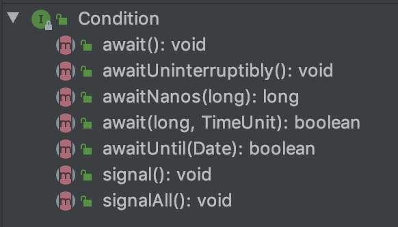

## Java中的多线程高并发

### 掌握的线程相关的基本知识

* 线程的三种实现方式 （包含一种特殊的具有返回值的实现方式）
* 线程本身对自己的一些控制API
* 线程如何优雅的退出（3种）
* synchronize，volatile关键字实现LocK锁的原理


### 问题一： 各个线程之间并不能确保所有的变量都能读取到最新值，也就是内存的可见性问题，Java中如何解决的呢？ 

### 问题二： 编译器为了运行方便会对指令进行重排优化加快运行的速度，这样一重排就会引起一些bug的出现：Java中如何解决的呢？

* Bug : 一个类中包含生成了另一个类，这样在实际运行中的时候就可能将这个类的new，放置到对这个类的使用的指令后面，从而引起出现运行时的空指向


### 解决方式---Volatile 关键字（底层实现了什么呢）

* 解决内存的可见性问题
* CPU 高速缓存一致性协议； 保证了cache里面的副本是完全一样;

* 核心思想： 当CPU写入数据时，发现该变量也被其他线程所共享；那麽将发出一个信号，来说明这个cache已经失 效；


* 保证了程序执行的有序性----在底层设置内存屏障的形式，来确保指令执行的有序性；也就是Java中规定了一些规则，**Happen-Before规则**。这些规则确保了程序执行的有序性

  + **对于在多线程中volatile变量,对这个变量的写操作要先与对这个变量的读操作  ,如果不是volatile的                        话在对象的创建过程中会进行指令重排，导致对象中的对象的创建排在后面**
  + unlock必须发生在lock之后
  + 传递规则:若a先于b，b先于C，那a先于c
  + 线程启动规则,start先于run
  + 线程中断规则,interupt先于catch
  + 对象销毁规则:初始化必须发生在finalize之前
  + 线程终结规则,线程所有的规则都发生在线程死亡之前

* 对volatile关键字的运行的有序性的使用例子：

  

  ```html
  这个地方： 创建了instance   ,  但还没有创建obj1,obj3 然后就放弃锁了，这个时候会导致对象没有创建完成就有其他的操作了；
  Obj1   0x 000002
  Obj2   0x000003
  最后在创建：
  Instance：　0x00001
  ```

  

  但如果在这个地方加入了volatile关键字以后呢？

  
  

### CAS原子性操作的实现（unsafe类实现了CPU级别的加锁）

* 先进行比较 ,预期值是否和真实值相同,如果相同则成功修改,返回true,如果预期值和真实值不相同,则返回false;
* 实质就是枷锁的锁粒级别变得更低了


## 基本组件AQS

* AbstractQueueSynchronizer : 一个内部抽象类： 处理并发问题的抽象队列同步器

  + AQS作为基础组件，为真正的实现类提供基础设施，如**构建同步队列，控制同步状态**

  + 维持着一个虚拟的同步队列，当请求锁的线程超过现有模式的限制时，会将线程包装成Node结点并将线程当前必要的信息存储到node结点中，然后加入同步队列等会获取锁

  + AQS只关注内部公共方法实现并不关心外部不同模式的实现，所以提供了模板方法给子类使用，也就是说实现独占锁，如ReentrantLock需要自己实现tryAcquire()方法和tryRelease()方法，而实现共享模式的Semaphore，则需要实现tryAcquireShared()方法和tryReleaseShared()方

    ```java
    //AQS中提供的主要模板方法，由子类实现。
    public abstract class AbstractQueuedSynchronizer
        extends AbstractOwnableSynchronizer{
    
        //独占模式下获取锁的方法
        protected boolean tryAcquire(int arg) {
            throw new UnsupportedOperationException();
        }
    
        //独占模式下解锁的方法
        protected boolean tryRelease(int arg) {
            throw new UnsupportedOperationException();
        }
    
        //共享模式下获取锁的方法
        protected int tryAcquireShared(int arg) {
            throw new UnsupportedOperationException();
        }
    
        //共享模式下解锁的方法
        protected boolean tryReleaseShared(int arg) {
            throw new UnsupportedOperationException();
        }
        //判断是否为持有独占锁
        protected boolean isHeldExclusively() {
            throw new UnsupportedOperationException();
        }
    
    }
    ```

    

* 内部的Node节点

  + 两种模式 ： 1. shared mode    2.exclusive mode 
  + 四种状态： 
    1. cancelled ： 这个节点已经被取消，失效
    2. condition ： 节点处于等待状态
    3. signal ： 代表这个线程处于一个非阻塞的状态，successor 后继者等待去signal。
    4. propagate：共享模式中节点的一种状态
  + 同步队列的指针和等待队列的指针
    1. 同步队列有两个pre和next指针
    2. 等待队列next指针

* ConditionObject 维护一个等待队列，**使对锁的控制粒度更细**

* 所有的加入队列和从队列中取出均为CAS操作

* condition 是对同一个lock面对不同情况时  -  线程唤醒与等待控制；

  

* 一个Node节点封装当前线程的相关信息加入到等待队列中进行等待，直到被唤醒、中断、超时才从队列中移出。Condition中的等待队列模型如下：

  

* 等待队列中结点的状态只有两种即CANCELLED和CONDITION

* AQS中只能存在一个同步队列，但可拥有多个等待队列

* Condition.await()方法的实现 --- 将当前的线程挂起并释放同步状态

  ```java
  public final void await() throws InterruptedException {
        //判断线程是否被中断
        if (Thread.interrupted())
            throw new InterruptedException();
        //创建新结点加入等待队列并返回
        Node node = addConditionWaiter();
        //释放当前线程锁即释放同步状态
        int savedState = fullyRelease(node);
        int interruptMode = 0;
        //判断结点是否同步队列(SyncQueue)中,即是否被唤醒
        while (!isOnSyncQueue(node)) {
            //挂起线程
            LockSupport.park(this);
            //判断是否被中断唤醒，如果是退出循环。
            if ((interruptMode = checkInterruptWhileWaiting(node)) != 0)
                break;
        }
        //被唤醒后执行自旋操作争取获得锁，同时判断线程是否被中断
        if (acquireQueued(node, savedState) && interruptMode != THROW_IE)
            interruptMode = REINTERRUPT;
         // clean up if cancelled
        if (node.nextWaiter != null) 
            //清理等待队列中不为CONDITION状态的结点
            unlinkCancelledWaiters();
        if (interruptMode != 0)
            reportInterruptAfterWait(interruptMode);
    }
  
  
   private Node addConditionWaiter() {
      Node t = lastWaiter;
        // 判断是否为结束状态的结点并移除
        if (t != null && t.waitStatus != Node.CONDITION) {
            unlinkCancelledWaiters();
            t = lastWaiter;
        }
        //创建新结点状态为CONDITION
        Node node = new Node(Thread.currentThread(), Node.CONDITION);
        //加入等待队列
        if (t == null)
            firstWaiter = node;
        else
            t.nextWaiter = node;
        lastWaiter = node;
        return node;
          }
  ```

  

* 将等待队列中的第一个节点进行唤醒

  ```java
   public final void signal() {
       //判断是否持有独占锁，如果不是抛出异常
     if (!isHeldExclusively())
            throw new IllegalMonitorStateException();
        Node first = firstWaiter;
        //唤醒等待队列第一个结点的线程
        if (first != null)
            doSignal(first);
   }
  //将等待队列中的头节点抽取出来加入到同步队列，如果加入同步队列失败，则继续循环通知后续节点
   private void doSignal(Node first) {
       do {
               //移除条件等待队列中的第一个结点，
               //如果后继结点为null，那么说没有其他结点将尾结点也设置为null
              if ( (firstWaiter = first.nextWaiter) == null)
                   lastWaiter = null;
               first.nextWaiter = null;
            //如果被通知节点没有进入到同步队列并且条件等待队列还有不为空的节点，则继续循环通知后续结点
           } while (!transferForSignal(first) &&
                    (first = firstWaiter) != null);
          }
  
  //加入到同步队列中，并且查看是否新加入的线程具有被唤醒的条件
  final boolean transferForSignal(Node node) {
      //尝试设置唤醒结点的waitStatus为0，即初始化状态
      //如果设置失败，说明当期结点node的waitStatus已不为
      //CONDITION状态，那么只能是结束状态了，因此返回false
      //返回doSignal()方法中继续唤醒其他结点的线程，注意这里并
      //不涉及并发问题，所以CAS操作失败只可能是预期值不为CONDITION，
      //而不是多线程设置导致预期值变化，毕竟操作该方法的线程是持有锁的。
      if (!compareAndSetWaitStatus(node, Node.CONDITION, 0))
           return false;
          //加入同步队列并返回前驱结点p
          Node p = enq(node);
          int ws = p.waitStatus;
          //判断前驱结点是否为结束结点(CANCELLED=1)或者在设置
          //前驱节点状态为Node.SIGNAL状态失败时，唤醒被通知节点代表的线程
          if (ws > 0 || !compareAndSetWaitStatus(p, ws, Node.SIGNAL))
              //唤醒node结点的线程
              LockSupport.unpark(node.thread);
          return true;
      }
  ```


* 整个等待队列到同步队列转移的流程图

  


### ReentrantLock  


* ReentrantLock调用Lock加入同步队列

  ​	

* 唤醒后即节点

  

* 整个的大体流程

  


### 整个线程池的任务处理策略

**线程池的设计要求**

* 如果当前线程池中的线程数目小于corePoolSize，则每来一个任务，就会创建一个线程去执行这个任务；

* 如果当前线程池中的线程数目>=corePoolSize，则每来一个任务，会尝试将其添加到任务缓存队列当中，若添加成功，则该任务会等待空闲线程将其取出去执行；若添加失败（一般来说是任务缓存队列已满），小于maxThreads则会尝试创建新的线程去执行这个任务；

  + **任务队列三种类型**
  + 1. ArrayBlockingQueue：基于数组的先进先出队列，此队列创建时必须指定大小；
    2. LinkedBlockingQueue：基于链表的先进先出队列，如果创建时没有指定此队列大小，则默认为Integer.MAX_VALUE；  
    3. synchronousQueue：这个队列比较特殊，它不会保存提交的任务，而是将直接新建一个线程来执行新来的任务  

* 以上是避免多开线程浪费资源；核心线程中的线程处理任务队列中的任务是大致合理平衡的状态

* 如果当前线程池中的线程数目达到maximumPoolSize，则会采取任务拒绝策略进行处理；

  + ThreadPoolExecutor.CallerRunsPolicy：由调用线程处理该任务
  + ThreadPoolExecutor.AbortPolicy:丢弃任务并抛出RejectedExecutionException异常。
  + ThreadPoolExecutor.DiscardPolicy：也是丢弃任务，但是不抛出异常。 
  + ThreadPoolExecutor.DiscardOldestPolicy：丢弃队列最前面的任务，然后重新尝试执行任务（重复此过程

* 如果线程池中的线程数量大于 corePoolSize时，如果某线程空闲时间超过keepAliveTime，线程将被终止，直至线程池中的线程数目不大于corePoolSize；如果允许为核心池中的线程设置存活时间，那么核心池中的线程空闲时间超过keepAliveTime，线程也会被终止  

* 线程池的创建参数

  ```java
    public ThreadPoolExecutor(int corePoolSize,
                                int maximumPoolSize,
                                long keepAliveTime,       -----线程的活跃的时间
                                TimeUnit unit,
                                BlockingQueue<Runnable> workQueue,  -----任务队列的类型
                                RejectedExecutionHandler handler) {
          this(corePoolSize, maximumPoolSize, keepAliveTime, unit, workQueue,
               Executors.defaultThreadFactory(), handler);
      }
  ```

  

* 官方给出的三种线程池：

  1. SingleThreadExecutor

     ```java
     public static ExecutorService newSingleThreadExecutor() {
         return new FinalizableDelegatedExecutorService
             (new ThreadPoolExecutor(1, 1,
                                     0L, TimeUnit.MILLISECONDS,
                                     new LinkedBlockingQueue<Runnable>()));
     }
     ```

  2. FIxThreadExecutor

     ```java
     newFixedThreadPool(int nThreads) {
         return new ThreadPoolExecutor(nThreads, nThreads,
                                       0L, TimeUnit.MILLISECONDS,
                                       new LinkedBlockingQueue<Runnable>());
     }
     ```

  3. CacheThreadExecutor

     ```java
     public static ExecutorService newCachedThreadPool() {
         return new ThreadPoolExecutor(0, Integer.MAX_VALUE,
                                       60L, TimeUnit.SECONDS,
                                       new SynchronousQueue<Runnable>());
     }
     ```

  4. ScheduleThreadExecutor

     * 和FixedThreadExecutor一样具有核心线程然后LinkedThreadQueue
     * 添加的具有功能 **延时执行和周期性执行任务**

### 自定义线程池

```javaj a
结合自己的源码观看
```

