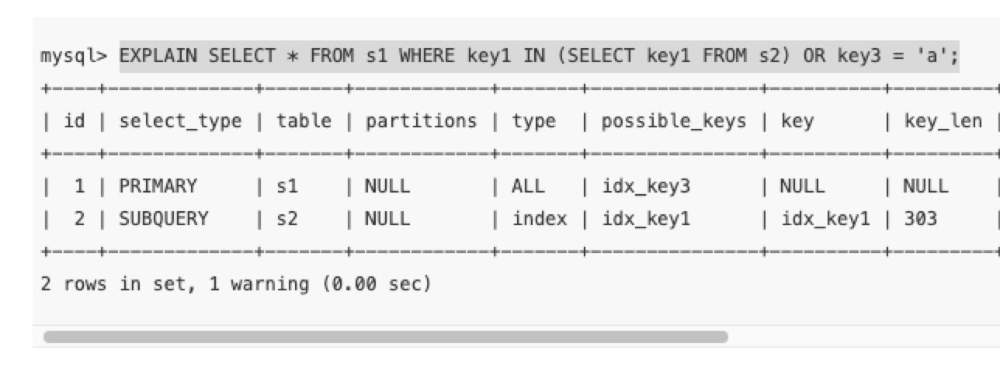

## select_type : 

### 物化：

```
MATERIALIZED   其实就是物化临时表
```

当查询优化器在执行包含子查询的语句时，选择将子查询物化之后与外层查询进行连接查询时，该子查询对应的`select_type`属性就是`MATERIALIZED`，比如下边这个查询：

```
mysql> EXPLAIN SELECT * FROM s1 WHERE key1 IN (SELECT key1 FROM s2);
```

执行计划的第三条记录的`id`值为`2`，说明该条记录对应的是一个单表查询，从它的`select_type`值为`MATERIALIZED`可以看出，查询优化器是要把子查询先转换成物化表。然后看执行计划的前两条记录的`id`值都为`1`，说明这两条记录对应的表进行连接查询，需要注意的是第二条记录的`table`列的值是`<subquery2>`，说明该表其实就是`id`为`2`对应的子查询执行之后产生的物化表，然后将`s1`和该物化表进行连接查询


### 物化后单查：

```
外层查询的select_type就是PRIMARY，子查询的select_type就是SUBQUERY。需要大家注意的是，由于select_type为SUBQUERY的子查询会被物化，所以只需要执行一遍。
```

EXPLAIN SELECT * FROM s1 WHERE key1 IN (SELECT key1 FROM s2) OR key3 = 'a';




## Type:

> 执行计划的一条记录就代表着`MySQL`对某个表的执行查询时的访问方法，其中的`type`列就表明了这个访问方法是个啥


* const ： 根据主键或者唯一二级索引列与常数进行等值匹配时，对单表的访问方法就是`const`
* eq_ref : 连接查询时的被驱动表是const查询，那就是eq_ref
* ref  ： 使用了普通索引进行查询
* index_merge: 两个普通索引等值查询情况下的顺序索引合并；
* unique_subquery : const 级别的子查询
* index_subquery ： 普通索引级别的子查询
* Range : 如果使用索引获取某些`范围区间`的记录，那么就可能使用到`range`访问方法
* index : 扫描索引 
* all :扫描全表


## MVCC:


