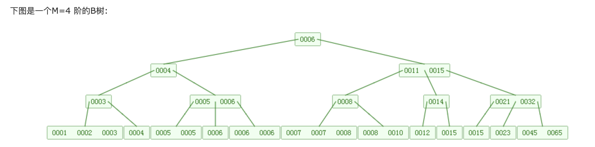
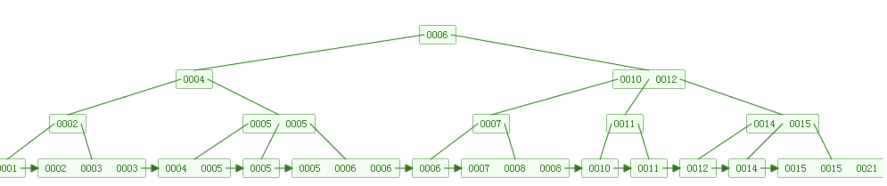

### 24数据库索引  

* 定义： 数据库索引是一种能够快速实现查询定位的一种数据结构，**重要点快速定位**
* 常用的数据库索引结构有三种： 
  + hash索引 ：定义一个哈希表，通过散列函数，定位数据元素的位置；
  + B树索引： [专门讲解的B树的文章](https://www.cnblogs.com/vincently/p/4526560.html)


#### B树和B+树的理解。

* B-tree 中每个节点都可以存储多个k-v，也算是一个二叉查找树；
* 左边是小于等于key ，右边的节点的值都大于key 



* B+tree 的不同点： 
  +  所有的非叶子结点只具有导航的作用，但不放值；只有叶子结点可以放值；而且所有的叶子结点连接起来是一个有序链表； 




##### B+和B树的各自优势

* B树： 
  + 经常访问的元素可能离根节点更近，因此访问也更迅速
* B+
  + 内存页中能够存放更多的key。 数据存放的更加紧密，具有更好的空间局部性
  + 便于区间查找和搜索


##### 联合索引

* 最左匹配的特性

  > 当b+树的数据项是复合的数据结构，比如(name,age,sex)的时候，b+数是按照从左到右的顺序来建立搜索树的，比如当(张三,20,F)这样的数据来检索的时候，b+树会优先比较name来确定下一步的所搜方向，如果name相同再依次比较age和sex，最后得到检索的数据；但当(20,F)这样的没有name的数据来的时候，b+树就不知道下一步该查哪个节点，因为建立搜索树的时候name就是第一个比较因子，必须要先根据name来搜索才能知道下一步去哪里查询。比如当(张三,F)这样的数据来检索时，b+树可以用name来指定搜索方向，但下一个字段age的缺失，所以只能把名字等于张三的数据都找到，然后再匹配性别是F的数据了， 这个是非常重要的性质，即索引的最左匹配特性


### 三大范式


### 存储引擎


* MylSAM
  + 锁粒度为表级别，并发性能低
  + 不支持事务和外键
* InnoDB
  + 增加了外键，事务，以及自增的功能
  + 锁粒度为行级别


## SQL优化


### SQL执行顺序 join where group

* where和having的执行顺序

  + where  ---》 group by ---〉 having（**having子句在聚合后对组记录进行筛选**）

* Where 和join 和on的执行顺序

  > SELECT * from id_name t1 LEFT JOIN id_age t2 on t1.id = t2.id and t2.age ='22'

  + On ---》join。on条件判定是在join之前，where是在join之后进行判定

  + Where 判定多个条件的时候是一步（一个条件）一步完成，中间建立虚拟表

  + 而join ，对每个表满足条件，然后合起来，一步到位，相对比更灵活一些，如下

    ```sql
    select * form tab1,tab2 where tab1.size = tab2.size and tab2.name='AAA';
    select * form tab1 left join tab2 on (tab1.size = tab2.size and tab2.name='AAA'); 
    ```

    

### exists 和 in 的区别

```sql
exists : select * from t1 a where exists (select * from t2 b where b.id = a.id)
in     : select * from t1 a where a.id in (select b.id from t2 b)
```

* IN 
  + 首先执行in语句，然后将结果缓存起来,之后for循环这个结果集
  + 对于每一个结果都对t1表利用 **t1.id (索引查询速度快)；**进行查询
  + 因为索引是使用的外表的；所以适用于外表A大的情况；
* EXISTS
  + 遍历t1表，利用t2表的索引进行查询；如果为true，则返回t1的这条数据
  + 这个并不对结果进行缓存；
  + exists是**顺序执行**，借助的是内表的索引；所以适用于内表比较大的情况。


### not exists 和not in

```sql
not exists : select * from t1 a where not exists (select * from t2 b where b.id = a.id)
not in     : select * from t1 a where a.id not in (select b.id from t2 b)
```

* NOT IN 
  + 先查内表，所以这里不使用索引；
* NOT EXISTS
  + 这个不影响，和exists 的查询方式一样；使用索引


### 联合索引： 

* 当创建**(a,b,c)联合索引时，相当于创建了(a)单列索引**，(a,b)联合索引以及**(a,b,c)联合索引**想要索引生效的话只能使用 a和a,b和a,b,c三种组合；a,c组合也可以，但实际上只用到了a的索引，c并没有用到！**只适用于and ,把 and 换成 or，发现联合所索引无效！**
* 避免在where子句中使用or来连接条件,因为如果俩个字段中有一个没有索引的话,引擎会放弃索引而产生全表扫描


### EXPLAIN

> EXPLAIN查看ｓｑｌ的执行效果：
>
> EXPLAIN : 常用explain来查看sql语句的使用情况:
>
> Type : 链接类型；一个好的sql语句至少要达到range级别，避免出现all；
>
> explain分析SQL    Explain select * from emp where ename=“zrlcHd”会产生如下信息：
>
> select_type:表示查询的类型。
>
> table:输出结果集的表
>
> type:表示表的连接类型
>
> possible_keys:表示查询时，可能使用的索引
>
> key:表示实际使用的索引
>
> key_len:索引字段的长度
>
> rows:扫描出的行数(估算的行数)
>
> Extra:执行情况的描述和说明


* 因此消除`Using filesort` 和使用临时表的方法就是让查询sql的排序走索引。


### 关于join将谁作为驱动表，也就是for循环的那个表

* 参与联合查询的表至少为2张表，一般都存在大小之分。如果连接方式是inner join，在没有其他过滤条件的情况下MySQL会自动选择小表作为驱动表，但是left join在驱动表的选择上遵循的是左边驱动右边的原则，即left join左边的表名为驱动表

### 表的拆分

* 数据结构的优化：
*  范式的优化： 避免表结构的冗余；
*  <mark>这个地方说反了吧</mark>
* 垂直拆分 分别放在不同服务器。
  + 好处： 缓解表与表之间的IO压力
  + 怀处：仍没方法解决数据量增加的压力
* 水平拆分 
  + 好处：缓解了表内容量的压力
  + 坏处：不能缓解表与表之间的IO压力


### 在线上进行dump数据：

```
mysqldump -h 100.69.238.30 -P4007 -u gs_messa_center_rw -pGSmescENts_rW@0110 --single-transaction message_center message_pushid
```


### mysql 开启一个事务是会对这个表的写操作进行加锁的，读不加锁； 


