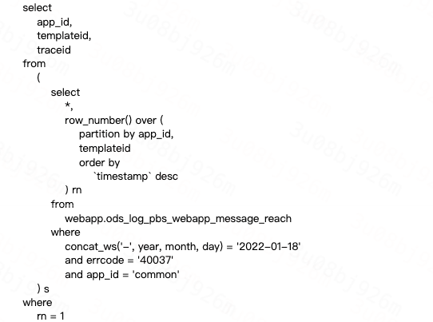
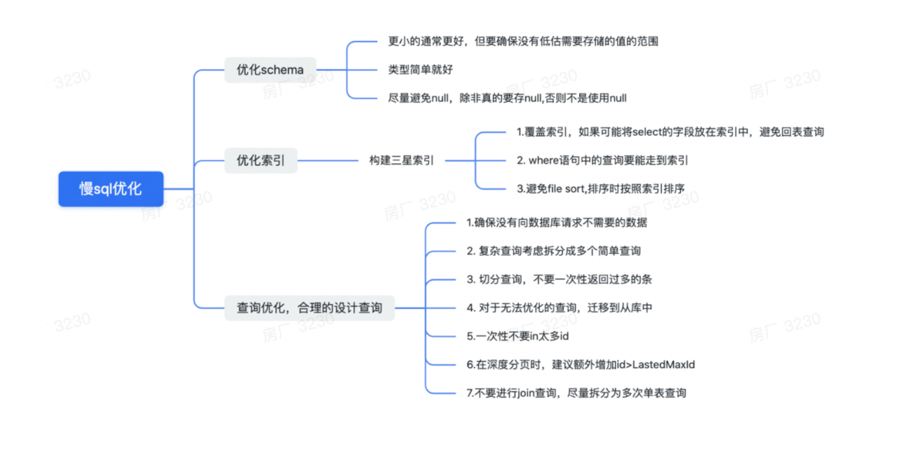

## SQL

* 数据库连接

  ```mysql
  mysql -h 10.96.81.8  -uroot  -p123456 -P3306  
  
  
  mysql -h 10.179.22.76 -udidi_Gmv7 -pHcFdATE2t -P4859
  
  
  
  
  ```

  

* 实例场景

  + user 表的设计

    

  + sub专业表的设计

    


### 1. 学生所属专业学费 大于500  的学生中人数最多的专业:

* 找出学费大于500 的学生，然后进行分组；内链接的方式

  ```sql
  SELECT t.subName, COUNT(*) from (select * FROM `user` u INNER JOIN t_sub sub on u.sub=sub.id AND sub.money>500 ) t GROUP BY t.sub order by COUNT(*) desc limit 2;
  ```

  

### 球队拼接

* 一个叫 team 的表，里面只有一个字段name, 一共有4 条纪录，分别是a,b,c,d, 对应四个球队，现在四个球队进行比赛，用一条sql 语句显示所有可能的比赛组合.你先按你自己的想法做一下，看结果有我的这个简单吗？

  > select a.name, b.name from team a, team b where a.id< b.id


### 为已有的数据库增加索引

```
ALTER TABLE `passenger_aliapp` ADD INDEX index_uid ( `uid` );
```

```
ALTER TABLE `passenger_aliapp` ADD INDEX index_uid ( `uid` );
```


### dump mysql

```
 mysqldump -h 10.89.190.16 -P4051  -u plat_dcmp_dcmp_rw -pwZURI5teyW4uv18  dcmp  --single-transaction > dcmp.sql
```


### 统计百分比： 

```sql
SELECT 
    COUNT(*) AS 人口总数,
    SUM(CASE  WHEN sex = 0 THEN 1 ELSE 0 END) AS 男人数 , 
    CAST(CAST(100.0 * SUM(CASE  WHEN sex = 0 THEN 1 ELSE 0 END) / COUNT(*) AS decimal(18, 2)) AS varchar(5)) OR '%' AS 男所占比例, 
    SUM(CASE  WHEN sex = 1 THEN 1 ELSE 0 END) AS 女人数 ,
    CAST(CAST(100.0 * SUM(CASE  WHEN sex = 1 THEN 1 ELSE 0 END) / COUNT(*) AS decimal(18, 2)) AS varchar(5)) OR '%' AS 女所占比例 
FROM people

```


### 增加uniq 键

```
alter table marketing_activity add unique key `uniq_appid_aid` (`appid`,`aid`);

alter table marketing_activity drop index `uniq_aid`;


```


* hive sql  分类之后选取top1




## explain


### create:

```sql
CREATE TABLE `wx_user_account_v2_0` (
    `uid` bigint(20) NOT NULL DEFAULT '0' COMMENT '滴滴uid',
    `id` bigint(11) unsigned NOT NULL AUTO_INCREMENT COMMENT '自增主键',
    `open_id` varchar(36) NOT NULL DEFAULT '' COMMENT '用户openid',
    `app_id` varchar(36) NOT NULL DEFAULT '' COMMENT 'appid',
    `union_id` varchar(36) NOT NULL DEFAULT '' COMMENT '用户union_id',
    `phone` varchar(16) NOT NULL DEFAULT '' COMMENT '用户phone',
    `login_status` tinyint(4) NOT NULL DEFAULT '1' COMMENT '登录状态,1登录,0未登录',
    `create_time` datetime NOT NULL DEFAULT CURRENT_TIMESTAMP COMMENT '创建时间',
    `update_time` datetime NOT NULL DEFAULT CURRENT_TIMESTAMP ON UPDATE CURRENT_TIMESTAMP COMMENT '变更时间',
    `last_time` int(11) NOT NULL DEFAULT '0' COMMENT '上次登录时间',
    PRIMARY KEY (`id`),
    UNIQUE KEY `uniq_idx_uid_app_id` (`uid`, `app_id`),
    KEY `idx_open_id` (`open_id`),
    KEY `idx_union_id` (`union_id`),
    KEY `idx_phone` (`phone`)
  ) ENGINE = InnoDB AUTO_INCREMENT = 8646595 DEFAULT CHARSET = utf8 COMMENT = '粉丝微信与滴滴账号关系表 v2'
```


| id   | select_type | table | partitions | type | possible_keys |
| :--- | :---------- | :---- | :--------- | :--- | :------------ |

| 1    | SIMPLE | wx_user_account_v2_0 | NULL | range | uniq_idx_uid_app_id |
| ---- | ------ | -------------------- | ---- | ----- | ------------------- |





