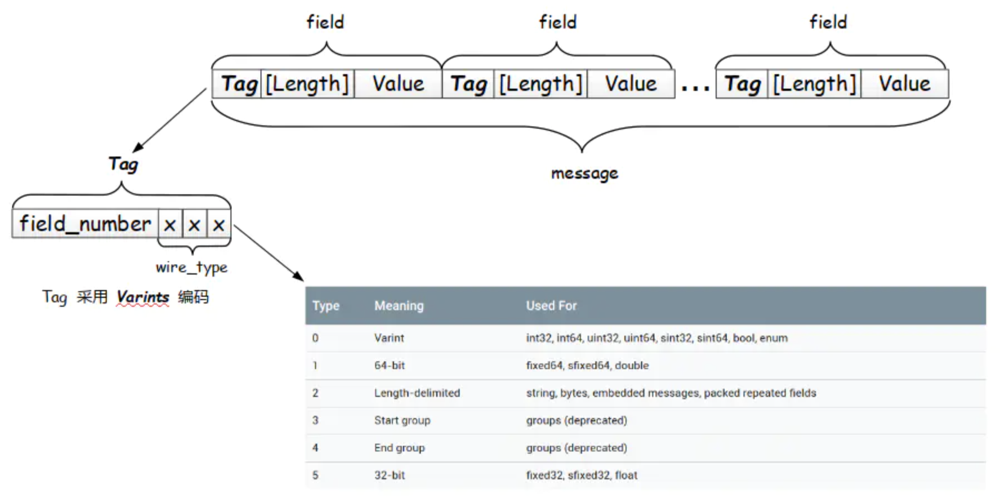
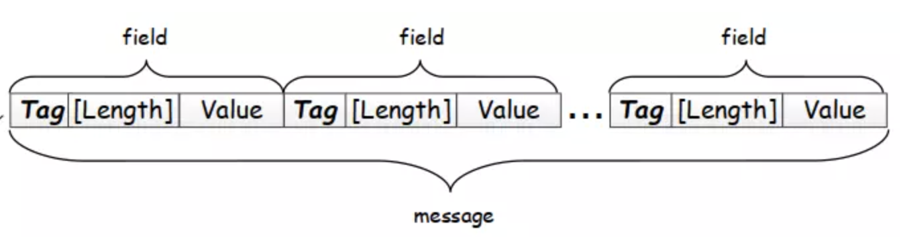

##ProtoBuf


* 转换为 字节流
* 序列化的速度快
* 体积小


### 编码方式

TLV 即 Tag - Length - Value。Tag 作为该字段的唯一标识，Length 代表 Value 数据域的长度，最后的 Value 并是数据本身。

ProtoBuf 编码采用类似的结构，但是实际上又有较大区别，其编码结构可见下图：






* 简单格式：

  ```sql
  message xxx {
    // 字段规则：required -> 字段只能也必须出现 1 次
    // 字段规则：optional -> 字段可出现 0 次或1次
    // 字段规则：repeated -> 字段可出现任意多次（包括 0）
    // 类型：int32、int64、sint32、sint64、string、32-bit ....
    // 字段编号：0 ~ 536870911（除去 19000 到 19999 之间的数字）
    字段规则 类型 名称 = 字段编号;
  }
  ```

  类型 string，名为 stringVal 的 optional 可选字段，字段编号为 1，此字段可出现 0 或 1 次

  类型 bytes，名为 bytesVal 的 optional 可选字段，字段编号为 2，此字段可出现 0 或 1 次

  类型 EmbeddedMessage（自定义的内嵌 message 类型），名为 embeddedExample1 的 optional 可选字段，字段编号为 3，此字段可出现 0 或 1 次

  类型 int32，名为 repeatedInt32Val 的 repeated 可重复字段，字段编号为 4，此字段可出现 任意多次（包括 0）

  类型 string，名为 repeatedStringVal 的 repeated 可重复字段，字段编号为 5，此字段可出现 任意多次（包括 0）


### 生成代码

```shell
$ protoc --go_out=plugins=grpc:. hello.proto
```

* -- xx_out 

  > protoc将首先查询是否有内置的xxx插件，如果没有内置的xxx插件那么将继续查询当前系统中是否存在protoc-gen-xxx命名的可执行程序，最终通过查询到的插件生成代码.

* plugins= grpc: 

  > 对于Go语言的protoc-gen-go插件来说，里面又实现了一层静态插件系统。比如protoc-gen-go内置了一个gRPC插件，用户可以通过`--go_out=plugins=grpc`参数来生成gRPC相关代码，否则只会针对message生成相关代码。


## gRPC

  gRPC是Google公司基于Protobuf开发的跨语言的开源RPC框架。gRPC基于HTTP/2协议设计，可以基于一个HTTP/2链接提供多个服务，对于移动设备更加友好。


