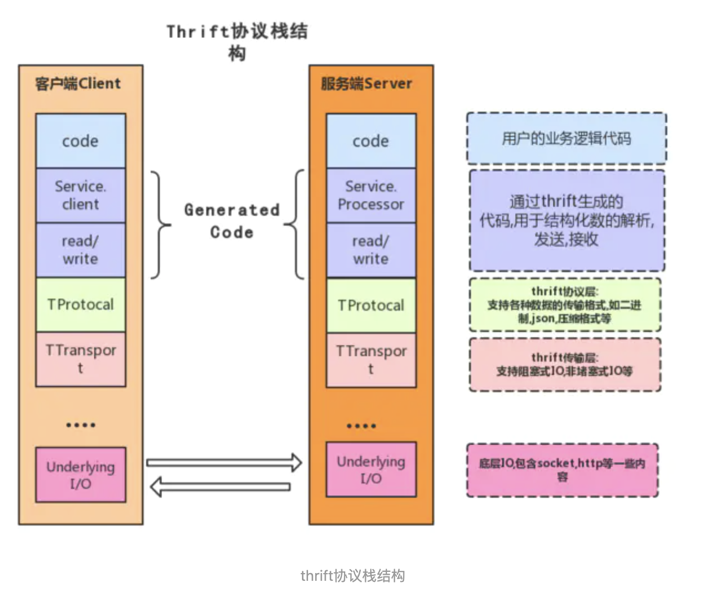

##thrift 

> thrift通过一个中间语言IDL(接口定义语言)来定义RPC的数据类型和接口,这些内容写在以.thrift结尾的文件中,然后通过特殊的编译器来生成不同语言的代码,以满足不同需要的开发者,比如java开发者,就可以生成java代码,c++开发者可以生成c++代码,生成的代码中不但包含目标语言的接口定义,方法,数据类型,还包含有RPC协议层和传输层的实现代码.



##### Transport

* Transport层提供了一个简单的网络读写抽象层，这使得thrift底层的transport从系统其他的部分解耦。Thrift使用ServerTransport接口接受或者创建原始transport对象。ServerTransport用在Server端，为到来的连接创建Transport对象。

##### Protocol

* Protocol抽象层定义了一种怎样将内存中数据结构映射成可传输格式的机制。Protocol定义了datatype怎样使用底层的Transport对自己进行编解码

##### Processor

* Processor封装了从输入数据流中读数据和向数据流中写数据的操作。


```java
interface TProcessor {
 
bool process(TProtocol in, TProtocol out) throws TException
 
}
```

与服务相关的processor实现由编译器产生。Processor主要工作流程如下：从连接中读取数据（使用输入protocol），将处理授权给handler（由用户实现），最后将结果写到连接上（使用输出protocol）。


##### Server

Server将以上所有特性集成在一起

- 创建一个transport对象
- 为transport对象创建输入输出protocol
- 基于输入输出protocol创建processor
- 等待连接请求并将之交给processor处理


* ThriftIDL语法： 

  ```idl
  //命名空间，对应着java中的包，Thrift生成的类文件会在这个目录中
  namespace  java com.test 
  
  //数据结构
  struct Parameter{
      1: required i32 id;
      2: required string name;
  }
  //service
  service DemoService{
      i32 demoMethod(1:string param1, 2:Parameter param2, 3:map<string,string> param3);
  }
  ```

* 数据类型

  ```sql
  * 基本类型：
  bool: 布尔值
  byte: 8位有符号整数
  i16: 16位有符号整数
  i32: 32位有符号整数
  i64: 64位有符号整数
  double: 64位浮点数
  string: UTF-8编码的字符串
  binary: 二进制串
  
  * 结构体类型：
  struct: 定义的结构体对象
  
  * 容器类型：
  list: 有序元素列表
  set: 无序无重复元素集合
  map: 有序的key/value集合
  
  * 异常类型：
  exception: 异常类型
  
  * 服务类型：
  service: 具体对应服务的类
  ```

  


