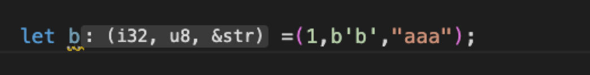
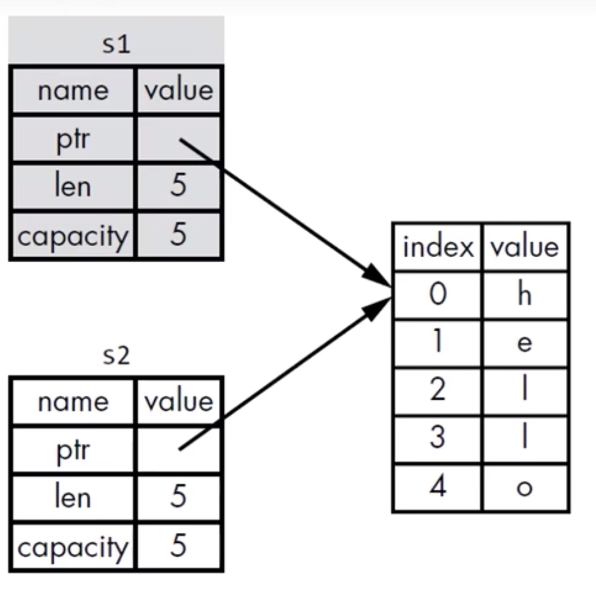
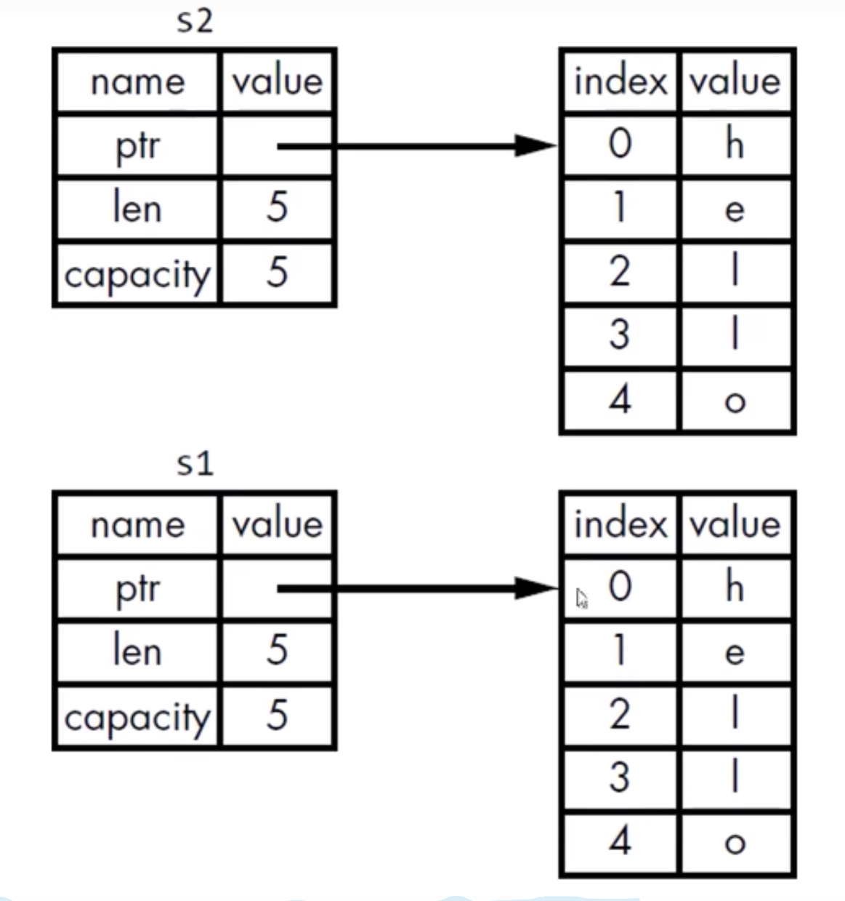

[TOC]

## 1.rust-基础类型

### Tuple

* 长度是固定的，一旦声明无法更改

* 相当于无名结构体：结构体无名，参数无名

  

### 数组

> 使用场景：
>
> 1. 如果想让你的数据放在栈上而不是heap上
> 2. 想保证固定数量的元素

* 长度是固定的

* 声明方式：

  let c:[i32;3]=[1,2,3];

  let d= [1;100]; //初始化方式，内有100个元素每个元素都是1；

### 函数

* 函数体由一系列的语句组成，可选的有一个表达式结束

  * 语句：是执行一些动作的指令,是不返回值的

  * 表达式：计算产生一个值

## 2.变量所有权

### 知识

> 前置知识，什么时候把数据放在栈上，什么时候放在堆上？
>
> 回答：如果这个数据是可以动态变更大小 或者 生命周期 != 此栈 数据则迁移到heap上
>
> 原因：
>
> 1. 栈上放置的数据都是固定大小的，这样在编译期所需要的大小都已经确定下来，每个变量的位置也确定下来，如果数据是可以动态变更大小的话，变量位置就会变化，维护成本比较高，不如收敛所有变量，逻辑简单的多
> 2. 栈的数据的生命周期都是固定的，如果数据是共享的，那就更需要将数据放置到heap上

在编译期就能自动补全free内存变量；

### 所有权规则

* 每个数据都有一个变量，这个变量是该值的所有者
* 每个值只能有一个所有者
* 当所有者超出作用域时，这个值便会删除

## 3.变量和数据的交互方式

### Heap变量

##### 移动-move

* 设计原则：rust不会自动创建数据的深copy
* stack上的拷贝，同时禁用oldKey ：避免 double free

##### 克隆-clone

### Stack变量

##### 复制：copy trait 

> 如果一个类型实现了<mark>copy</mark>这个trait，那么旧的变量在赋值后仍然可用
>
> 比如整数类型就原生实现了copy trait

如果一个类型或者一个类型的一部分实现了drop trait，说明这个类型是在heap上有数据的，那肯定不在stack上，那肯定不能实现copy trait 

