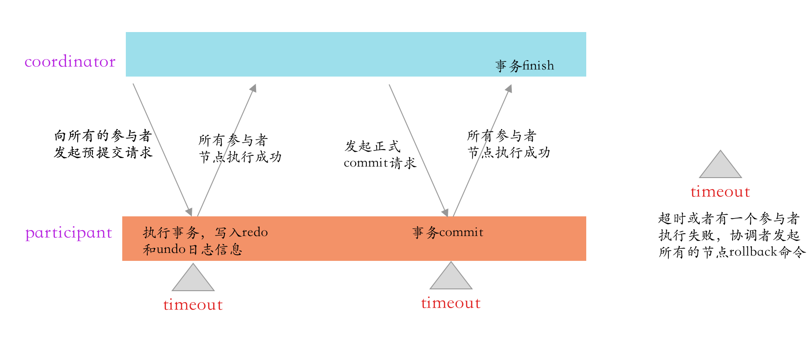
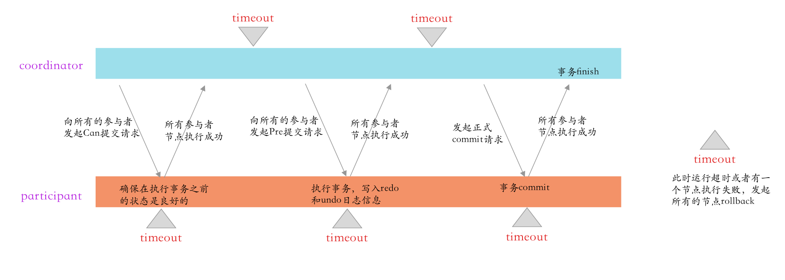
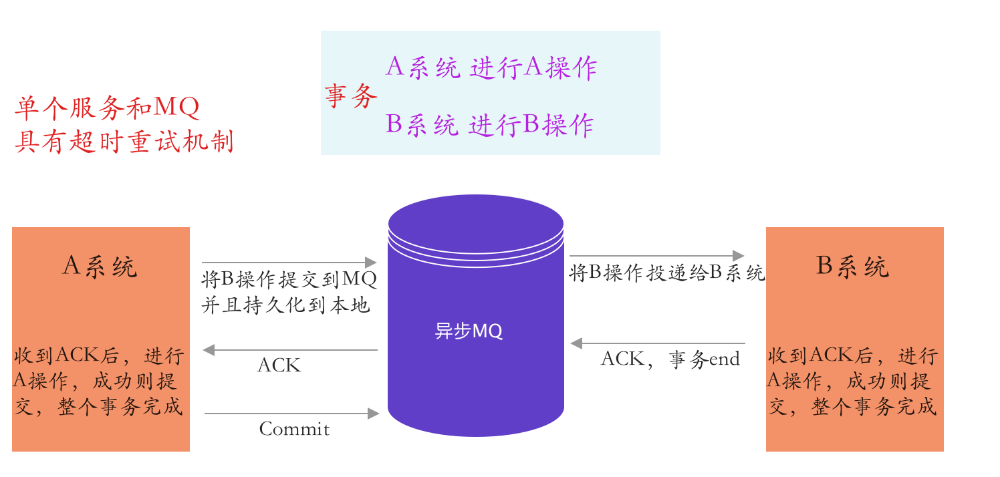

## 分布式事务

### 两阶段提交

>二阶段提交本身比较简单，就是把分布式事务分成`准备阶段`和`提交阶段`两个阶段。
>
>目的很明确:
>
><mark> 就是尽可能晚地提交事务，让事务在提交前尽可能地完成所有能完成的工作，这样，最后的提交阶段将是一个耗时极短的微小操作，这种操作在一个分布式系统中失败的概率是非常小的，也就是所谓的“网络通讯危险期”非常的短暂，这是两阶段提交确保分布式事务原子性的关键所在。</mark>
>
>（唯一理论上两阶段提交出现问题的情况是当协调者发出提交指令后宕机并出现磁盘故障等永久性错误，导致事务不可追踪和恢复）。

##### 缺点：

* 单点故障 ： leader节点一旦挂掉，follower 未提交的占用的一些公共资源就一直不能释放 ，<mark> 三阶段提交增加了超时默认提交,自动释放公共资源 </mark>
* 数据一致性问题 ： 当leader节点 同步commit 一半后，挂掉，后面选举成的leader 可能是 commit状态的，也可能是uncommitted的；所以这样数据就不一致了，三阶段<mark>超时默认提交</mark>解决了这个问题。
* 加锁同步阻塞问题：本身对公共资源的占用时间就很长，还有一个case，有8个人，7个人阶段成功了一个人失败，那么所有人还要回滚，这样的case3PC把2PC的准备阶段再次一分为二，先问下大家是否有资源？，如果没有早就cancel。能够快速响应，减少无畏的同步阻塞占用。

### 三阶段提交：覆盖了大部分case能够保持数据一致性。

* 针对两阶段提交的缺点进行改进，在参与者中也加入的超市机制，参与者，协调者都有；解决单点故障问题。
* **3PC把2PC的准备阶段再次一分为二，这样三阶段提交就有CanCommit、PreCommit、DoCommit三个阶段。这样就能快速响应（先问下资源是否都有，避免直接占用资源，8个人7个人完成了还有一个失败了，还得回滚七个人，浪费资源占用。）**

### 基于可靠消息的分布式事务

* 上面所介绍的Commit和Rollback都属于理想情况，但在实际系统中，Commit和Rollback指令都有可能在传输途中丢失。那么当出现这种情况的时候，消息中间件是如何保证数据一致性呢？——答案就是超时询问机制

  