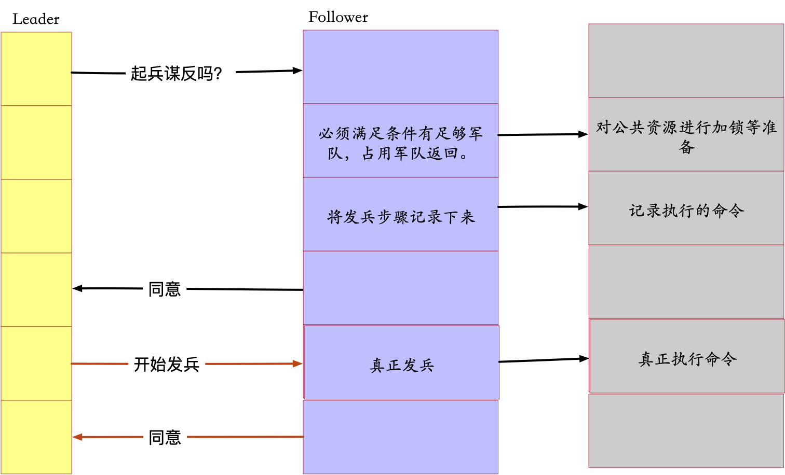

## 一场推翻朝廷的谋反：

大将军 L ，必须结合 a b c 三位将军的力量，在同一时刻发兵才能成功，

大将军对每位将军进行沟通：

### 缺点： 

* 占用兵力资源
* 单点故障： L 将军 挂了后，所有将军的军队使用在占用中，不能去干别的。
* 数据不一致： L 将军 挂了后，不知道该不该起兵

### 优化：

* 超时默认起兵 --- 解决大部分数据不一致的情况，解决同步阻塞造成的单点故障
* 第一步一分为二，减少对资源的阻塞。

