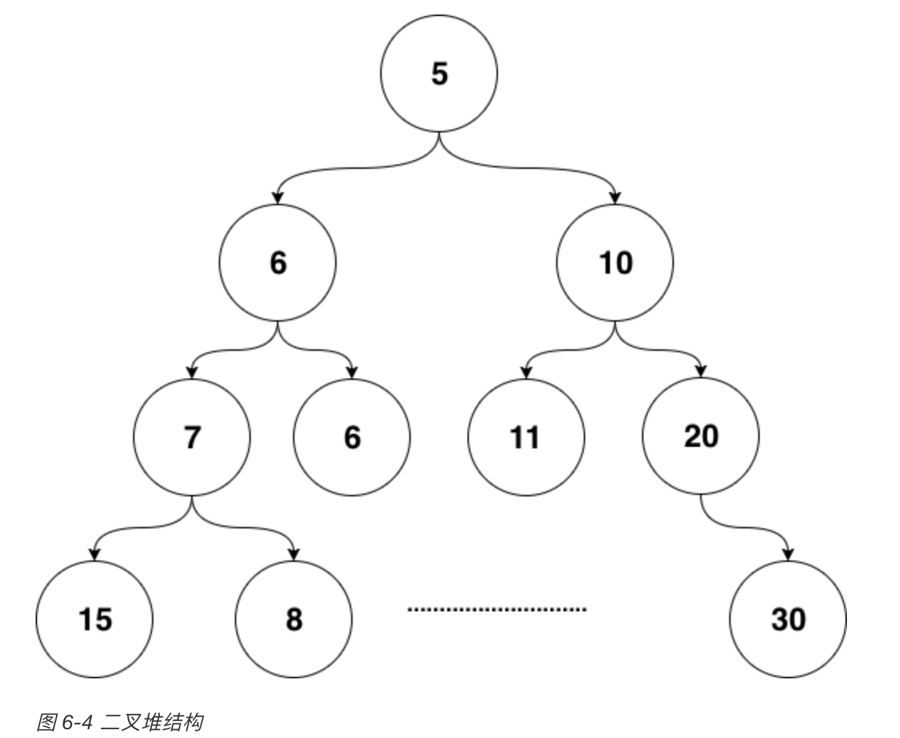
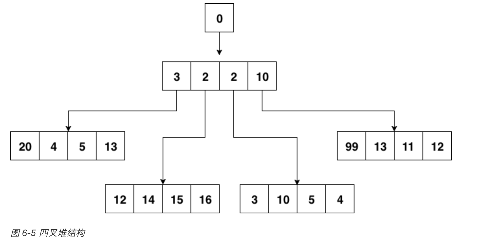

## 延时任务系统

> 我们在做系统时，很多时候是处理实时的任务，请求来了马上就处理，然后立刻给用户以反馈。但有时也会遇到非实时的任务，比如确定的时间点发布重要公告。或者需要在用户做了一件事情的X分钟/Y小时后，对其特定动作，比如通知、发券等等。

##### 常见的解决方式

* 具有定时功能的消息队列
* crontab的分布式定时任务管理系统

### 设计延时功能的数据结构

* `小顶堆`

* 优点

  > 对于定时器来说，如果堆顶元素比当前的时间还要大，那么说明堆内所有元素都比当前时间大。进而说明这个时刻我们还没有必要对时间堆进行任何处理。定时检查的`时间复杂度是`O(1)`。
  >
  > 当我们发现堆顶的元素小于当前时间时，那么说明可能已经有一批事件已经开始过期了，进行正常的弹出和堆调整操作就好。每一次堆调整的时间复杂度都是`O(LgN)`。

* `四顶堆`

  > Go自身的内置定时器就是用时间堆来实现的，不过并没有使用二叉堆，而是使用了扁平一些的四叉堆。在最近的版本中，还加了一些优化，我们先不说优化，先来看看四叉的小顶堆长什么样：

* 时间轮的概念

  >​        用时间轮来实现定时器时，我们需要定义每一个格子的“刻度”，可以将时间轮想像成一个时钟，中心有秒针顺时针转动。每次转动到一个刻度时，我们就需要去查看该刻度挂载的任务列表是否有已经到期的任务。
  >
  >​        从结构上来讲，时间轮和哈希表很相似，如果我们把哈希算法定义为：触发时间%时间轮元素大小。那么这就是一个简单的哈希表。在哈希冲突时，采用链表挂载哈希冲突的定时器。

  