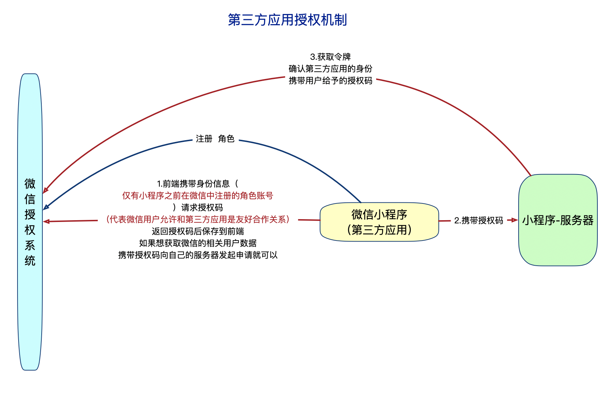

## OAuth 2 

### 第三方授权机制的理解

* 小区的送餐机制；

  第一步，门禁系统的密码输入器下面，增加一个按钮，叫做"获取授权"。快递员需要首先按这个按钮，去申请授权。

  第二步，他按下按钮以后，屋主（也就是我）的手机就会跳出对话框：有人正在要求授权。系统还会显示该快递员的姓名、工号和所属的快递公司。

  我确认请求属实，就点击按钮，告诉门禁系统，我同意给予他进入小区的授权。

  第三步，门禁系统得到我的确认以后，向快递员显示一个进入小区的令牌（access token）。令牌就是类似密码的一串数字，只在短期内（比如七天）有效。

  第四步，快递员向门禁系统输入令牌，进入小区。

  有人可能会问，为什么不是远程为快递员开门，而要为他单独生成一个令牌？这是因为快递员可能每天都会来送货，第二天他还可以复用这个令牌。另外，有的小区有多重门禁，快递员可以使用同一个令牌通过它们。

### 比较流行的授权码授权方式

