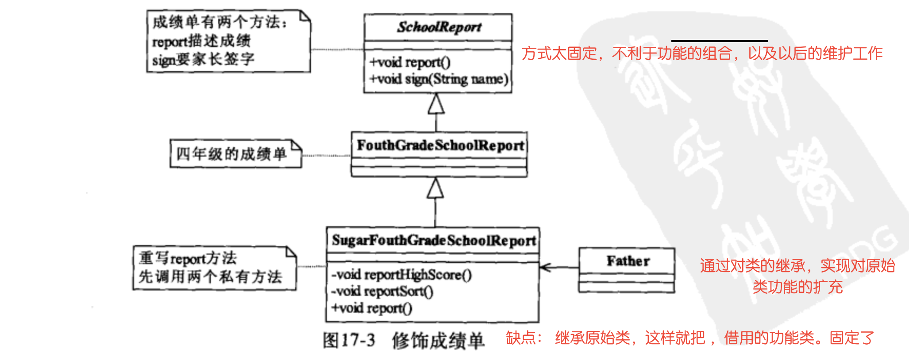
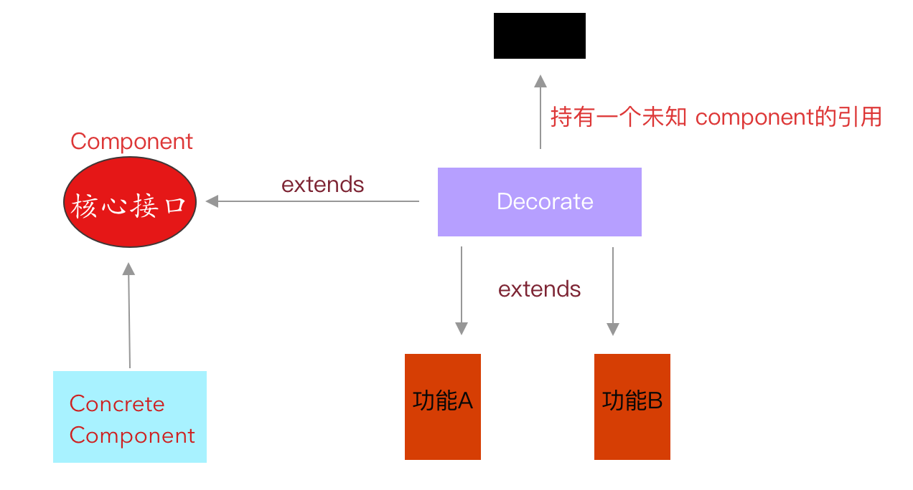

## 装饰即对功能的扩充以及骚组合


### 1. 继承的方式对功能的扩充（不实用，废弃）



* 这样的话要进行一些类的功能的扩充，这样就要写具多的子类进行对功能的扩充组合（明显是不容易维护和扩展的）


### 2. flexible decorate design way  ---要进行组合的对象是动态insject 注入的



* 设计的最初和核心功能抽象

* ```java
  public interface Component {
      public  void operate();
  }
  
```
  
* 最原始的核心实现者 

  ```java
  public class ConcreteComponent implement Component{
      @Override
      public void operate() {
          System.out.println("最原始的 核心功能操作");
      }
  }
  ```

* 装饰者模式的核心逻辑---设有虚拟的某个组件的功能

  ```java
  //todo 持有另一个功能的component组件的使用
  public abstract class Decorate extends Component{
  
      private Component component;
  
      public Decorate(Component component) {
          this.component = component;
      }
  
      @Override
      public void operate() {
          component.operate();
      }
  }
  ```

* 扩增的多个可组合的功能

  ```java
  public class 唱歌_1 extends Decorate {
      //todo 要组合的功能类是未知的，dynamic combine
      public Extension_1(Component component) {
          super(component);
      }
      @Override
      public void operate() {
          System.out.println("唱歌功能A");
          super.operate();//未知的方法实现
      }
  }
  
  
  public class 跳舞_2 extends Decorate {
      //todo 要组合的功能类是未知的，dynamic combine
      public Extension_1(Component component) {
          super(component);
      }
      @Override
      public void operate() {
          System.out.println("跳舞功能B");
          super.operate();
      }
  }
  
  
  
  public class 弹琴_3 extends Decorate {
      //todo 要组合的功能类是未知的，dynamic combine
      public Extension_1(Component component) {
          super(component);
      }
      @Override
      public void operate() {
          System.out.println("弹琴功能C");
          super.operate();
      }
  }
  
  
  
  
  
  
  ```
  
* 任意组合功能的使用

  ```java
   public static void main(String[] args) {
          //todo 最原始的功能，现在要他组合上功能 A和功能B
          Component base = new ConcreteComponent();
          Component A_base=new 唱歌_1(base); //todo 组合扩展的功能 A
          Component B_A_base=new 跳舞_2(A_base);//todo 组合扩展的功能 B
          B_A_base.operate();
      }
  
  
  
  结果： 
    跳舞功能B 
    唱歌功能A
    最原始的 核心功能操作
    
    
    
    
   
  ```
  


