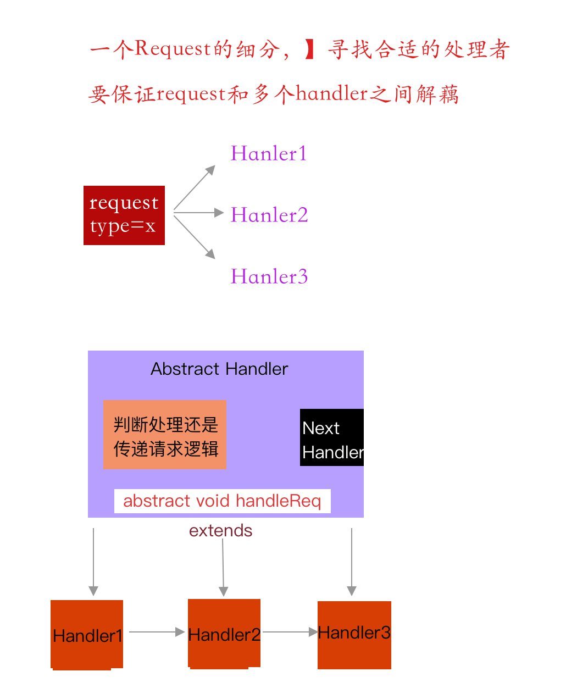

## 责任链模式

* 一种请求的模式有多种，也就是说多个对象都有机会处理请求；
* 同时也要使多个处理者 与 请求之间 不能耦合 （方便扩展新的处理者）符合开闭原则




* 所有的处理者都在一条链上，运行直到找到合适的处理器为止；

* 核心类

  ```java
  public abstract class Handler {
       int type=0;
      private Handler next;
      public Handler(int type) {
          this.type = type;
      }
      public void setNext(Handler next) {
          this.next = next;
      }
      //todo 具体的处理者只需要关注自己的处理逻辑即可
       abstract void handleReq(IRequest request);
  
      //todo 模版模式--》判定reques是否符合（符合则处理）不符合则责任链传递
      public void handle(IRequest req){
          if (req.getType()==type){
              handleReq(req);
          }else{
              next.handle(req);
          }
      }
  
  }
  ```

##### 缺点：

* 遍历链表，性能降低
* 调试不方便