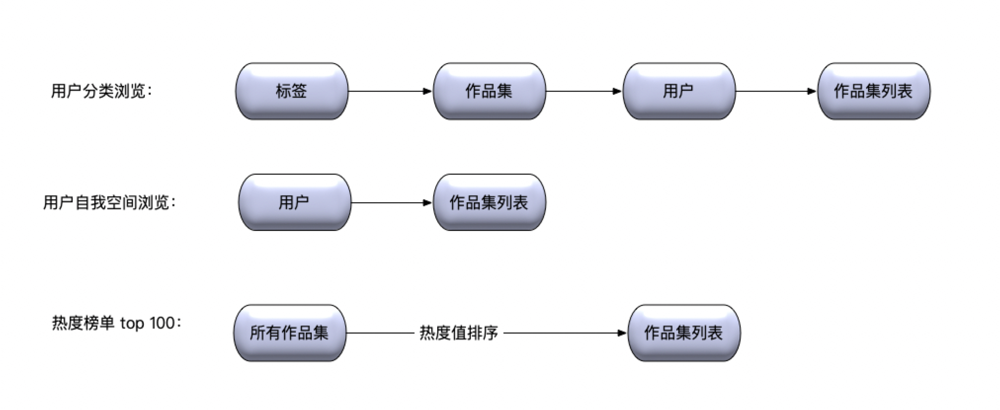

# 小程序账号表：

```sql
CREATE TABLE `wx_account` (
  `id` bigint(11) unsigned NOT NULL AUTO_INCREMENT COMMENT '自增id',
  `account_type` tinyint(10) NOT NULL DEFAULT '1' COMMENT '微信账号类型,1是公众号,2小程序',
  `name` varchar(50) NOT NULL DEFAULT '' COMMENT '入驻程序名称',
  `appid` varchar(50) NOT NULL DEFAULT '' COMMENT 'appid',
  `appsecret` varchar(50) NOT NULL DEFAULT '' COMMENT 'appsecret',
  PRIMARY KEY (`id`),
  UNIQUE KEY `uniq_appid` (`appid`),
) ENGINE=InnoDB AUTO_INCREMENT=579 DEFAULT CHARSET=utf8 COMMENT='小程序,公众号表';
```


# 用户账号表：

```sql
CREATE TABLE `wx_user_account` (
  `id` bigint(11) unsigned NOT NULL AUTO_INCREMENT COMMENT '自增主键',
  `appid` varchar(56) NOT NULL DEFAULT '' COMMENT 'appid',
  `openid` varchar(36) NOT NULL DEFAULT '' COMMENT '用户openid',
  `unionid` varchar(56) NOT NULL DEFAULT '' COMMENT '用户unionid',
  `avatar_url` varchar(512) NOT NULL DEFAULT '' COMMENT '头像',
  `nick_name` varchar(30) NOT NULL DEFAULT '' COMMENT '昵称',
  `phone` varchar(30) NOT NULL DEFAULT '' COMMENT 'phone',
  `create_time` datetime NOT NULL DEFAULT CURRENT_TIMESTAMP COMMENT '创建时间',
  `update_time` datetime NOT NULL DEFAULT CURRENT_TIMESTAMP ON UPDATE CURRENT_TIMESTAMP COMMENT '变更时间',
  PRIMARY KEY (`id`),
  KEY `idx_phone` (`phone`),
  UNIQUE KEY `uniq_openid_appid` (`openid`,`appid`)
) ENGINE=InnoDB AUTO_INCREMENT=1216 DEFAULT CHARSET=utf8mb4 COMMENT='用户账号表';
```

# 图片表：

```sql

CREATE TABLE `image` (
  `id` bigint(11) unsigned NOT NULL AUTO_INCREMENT COMMENT '唯一标示符',
  `image_key` varchar(255) NOT NULL DEFAULT '' COMMENT 'gift系统存储的多媒体文件的key',
  `create_time` timestamp NOT NULL DEFAULT CURRENT_TIMESTAMP COMMENT '创建时间',
  PRIMARY KEY (`id`),
  UNIQUE KEY `uniq_image_key` (`image_key`)
) ENGINE=InnoDB DEFAULT CHARSET=utf8mb4 COMMENT='图片表';
```


# 作品集：collection

* 包含：

  * 标题，限制30个字以内 
  * 标签：<=3
  * 图片: <=20
  * 热度值：浏览量\*1+点赞\*2+评论\*3+下载\*3
  * 相关评论

* 索引：

  

  ```sql
  CREATE TABLE `collection` (
    `id` bigint(11) unsigned NOT NULL AUTO_INCREMENT COMMENT '自增主键',
    `title` varchar(256) NOT NULL DEFAULT '' COMMENT '标题',
    `uid` bigint(11) unsigned NOT NULL DEFAULT '' COMMENT '归属用户id',
    `like_count` bigint(11) unsigned NOT NULL DEFAULT '' COMMENT '点赞数',
    `read_count` bigint(11) unsigned NOT NULL DEFAULT '' COMMENT '浏览数',
    `create_time` datetime NOT NULL DEFAULT CURRENT_TIMESTAMP COMMENT '创建时间',
    `update_time` datetime NOT NULL DEFAULT CURRENT_TIMESTAMP ON UPDATE CURRENT_TIMESTAMP COMMENT '变更时间',
    PRIMARY KEY (`id`),
    UNIQUE KEY `uniq_uid_name` (`uid`,`name`),
  ) ENGINE=InnoDB AUTO_INCREMENT=1216 DEFAULT CHARSET=utf8mb4 COMMENT='作品集表' ;
  ```


# collection_image

* 空间下包含哪些图片

```sql
CREATE TABLE `collection_image` (
  `id` bigint(11) unsigned NOT NULL AUTO_INCREMENT COMMENT '自增主键',
  `collection_id` bigint(11) unsigned NOT NULL DEFAULT '' COMMENT '作品集ID',
  `image_id` bigint(11) unsigned NOT NULL DEFAULT '' COMMENT '图片id',
  `status` tinyint(4) NOT NULL DEFAULT '1' COMMENT '状态,1正常,0删除',
  `create_time` datetime NOT NULL DEFAULT CURRENT_TIMESTAMP COMMENT '创建时间',
  `update_time` datetime NOT NULL DEFAULT CURRENT_TIMESTAMP ON UPDATE CURRENT_TIMESTAMP COMMENT '变更时间',
  PRIMARY KEY (`id`),
  UNIQUE KEY `uniq_sid_imid` (`space_id`,`image_id`),
) ENGINE=InnoDB AUTO_INCREMENT=1216 DEFAULT CHARSET=utf8mb4 COMMENT='空间映射表' ;
```


# 标签：

```sql
CREATE TABLE `tag` (
  `id` bigint(11) unsigned NOT NULL AUTO_INCREMENT COMMENT '唯一标示符',
  `tag_key` varchar(255) NOT NULL DEFAULT '' COMMENT 'tag key',
  `create_time` timestamp NOT NULL DEFAULT CURRENT_TIMESTAMP COMMENT '创建时间',
  `update_time` datetime NOT NULL DEFAULT CURRENT_TIMESTAMP ON UPDATE CURRENT_TIMESTAMP COMMENT '变更时间',
  PRIMARY KEY (`id`),
  UNIQUE KEY `uniq_tag_key` (`tag_key`)
) ENGINE=InnoDB DEFAULT CHARSET=utf8mb4 COMMENT='标签表';
```


# collection_tag

* 这个作品集绑定了哪些标签

```sql
CREATE TABLE `collection_tag` (
  `id` bigint(11) unsigned NOT NULL AUTO_INCREMENT COMMENT '自增主键',
  `collection_id` bigint(11) unsigned NOT NULL DEFAULT '' COMMENT '作品集ID',
  `tag_id` bigint(11) unsigned NOT NULL DEFAULT '' COMMENT '标签id',
  `create_time` datetime NOT NULL DEFAULT CURRENT_TIMESTAMP COMMENT '创建时间',
  `update_time` datetime NOT NULL DEFAULT CURRENT_TIMESTAMP ON UPDATE CURRENT_TIMESTAMP COMMENT '变更时间',
  PRIMARY KEY (`id`),
  KEY `idx_tag_id` (`tag_id`)
  UNIQUE KEY `uniq_cid_tid` (`collection_id`,`tag_id`),
) ENGINE=InnoDB AUTO_INCREMENT=1216 DEFAULT CHARSET=utf8mb4 COMMENT='作品集标签表' ;
```


# Space:

* 查询用户下面

```sql

CREATE TABLE `space` (
  `id` bigint(11) unsigned NOT NULL AUTO_INCREMENT COMMENT '自增主键',
  `space_name` varchar(128) NOT NULL DEFAULT '' COMMENT '空间名称',
  `uid` bigint(11) unsigned NOT NULL DEFAULT 0 COMMENT '归属用户id',
  `status` tinyint(4) NOT NULL DEFAULT '1' COMMENT '状态,1正常,0删除',
  `create_time` datetime NOT NULL DEFAULT CURRENT_TIMESTAMP COMMENT '创建时间',
  `update_time` datetime NOT NULL DEFAULT CURRENT_TIMESTAMP ON UPDATE CURRENT_TIMESTAMP COMMENT '变更时间',
  PRIMARY KEY (`id`),
  UNIQUE KEY `uniq_uid_name` (`uid`,`space_name`,`status`)
) ENGINE=InnoDB AUTO_INCREMENT=1215 DEFAULT CHARSET=utf8mb4 COMMENT='用户空间表' ;
```


# space_auth：

含义：用户有那些空间的权限

```sql
CREATE TABLE `space_auth` (
  `id` bigint(11) unsigned NOT NULL AUTO_INCREMENT COMMENT '自增主键',
  `uid` bigint(11) unsigned NOT NULL DEFAULT 0 COMMENT '用户id',
  `space_id` bigint(11) unsigned NOT NULL DEFAULT 0 COMMENT '空间ID',
  `create_time` datetime NOT NULL DEFAULT CURRENT_TIMESTAMP COMMENT '创建时间',
  `update_time` datetime NOT NULL DEFAULT CURRENT_TIMESTAMP ON UPDATE CURRENT_TIMESTAMP COMMENT '变更时间',
  PRIMARY KEY (`id`),
  KEY `idx_space_id` (`space_id`),
  UNIQUE KEY `uniq_uid_name` (`uid`,`space_id`)
) ENGINE=InnoDB AUTO_INCREMENT=1216 DEFAULT CHARSET=utf8mb4 COMMENT='用户空间权限表' ;
```


# space_image

* 空间下包含哪些图片

```sql
CREATE TABLE `space_image` (
  `id` bigint(11) unsigned NOT NULL AUTO_INCREMENT COMMENT '自增主键',
  `space_id` bigint(11) unsigned NOT NULL DEFAULT 0 COMMENT '空间ID',
  `image_id` bigint(11) unsigned NOT NULL DEFAULT 0 COMMENT '图片id',
  `status` tinyint(4) NOT NULL DEFAULT 1 COMMENT '状态,1正常,0删除',
  `create_time` datetime NOT NULL DEFAULT CURRENT_TIMESTAMP COMMENT '创建时间',
  `update_time` datetime NOT NULL DEFAULT CURRENT_TIMESTAMP ON UPDATE CURRENT_TIMESTAMP COMMENT '变更时间',
  PRIMARY KEY (`id`),
  UNIQUE KEY `uniq_sid_imid` (`space_id`,`image_id`)
) ENGINE=InnoDB AUTO_INCREMENT=1216 DEFAULT CHARSET=utf8mb4 COMMENT='空间内图片映射表' ;
```


] 