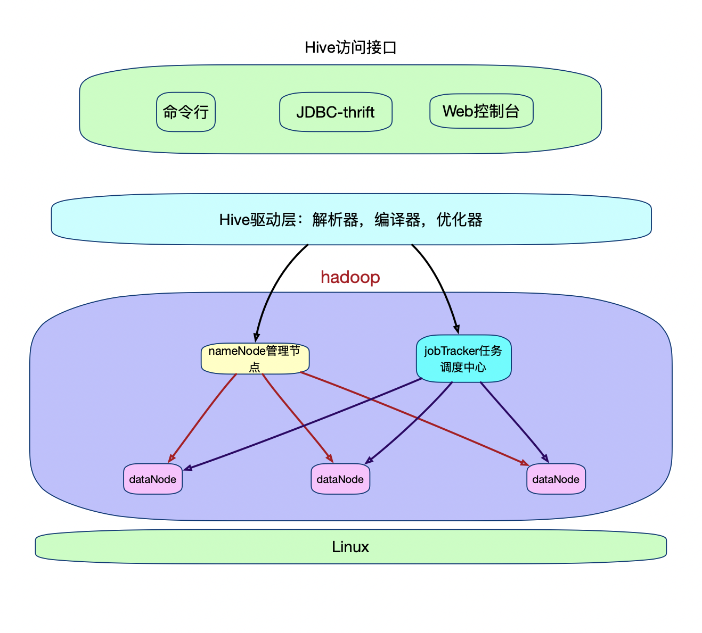

## hive

```scheme
数据仓库是一个面向主题， 抽取数据，不可更新的仓库；
```


> 基于hadoop 做的一个分布式数据存储仓库

### Hive的体系结构是啥样的？


### Hive如何与 hadoop 的分布式文件系统交互的？




### Hive数据和文件之间的关系是啥样的？


### hive的基本知识

* 基本数据类型

  ```sql
  1. string 相当于varchar 可变长度 可以指定字符集 最大2G
  2. binary 字节数组
  ```

* 集合数据类型

  ```map
  有三种复杂数据类型 ARRAY 、 MAP 和 STRUCT 。
  ```

* 创建一个hive 表，并设置倒入数据的格式

  我们想导入的数据格式是这样的： 

  ```json
  {
      "name":"xiaoming",
      "friends":[      //array 
          "bingbing",
          "lili"
      ],
      "children":{    //map
          "xiao song":18,
          "xiaoxiao song":19
      },
      "address":{
          "street":"hui long guan",
          "city":"beijing"
      }
  }
  ```

  真实的文件中记录的真实数据是：

  ```json
  xiaoming,bingbing_lili,xiao song:18_xiaoxiao song:19,hui long guan_beijing
  yangyang,caicai susu,xiao yang:18_xiaoxiao yang:19,chao yang_beijing
  ```

* 创建的hive 

  ```sql
  create table persons(
    name string ,
    friends array<string> ,
    children map<string,int> ,
    address struct<street:string,city:string>
  )
  row  format delimited fields terminated by ','  //代表行分割属性界符；
  collection items terminated by '_'
  map keys terminated by ':'
  lines terminated by '\n';
  ```
  
* 导入数据

  ```
  load data local inpath '' into table database.table ;
  ```

  

### 表的类型

* 内部表和外部表：

  ```sql
  创建内部表的时候，会将数据移动到数据仓库指向的路径，若创建外部表，仅记录数据所在的路径，不对数据的路径做出任何改变；
  删除的时候，内部表的元数据和数据回忆起进行删除，而外部表只删除元数据； 
  都进行存储，但是存储的目录是不同的； 
  ```

* 分区表

  ```sql
  对表的再次区分，同一个表，对下面的数据再次区分；
  create table dept_partition(
  deptno int, dname string, loc string
  ）
  partitioned by (month string)
  row format delimited fields terminated by '\t';
  ```

  

### 对json数据进行处理分析： 

```
    count( get_json_object(push_context,'$.message.ext_info[5].ext_value') ) as order_id_count 
```


### 查询示例：

```sql
select
   all_and_wx.send_date,
    all_and_wx.msg_key,
    all_and_wx.push_num,
    all_and_wx.wx_num,
    push_sms.num,
    all_and_wx.wx_rate,
    all_and_wx.spilt_rate,
    all_and_wx.profit
from
    (
        select
            wx_reach.send_date,
            wx_reach.msg_key,
            push.push_num,
            wx_reach.wx_num,
            concat(
                round(wx_reach.wx_num / push.push_num, 5) * 100,
                '%'
            ) as wx_rate,
            wx_reach.spilt_rate,
            wx_reach.profit
        from
            (
                select
                    send_date,
                    msg_key,
                    count(*) as wx_num,
                    case
                        msg_key
                        when 'driver_reassign_no_carpool_no_duty_passenger_later_realtime_no_strived_status' then 1
                        when 'passenger_pcanceltrip_callcarOrder_zkh_realtype_passenger' then 1
                        when 'passenger_pcanceltrip_callcarOrder_zkh_book_passenger' then 1.987
                        when 'driver_reassign_call_car_realtype_passenger' then 2
                        when 'driver_reassign_call_car_realtype_caller' then 2
                        when 'driver_arrived_call_car_caller' then 1.00017
                        when 'driver_strive_callback_no_openapi_channel_book_order_passenger' then 6
                        when 'sms_intercity_carpool_booking_success' then 1.99967
                        when 'driver_strive_callback_callcar_no_openapi_channel_book_new_user_passenger_1' then 5.99853
                        when 'driver_strive_callback_callcar_no_openapi_channel_no_book_new_user_passenger_1' then 5
                        else 0
                    end as spilt_rate,
                    case
                        msg_key
                        when 'driver_reassign_no_carpool_no_duty_passenger_later_realtime_no_strived_status' then 1
                        when 'passenger_pcanceltrip_callcarOrder_zkh_realtype_passenger' then 1
                        when 'passenger_pcanceltrip_callcarOrder_zkh_book_passenger' then 1.987
                        when 'driver_reassign_call_car_realtype_passenger' then 2
                        when 'driver_reassign_call_car_realtype_caller' then 2
                        when 'driver_arrived_call_car_caller' then 1.00017
                        when 'driver_strive_callback_no_openapi_channel_book_order_passenger' then 6
                        when 'sms_intercity_carpool_booking_success' then 1.99967
                        when 'driver_strive_callback_callcar_no_openapi_channel_book_new_user_passenger_1' then 5.99853
                        when 'driver_strive_callback_callcar_no_openapi_channel_no_book_new_user_passenger_1' then 5
                        else 0
                    end * 0.025 * count(*) as profit
                from
                    (
                        select
                            status,
                            concat_ws('-', year, month, day) as send_date,
                            msg_key,
                            msg_id
                        from
                            dmc_log_search.ods_log_ws_weixin_reach_record_v2
                        where
                            concat_ws('-', year, month, day) >= '${start}'
                            and concat_ws('-', year, month, day) <= '${end}'
                            and status = '3000000'
                            and msg_key in (
                                'driver_reassign_no_carpool_no_duty_passenger_later_realtime_no_strived_status',
                                'passenger_pcanceltrip_callcarOrder_zkh_realtype_passenger',
                                'passenger_pcanceltrip_callcarOrder_zkh_book_passenger',
                                'driver_reassign_call_car_realtype_passenger',
                                'driver_reassign_call_car_realtype_caller',
                                'driver_arrived_call_car_caller',
                                'driver_strive_callback_no_openapi_channel_book_order_passenger',
                                'sms_intercity_carpool_booking_success',
                                'driver_strive_callback_callcar_no_openapi_channel_book_new_user_passenger_1',
                                'driver_strive_callback_callcar_no_openapi_channel_no_book_new_user_passenger_1'
                            )
                        group by
                            msg_key,
                            year,
                            month,
                            day,
                            status,
                            msg_id
                    ) wx
                    left outer join (
                        select
                            msg_id as msg_id2,
                            status as s2
                        from
                            dmc_log_search.ods_log_ws_sms_reach_record_v2
                        where
                            concat_ws('-', year, month, day) >= '${start}'
                            and concat_ws(
                                '-',
                                year,
                                month,
                                day
                            ) <= '${end}'
                            and msg_key in (
                                'driver_reassign_no_carpool_no_duty_passenger_later_realtime_no_strived_status',
                                'passenger_pcanceltrip_callcarOrder_zkh_realtype_passenger',
                                'passenger_pcanceltrip_callcarOrder_zkh_book_passenger',
                                'driver_reassign_call_car_realtype_passenger',
                                'driver_reassign_call_car_realtype_caller',
                                'driver_arrived_call_car_caller',
                                'driver_strive_callback_no_openapi_channel_book_order_passenger',
                                'sms_intercity_carpool_booking_success',
                                'driver_strive_callback_callcar_no_openapi_channel_book_new_user_passenger_1',
                                'driver_strive_callback_callcar_no_openapi_channel_no_book_new_user_passenger_1'
                            )
                        group by
                            msg_id,
                            status
                    ) sms on (sms.msg_id2 = wx.msg_id)
                where
                    (
                        s2 != '3000000'
                        or s2 is null
                    )
                    and status = '3000000'
                group by
                    msg_key,
                    send_date
                order by
                    send_date
            ) as wx_reach
            inner join (
                select
                    msg_key,
                    concat_ws('-', year, month, day) as push_day,
                    count(distinct(msg_id)) as push_num
                from
                    dmc_log_search.ods_log_ws_all_push_record
                where
                    concat_ws('-', year, month, day) >= '${start}'
                    and concat_ws(
                        '-',
                        year,
                        month,
                        day
                    ) <= '${end}'
                    and msg_key in (
                        'driver_reassign_no_carpool_no_duty_passenger_later_realtime_no_strived_status',
                        'passenger_pcanceltrip_callcarOrder_zkh_realtype_passenger',
                        'passenger_pcanceltrip_callcarOrder_zkh_book_passenger',
                        'driver_reassign_call_car_realtype_passenger',
                        'driver_reassign_call_car_realtype_caller',
                        'driver_arrived_call_car_caller',
                        'driver_strive_callback_no_openapi_channel_book_order_passenger',
                        'sms_intercity_carpool_booking_success',
                        'driver_strive_callback_callcar_no_openapi_channel_book_new_user_passenger_1',
                        'driver_strive_callback_callcar_no_openapi_channel_no_book_new_user_passenger_1'
                    )
                    and custom_strategy = '0011000000'
                group by
                    msg_key,
                    year,
                    month,
                    day
            ) as push on push.msg_key = wx_reach.msg_key
            and push.push_day = wx_reach.send_date
        order by
            wx_reach.send_date
    ) as all_and_wx
    inner join (
        select
            sms.sms_push_day,
            sms.msg_key,
            count(*) as num
        from
            (
                select
                    status,
                    msg_id
                from
                    dmc_log_search.ods_log_ws_weixin_reach_record_v2
                where
                    concat_ws('-', year, month, day) >= '${start}'
                    and concat_ws('-', year, month, day) <= '${end}'
                    and status != '3000000'
                    and msg_key in (
                        'driver_reassign_no_carpool_no_duty_passenger_later_realtime_no_strived_status',
                        'passenger_pcanceltrip_callcarOrder_zkh_realtype_passenger',
                        'passenger_pcanceltrip_callcarOrder_zkh_book_passenger',
                        'driver_reassign_call_car_realtype_passenger',
                        'driver_reassign_call_car_realtype_caller',
                        'driver_arrived_call_car_caller',
                        'driver_strive_callback_no_openapi_channel_book_order_passenger',
                        'sms_intercity_carpool_booking_success',
                        'driver_strive_callback_callcar_no_openapi_channel_book_new_user_passenger_1',
                        'driver_strive_callback_callcar_no_openapi_channel_no_book_new_user_passenger_1'
                    )
                group by
                    status,
                    msg_id
            ) wx
            right join (
                select
                    msg_id,
                    msg_key,
                    concat_ws('-', year, month, day) as sms_push_day
                from
                    dmc_log_search.ods_log_ws_sms_reach_record_v2
                where
                    concat_ws('-', year, month, day) >= '${start}'
                    and concat_ws('-', year, month, day) <= '${end}'
                    and status = '3000000'
                    and msg_key in (
                        'driver_reassign_no_carpool_no_duty_passenger_later_realtime_no_strived_status',
                        'passenger_pcanceltrip_callcarOrder_zkh_realtype_passenger',
                        'passenger_pcanceltrip_callcarOrder_zkh_book_passenger',
                        'driver_reassign_call_car_realtype_passenger',
                        'driver_reassign_call_car_realtype_caller',
                        'driver_arrived_call_car_caller',
                        'driver_strive_callback_no_openapi_channel_book_order_passenger',
                        'sms_intercity_carpool_booking_success',
                        'driver_strive_callback_callcar_no_openapi_channel_book_new_user_passenger_1',
                        'driver_strive_callback_callcar_no_openapi_channel_no_book_new_user_passenger_1'
                    )
                group by
                    msg_id,
                    msg_key,
                    year,
                    month,
                    day
            ) sms on sms.msg_id = wx.msg_id
        where
            wx.status != '3000000'
        group by
            sms.sms_push_day,
            sms.msg_key
    ) push_sms on push_sms.msg_key = all_and_wx.msg_key
    and push_sms.sms_push_day = all_and_wx.send_date
order by
    all_and_wx.send_date;
```

* 
* 3754139 成功推送量   26号

* 118209 推送量；27号       
  * 成功: 110313        
  * 失败: 7896  


```
select
    aTrue.result as type0 ,aTrue.count_value as count0, 
    bFalse.result as type1,bFalse.count_value as count1, 
    concat( round(aTrue.count_value /(aTrue.count_value+bFalse.count_value), 5) * 100,'%') as rate  -- 计算触达率 
from
    (
        select
            reachresult as result,
            count(*) as count_value
        from
            webapp.ods_log_pbs_push_message_to_app
        where
            concat_ws('-', year, month, day) = '${time}'
            and reachresult = 'true'
    ) as aTrue,
    (
        select
            reachresult as result,
            count(*) as count_value
        from
            webapp.ods_log_pbs_push_message_to_app
        where
            concat_ws('-', year, month, day) = '${time}'
            and reachresult = 'false'
    ) as bFalse;
```


```
curl 'http://sim00-api.udache.com/common/webapp/platform/jsapiticket?url=https%3a%2f%2fpage.xiaojukeji.com%2f%3ffrom_page%253dhome%2526target_page%253droute_select%2526navi_end_lng%253d116.397356%2526navi_end_lat%253d39.908814%2526navi%253b_end_name%253d%25e6%25bb%25b4%25e6%25bb%25b4%25e5%25a4%25a7%25e5%258e%25a6'
```


