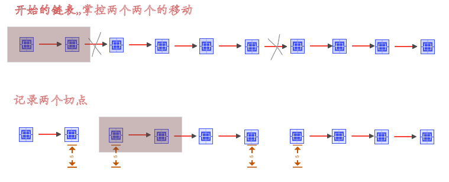

* 在leetcode排名第一名

  

* 对链表的两个剪切，记录下四个切点的重新连接；

* 移动过程，两个节点，两个节点的移动坐标

  

* 具体步骤

  ```go
  
   type ListNode struct {
  	 Val int
  	 Next *ListNode
   }
  
  func reverseBetween(head *ListNode, m int, n int) *ListNode {
  	var h0,pre,F1,next *ListNode
  	var index int
  	h0 = head //todo 默认的开头
  	m--
  //todo 进行第一个切断  pre and F1
  	for head != nil {
  		if index == m {
  			break
  		}
  		index++
  		pre=head
  		head =head.Next
  	}
  	F1=head //todo 反转的开始
  
  	//todo 代表从head这个节点开始进行反转, 切成 head and next
  	index=0
  	count:=n-m-1
  	//todo 反转部分是一个节点（不需要进行反转）和多个节点的区分
  	if count !=0{
  		next=head.Next
  		for next != nil  &&  index!=count {
  			nnext:=next.Next
  			next.Next=head
  			head=next
  			next=nnext
  			index++
  		}
  		//todo 接后半部分的断点，
  		F1.Next=next
  	}
  
  
  	//todo 接上半部分的断点，需要区分是否需要从第一个节点进行区分
  	if pre != nil {
  		pre.Next=head
  	}else {
  		h0=head
  	}
  	return h0
  
  }
  ```

  