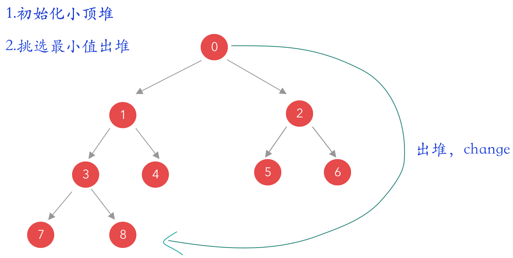

* todo 以数组的index为序列号进行建堆
* todo 初始化小顶堆
* todo 选出head值出堆，然后重新adjust heap




* java

  ```java
  
      public static void main(String[] args) {
  
          int[] a={5,6,2,8,33,9,10,25,32,65,10};
          heapSort(a);
          System.out.println(Arrays.toString(a));
      }
  
      /***
       * todo 以数组的index为序列号进行建堆
       * todo 初始化小顶堆
       * todo 选出head值出堆，然后重新adjust heap
       * @param a
       */
      private static void heapSort(int[] a) {
  
          //todo Init heap
          //last 非叶子节点
          int S=(a.length-2)/2;
          for (int i = S; i >0; i--) {
              adjustHeap(a,a.length-1,i);
          }
          System.out.println(Arrays.toString(a));
  
          //todo 最小值依次出堆
          for (int i = 0; i < a.length-1; i++) {
              int len=a.length-1-i;
              adjustHeap(a,len,0);
              change(a,0,len);
          }
  
      }
  
    public static void adjustHeap(int[] a,int len , int i ){
        int L,R ;
        while (true){
            L=2*i+1;R=L+1;
            if (L<=len ) {
                int min =L;
                if (R <= len && a[R]< a[L])
                    min = R;
                if (a[min]<a[i]){
                    change(a,min,i);
                    i=min;
                }else break;
            }else {
                break;
            }
        }
  
    }
  
    static void change(int[] a, int i,int j ){
          int x= a[i];
          a[i]=a[j];
          a[j]=x;
    }
  ```

* go 

  ```go
  
  // Heap 定义堆排序过程中使用的堆结构
  type Heap struct {
  	arr  []int   // 用来存储堆的数据
  	size int     // 用来标识堆的大小
  }
  
  // todo adjustHeap 用于调整堆，保持堆的固有性质，利用了递归的方式
  func adjustHeap(h Heap, parentNode int) {
  	leftNode := parentNode*2 + 1
  	rightNode := parentNode*2 + 2
  
  	maxNode := parentNode
  	if leftNode < h.size && h.arr[maxNode] < h.arr[leftNode] {
  		maxNode = leftNode
  	}
  	if rightNode < h.size && h.arr[maxNode] < h.arr[rightNode] {
  		maxNode = rightNode
  	}
  
  	if maxNode != parentNode {
  		h.arr[maxNode], h.arr[parentNode] = h.arr[parentNode], h.arr[maxNode]
  		adjustHeap(h, maxNode)
  	}
  }
  
  // createHeap 用于构造一个堆
  func createHeap(arr []int) (h Heap) {
  	h.arr = arr
  	h.size = len(arr)
  
  	for i := h.size / 2; i >= 0; i-- {
  		adjustHeap(h, i)
  	}
  	return
  }
  
  // heapSort 使用堆对数组进行排序
  func heapSort(arr []int) {
  	h := createHeap(arr)
  	for h.size > 0 {
  		// 将最大的数值调整到堆的末尾
  		h.arr[0], h.arr[h.size-1] = h.arr[h.size-1], h.arr[0]
  		// 减少堆的长度
  		h.size--
  		// 由于堆顶元素改变了，而且堆的大小改变了，需要重新调整堆，维持堆的性质
  		adjustHeap(h, 0)
  	}
  }
  
  func main() {
  	// 测试代码
  	arr := []int{9, 8, 7, 6, 5, 1, 2, 3, 4, 0}
  	fmt.Println(arr)
  	heapSort(arr)
  	fmt.Println(arr)
  }
  ```

  