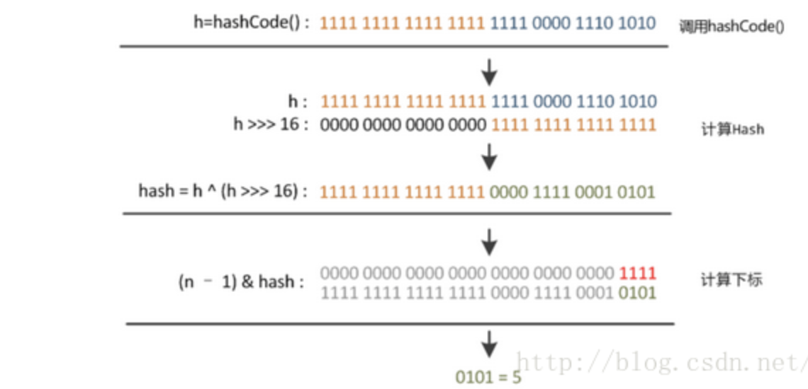

### hashmap

* threshold  ：阈值。
* LoadFactor ： 负载因子
* threshold = length * Load factor  

### 根据Key获取index的步骤

* *数组下标的计算方式：index=hash&（tab.length-1）*

* *高低位均参与运算*

* *根据hash和len得到index*, 因为 len=2的n次方，所以满足

  >Hash % len = hash & （len-1)     与的方式运算速度更快

  

  

### 扩容resize

* 当达到阈值的时候就要进行扩容
* **扩容大小：Newsize=2\*oldsize;**
* 扩容后要重新计算index的大小，重新进行排列：rehashing
* **Hashmap的resize（）方法: jdk1.8发现一个规律，再length\*2后  n-1二进制表示高位会增加个1；所以就省去了hash&(n-1)=index的过程直接判定hash高位是一还是0，是一的话原索引+oldcapcity；0的话就是原来的索引值；**

### 设定容量为2的n次方的作用

* 快速定位index
* 快速扩容

### 链表，红黑树

* 引入了红黑树。而当链表长度太长（默认超过8）时，链表就转换为红黑树，利用红黑树快速增删改查的特点提高HashMap的性能，其中会用到红黑树的插入、删除、查找等算法

