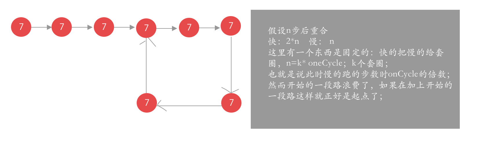

## 环形链表




### 两种方式解决

* 可以用快慢指针的方式获取环形链表的起点，和判定是否有环形

  ```java
   while (true){
              if (sNode.next!=null&&fNode.next!=null&&fNode.next.next!=null){
                  sNode=sNode.next;
                  fNode=fNode.next.next;
              }else
                  return 0;
              if (sNode==fNode){
                  listNode=sNode;
                  break;
              }
          }
          sNode=head;
          while(true){
              if(sNode==listNode)
                  break;
              else {
  
                  sNode=sNode.next;
                  listNode=listNode.next;            }
          }
  ```

* 另一种方式使用map记录每个节点的地址的方式

  ```java
  Map<ListNode, Boolean> map = new HashMap();
          ListNode listNode = head;
          boolean flag = false;
          while (true) {
              if (map.containsKey(listNode)) {
                  flag = true;
                  break;
              } else {
                  map.put(listNode,true);
                  if(listNode.next!=null)
                      listNode = listNode.next;
                  else break;
              }
  
  
          }
          return flag;
  ```

  