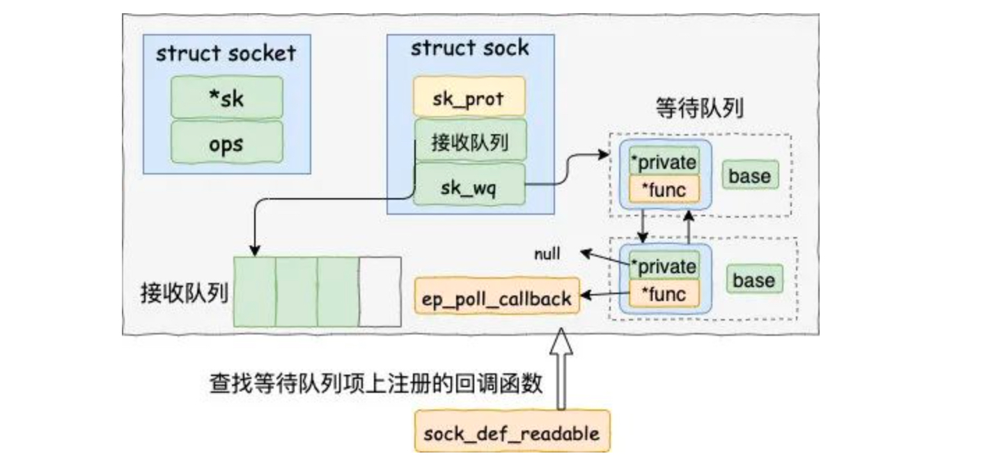
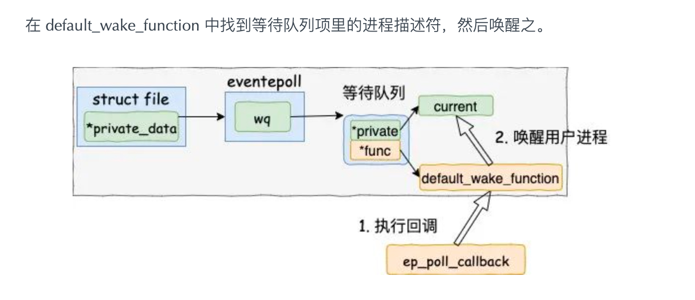
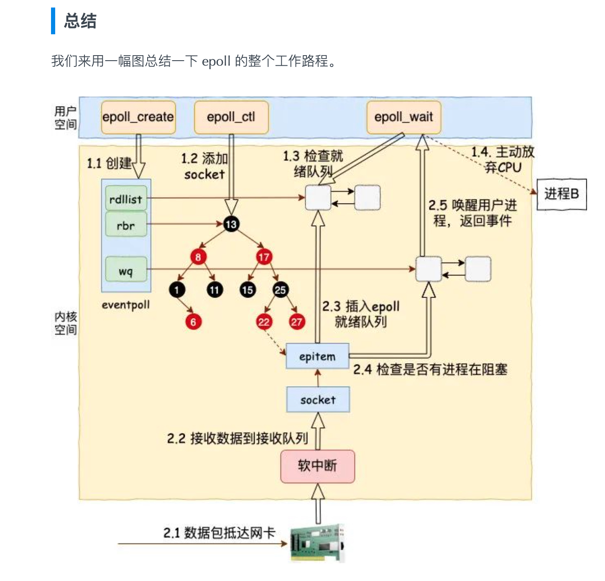

## 出发点：

> 进程在 Linux 上是一个开销不小的家伙，先不说创建，光是上下文切换一次就得几个微秒。所以为了高效地对海量用户提供服务，必须要让一个进程能同时处理很多个 tcp 连接才行。现在假设一个进程保持了 10000 条连接，那么如何发现哪条连接上有数据可读了、哪条连接可写了 ？

```
int main(){
    
    // 1. 监听一个 socket server 
    listen(lfd, ...);

    // 2. 客服端发起请求，服务端生成多个连接
    cfd1 = accept(...);
    cfd2 = accept(...);
    
    // 3. 创建一个epoll管家，统一管理这些连接
    efd = epoll_create(...);
    epoll_ctl(efd, EPOLL_CTL_ADD, cfd1, ...);
    epoll_ctl(efd, EPOLL_CTL_ADD, cfd2, ...);
    
    // 4. 拿取最近活跃的连接
    epoll_wait(efd, ...)
}
```

## epoll:

- **wq：** 等待队列链表。软中断数据就绪的时候会通过 wq 来找到阻塞在 epoll 对象上的用户进程。

- **rbr：** 一棵红黑树。为了支持对海量连接的高效查找、插入和删除，eventpoll 内部使用了一棵红黑树。通过这棵树来管理用户进程下添加进来的所有 socket 连接。

  <mark>应用场景:</mark>

  >        EPOLL_CTL_ADD：在文件描述符epfd所引用的epoll实例上注册目标文件描述符fd，并将事件事件与内部文件链接到fd。
  >     
  >        EPOLL_CTL_MOD：更改与目标文件描述符fd相关联的事件事件。
  >     
  >        EPOLL_CTL_DEL：从epfd引用的epoll实例中删除（注销）目标文件描述符fd。该事件将被忽略，并且可以为NULL

- **rdllist：** 就绪的描述符的链表。当有的连接就绪的时候，内核会把就绪的连接放到 rdllist 链表里。这样应用进程只需要判断链表就能找出就绪进程，而不用去遍历整棵树。


### epoll_ctl 添加 socket  [重点关注注册的两个回调函数] ：

- 1.分配一个红黑树节点对象 epitem

  - <mark>可以注册自己关心的事件类型</mark>
  - <mark>判断是哪个线程需要知道这个消息</mark>

  ```
  struct epitem {
  
      //红黑树节点
      struct rb_node rbn;
  
      //socket文件描述符信息
      struct epoll_filefd ffd;
  
      //所归属的 eventpoll 对象
      struct eventpoll *ep;
  
      //等待队列
      struct list_head pwqlist;
  }
  ```

- 2.添加等待事件到 socket 的等待队列中，其回调函数是 ep_poll_callback

- 3.将 epitem 插入到 epoll 对象的红黑树里

## 数据来了：

1. 在 ep_poll_callback 根据等待任务队列项上的额外的 base 指针可以找到 epitem， 进而也可以找到 eventpoll 对象。

   

2. 首先它做的第一件事就是**把自己的 epitem 添加到 epoll 的就绪队列中**。

3. 接着它又会查看 eventpoll 对象上的等待队列里是否有等待项（epoll_wait 执行的时候会设置）。

   

   * 如果没执行软中断的事情就做完了。如果有等待项，那就查找到等待项里设置的回调函数。
   * 在 default_wake_function 中找到等待队列项里的进程描述符，然后唤醒之。
   * 将 epoll_wait 进程推入可运行队列，等待内核重新调度进程。然后 epoll_wait 对应的这个进程重新运行后，就从 schedule 恢复
   * 当进程醒来后，继续从 epoll_wait 时暂停的代码继续执行。把 rdlist 中就绪的事件返回给用户进程


## 总流程：



## 参考文档：

https://mp.weixin.qq.com/s/9vVs2olnfoVEpoJCFWUmMQ


