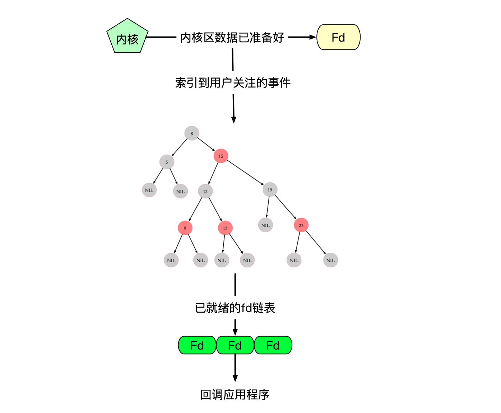

## select&poll&epoll IO 模型 进化史：

### 网络IO所经历的过程：

### 系统接口select实现：

#### 缺点：

>  在内核态和用户态之间进行频繁复制fdlist ，耗能很大
>
>  返回值不明确，只能返回有几个就绪描述符，还得用户程序去遍历
>
> 在内核层仍然是通过遍历的方式检查文件描述符的就绪状态，是个同步过程，只不过无系统调用切换上下文的开销。（内核层可优化为异步事件通知）
>
> 只能监听 1024 个文件描述符的限制

#### poll：

> poll 也是操作系统提供的系统调用函数。select 的主要区别就是，去掉了 select 只能监听 1024 个文件描述符的限制

### 系统接口epoll——wait实现：

## 文章：

https://mp.weixin.qq.com/s/YdIdoZ_yusVWza1PU7lWaw

**https://mp.weixin.qq.com/s?__biz=MjM5Njg5NDgwNA==&mid=2247484905&idx=1&sn=a74ed5d7551c4fb80a8abe057405ea5e&chksm=a6e304d291948dc4fd7fe32498daaae715adb5f84ec761c31faf7a6310f4b595f95186647f12&scene=21#wechat_redirect**

### 内核态和用户态：

  如果在用户级线程中发生了系统调用，则此线程就会进入阻塞状态。变成暂时不可运行的状态，并且把执行权交还给内核，让内核可以调度其他线程。所以，像游戏逻辑服务器的主逻辑线程(CPU密集型线程)就不应该出现诸如：

* 设备IO操作 或者 进程间通信等这样的系统调用。否则会发生此线程不必要的运行中断。造成逻辑运行效率低下。

所以,在CPU密集型线程中,比如游戏逻辑服务器的主逻辑线程中，千万不要出现设备IO操作 或者 Sleep()这样的系统调用。否则CPU分配的执行时间片段还没被用完就造成一次线程切换是得补偿失的。

