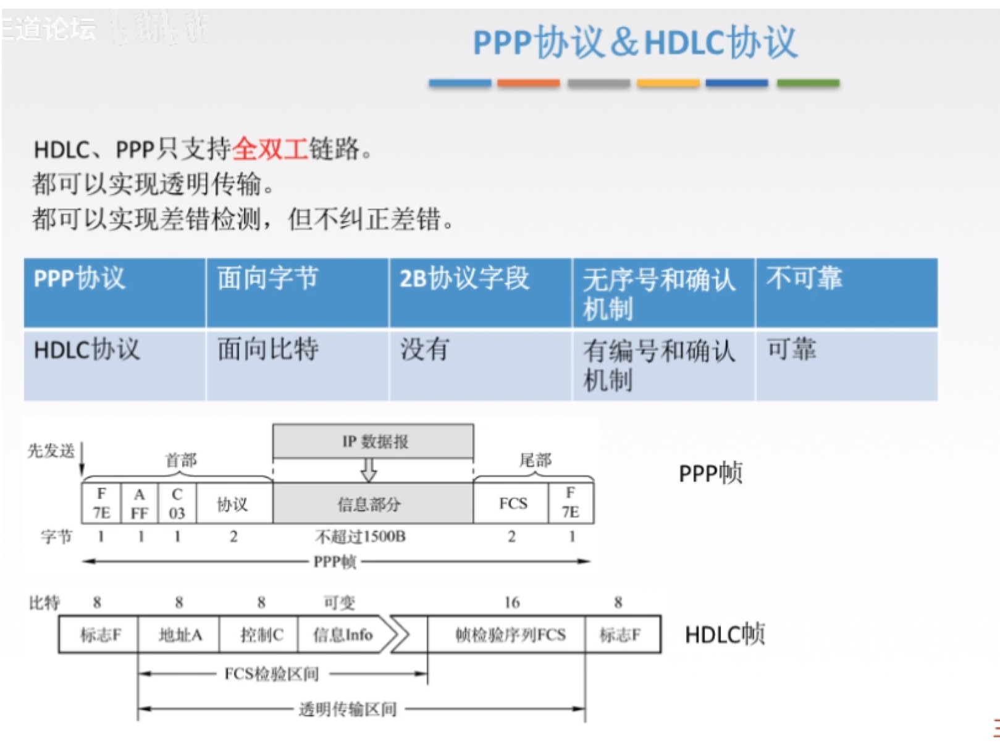

## 数据链路层：

> 功能： 将来自网络层的数据可靠的传输到相邻节点的目标机中。其主要作用就是 加强物理层传输原始byte流的功能，将可能出错的物理连接转换为逻辑上无差错的数据链路。

* 封装成帧，透明传输（添加转义字符法）
* 差错控制（奇偶校验码）
* 流量控制和可靠传输 （停等协议，后退n帧协议，选择性重传协议）

|                                                              | --           |
| ------------------------------------------------------------ | ------------ |
| IP 地址和 Mac 地址相互映射的协议                             | 地址解析协议 |
| 数据链路层协议---ppp协议 不可靠的尽力传输，将差错控制交给了TCP层 |              |
|                                                              |              |
|                                                              |              |

### 两台主机直接如何传输呢？

> 而是向本网络内所有计算机发送，让每台计算机自己判断，是否为接收方。

### 网桥：

使用网桥时，由于网桥会根据mac地址进行过滤，所以**不会形成冲突域**

