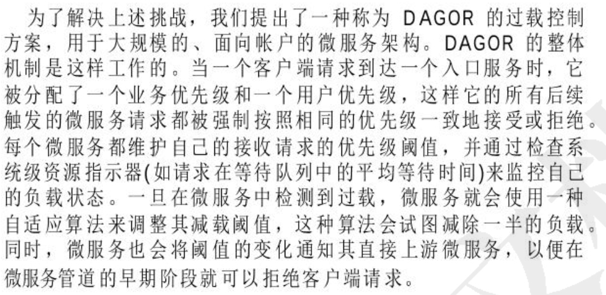

进行有效的过载控制是至关重要的，一般来说，单个服务自行实现过载控制（比如设置限流值等），但是由于复杂的服务依赖关系以及有缺陷的服务实现，单个服务实现的过载控制机制可能不利于整个系统。

在服务开发过程中，rd通常很难准确估计实际的负载程度，因此，<mark>将过载控制从服务逻辑中解耦至关重要</mark>


### 基本原理：




## 负反馈自动调节过载限流：

> 人工自动调节限流值，不能合理的使用服务器的资源。

```
过载控制被设置为业务优先级n时，来自优先级n+1的所有请求一律被丢弃。这对于混合工作负载来说很好，但是假设有潮水般涌入的支付请求，所有这些请求都有同样的优先级（比如p）。系统将变得过载，因此将过载阈值改为p-1，这时系统将再次处于轻负载情形。一旦检测到轻负载，过载阈值再次调高到p，再一次处于过载状态。为了在因同一优先级的请求而超载时停止这种翻转，我们需要比业务优先级更精细的粒度级别。l
```


## 避免灾害放大：

> 由于服务依赖的复杂性，让微服务独立处理重载可能会产生问题。
>
> 根本原因：失败请求的部分处理仍然会消耗资源

> 例如，假设客户端请求的处理依赖于K个微服务，但目前所需的微服务都是重载的，并且它们中的每一个都以p的概率独立地拒绝传入的请求。客户端请求完成处理的期望是(1−p)的k次方。如果p接近1或者K很大，在这种情况下，系统吞吐量趋于消失。

所以我们的目标就是让机器有的资源都能处理成功，正常响应用户的请求。而不是让失败的请求来消耗资源。

## 系统设计：

* 负载指标：衡量机器是否是超载状态的指标，微信使用在请求到达到开始处理的时间作为负载指标 <20ms 
* 自适应算法：负反馈调节机制（有点类似与pid控制算法）
* 过载裁流量（或者增加流量）：选择性裁（保证有限的资源都能使用上），


